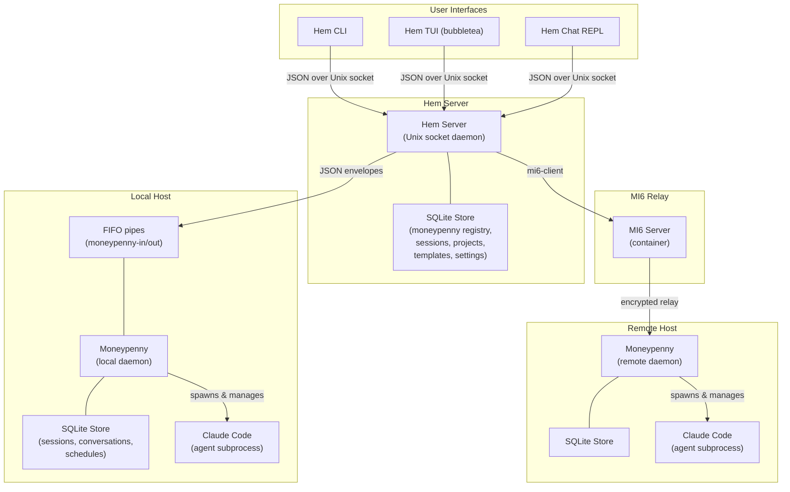
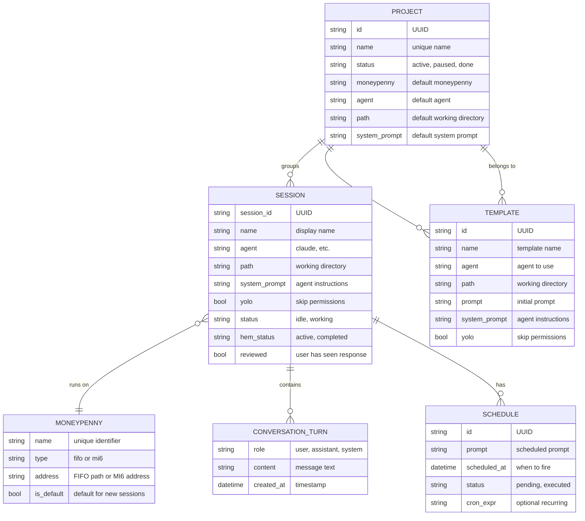

We are building James, a set of tools used to orchestrate agents (see the pun yet?).

# Some basic requirements

- Keep track of technical decisions in an ARCHITECTURE.md file. Always check if it needs updates
- Keep the spec up to date, I might ask you to do changes out of the spec, they should be reflected here.

# Architecture Overview



# Concepts



# MI6

MI6 is a transport abstraction that allows, by creating a central place that all hosts can reach, to communicate between these hosts.

- We'll have agents running remotely. They checking in to their boss through MI6.
- MI6 is simply a delocalized proxy where agents can check-in. It serves as transport.
- It is composed of two pieces: a local client `mi6-client` that connects to a unique, remote server `mi6-server`. Mi-6 server will run in a container somewhere.
- It is built using golang.
- mi-6 client opens a session to mi6-server. That session is authenticated using ssh-keys, and has a session-id determined by the client.
- mi-6 server has a list of authorized_keys, we should support ecdsa and rsa.
- communication between client and server is encrypted using the ssh-key, with per-message gzip compression negotiated during handshake
- 2 or more clients will open the same session on mi-6 server, then communicate through it.
- Communication on the client happens through stdio. Client should batch some of the text coming through stdin, then send to the server. Server then broadcasts to all _other_ connected clients to their stdout.
- For the client, let's support `mi6-client mi6.servername.com/session_id` as a valid command, in addition to flags.
- We should be able to pass the ECDSA key as environment variable to mi6-client, or directly in a `--key-value` path.
- Add a `--generate-key` that generates a key.

# Moneypenny

Moneypenny is a client deployed on each host, which handles agent sessions. It is built using Go.

- Interfacing is done using stdio. Commands are sent to Moneypenny using stdin, and it outputs responses on stdout.
- `-v` flag enables verbose logging to stderr: commands received, agent executions, responses sent.
- Moneypenny can either interface directly on stdio (for local use), or open a connection to an mi6-server. `moneypenny --mi6 mi6.servername.com/this_hosts_name` ; using host name as the session id.
- Moneypenny has a local store based on sqlite, to keep track of everything it needs (sessions, conversation history, parameters).
- When integrating through mi6, moneypenny creates an ECDSA ssh-key, stores it locally, and uses that to authenticate with mi6. Use `moneypenny --show-public-key` to output the public key for adding to an mi6-server's authorized_keys.
- We'll be using a protocol based on json envelopes for commands and responses:
  - Request: `{ "type": "request", "method": "method_name", "request_id": "id", "data": {} }`
  - Success response: `{ "type": "response", "status": "success", "request_id": "id", "data": {} }`
  - Error response: `{ "type": "response", "status": "error", "request_id": "id", "error_code": "ERROR_CODE", "data": { "message": "human-readable description" } }`
- Standardized error codes:
  - `SESSION_NOT_FOUND` - session_id does not exist
  - `SESSION_ALREADY_EXISTS` - create_session with a session_id that already exists
  - `SESSION_NOT_IDLE` - continue_session when session is in working state
  - `SESSION_NOT_WORKING` - stop_session when session is not in working state
  - `AGENT_NOT_FOUND` - the requested agent binary (e.g. claude) is not installed
  - `INVALID_PATH` - the provided path does not exist
  - `AGENT_ERROR` - the agent subprocess crashed or returned an error
  - `INVALID_REQUEST` - malformed command or missing required fields
  - `SCHEDULE_NOT_FOUND` - cancel_schedule with a schedule_id that does not exist
  - `INTERNAL_ERROR` - unexpected internal error

### Agent Support

Moneypenny supports multiple agent types:

- **claude** (default): Claude Code CLI. Uses `--output-format json --session-id <id> -p <prompt>`. System prompt via `--system-prompt`. Permissions via `--dangerously-skip-permissions`. New sessions use bare flags, continuations add `--continue`.
- **copilot**: GitHub Copilot CLI. Uses `--resume <id> -s -p <prompt>` for both new and continued sessions. Permissions via `--yolo`. No JSON output format — parses plain text. No system prompt support.

Method: **create_session**: creates a new session with an agent. Format of the data is `{ "agent": "claude", "system_prompt": "a system prompt for the agent", "yolo": boolean indicating if the session should be started with --dangerously-skip-permissions, "prompt": "prompt for the agent", "session_id": "GUID used for communication about that session id", "name": "a session name", "path": "the path where to start the agent" }`

- If session_id already exists, return `SESSION_ALREADY_EXISTS` error.
- When a new session is started, moneypenny saves all the parameters in its local storage, and invokes the agent following the parameters in data of the method.
- It requests output-format to be json, invokes the corresponding agent with the correct parameters.
- When invoking claude, it uses the session_id passed by the caller as session id.
- It waits for the response, then saves it in its local store and sends back the text response wrapped in the response envelope.
- Moneypenny should keep track of a session state, notably: working, when a prompt was sent to the agent and we are waiting for the response ; and idle, when the response was received.

Method: **continue_session**: continues a session that was started with an agent. Data for the request contains the session_id and the new prompt to send to the agent: `{ "session_id": "id", "prompt": "the new prompt" }`

- Moneypenny then simply runs the prompt, using the session_id to continue the conversation. It reuses the parameters previously sent when session was created.
- Moneypenny should reject continue_session commands when the session is not idle (`SESSION_NOT_IDLE` error).

Method: **list_sessions**: returns the list of sessions, with their respective status, name and ids.

Method: **get_session**: returns details about the provided session_id, including all parameters, status, and all prompts and responses (stored in sqlite).

Method: **delete_session**: deletes a session. If it is in working state, the agent subprocess is killed first.

Method: **stop_session**: stops the agent subprocess for a working session. Session state goes back to idle, allowing continue_session to be called afterwards. Returns `SESSION_NOT_WORKING` error if session is not in working state.

Method: **update_session**: updates session parameters. Data: `{ "session_id": "id", "name": "new name", "system_prompt": "new prompt", "yolo": true, "path": "/new/path" }`. Only non-nil fields are updated.

Method: **queue_prompt**: queues a prompt for a session that is currently working. Data: `{ "session_id": "id", "prompt": "the prompt to queue" }`. When the agent finishes, moneypenny drains the queue and continues with all queued prompts. Each queued prompt is stored as its own conversation turn, but they are joined and sent to the agent as a single combined prompt.

Method: **import_session**: creates a session with pre-existing conversation history without running an agent. Data: `{ "session_id": "id", "name": "name", "agent": "claude", "path": "/path", "conversation": [{"role": "user", "content": "..."}, ...] }`. Used by `hem import session`.

Method: **git_diff**: runs `git diff` and `git diff --cached` in a session's working directory. Data: `{ "session_id": "id" }`. Returns `{ "diff": "..." }`.

Method: **git_commit**: stages all changes and commits in a session's working directory. Data: `{ "session_id": "id", "message": "commit message" }`. Runs `git add -A` then `git commit -m`. Returns `{ "output": "..." }`.

Method: **git_branch**: creates and switches to a new branch in a session's working directory. Data: `{ "session_id": "id", "branch": "branch-name" }`. Runs `git checkout -b`. Returns `{ "output": "..." }`.

Method: **git_push**: pushes the current branch to origin in a session's working directory. Data: `{ "session_id": "id" }`. Runs `git push -u origin <current-branch>`. Returns `{ "output": "..." }`.

Method: **execute_command**: executes a shell command on the host. Data: `{ "command": "the shell command to run", "path": "/optional/working/directory" }`. Runs the command via `sh -c` in the specified path (or moneypenny's current directory if path is empty). Returns `{ "output": "combined stdout+stderr", "exit_code": 0 }`. Non-zero exit codes are returned in the response (not as errors). Only returns an error envelope if the command fails to execute at all (e.g., path doesn't exist).

Method: **schedule**: creates a scheduled continuation for a session. Data: `{ "session_id": "id", "prompt": "the prompt to send", "at": "RFC3339 timestamp or relative duration" }`. The `at` field accepts RFC3339 timestamps, relative durations (`+2h`, `+30m`), local time (`YYYY-MM-DD HH:MM`, `HH:MM`). Returns `{ "schedule_id": "id", "scheduled_at": "RFC3339 timestamp" }`. When the scheduled time arrives: if the session is idle, continues directly; if the session is busy, queues the prompt via `queue_prompt`.

Method: **list_schedules**: lists pending schedules for a session. Data: `{ "session_id": "id" }`. Returns `{ "schedules": [{ "schedule_id": "id", "prompt": "...", "scheduled_at": "RFC3339", "created_at": "RFC3339" }, ...] }`.

Method: **cancel_schedule**: cancels a pending schedule. Data: `{ "session_id": "id", "schedule_id": "id" }`. Returns success if the schedule existed and was removed. Returns `INVALID_REQUEST` if the schedule_id is not found.

Method: **list_directory**: lists entries in a directory. Data: `{ "path": "/some/path" }`. Returns `{ "path": "/some/path", "entries": [{ "name": "foo", "is_dir": true }, ...] }`. Hidden files (starting with `.`) are excluded. Defaults to `/` if path is empty.

Method: **get_version**: returns the version of moneypenny

Memory: Moneypenny creates a memory file for all the sessions it handles. It give the path to that memory files to the agent in the system prompt and asks it to write anything it needs to remember there, and dumps the memory into the system prompt in each call.

Local deployment: add a `--local` convenience flag that allows moneypenny to run in local mode through fifo.

- We invoke moneypenny with `--fifo FOLDER` or `--local` (defaults to `~/.config/james/moneypenny/fifo`)
- Moneypenny creates two fifo, `moneypenny-in` and `moneypenny-out`
- Then it uses these fifo to get input and produce output

Versioning: A single `VERSION` file at the project root is the source of truth for all components (mi6, moneypenny, hem). Semver format (e.g. `0.1.0`). The version is injected at compile time via Go's `-ldflags "-X main.Version=..."`. Each component's Makefile reads from `VERSION`. Bump minor for new features, patch for fixes. All components display their version on startup (moneypenny, hem server, mi6-server log it; hem TUI shows it in the status bar). `hem --version` shows both client and server versions.

# Hem

Hem handles the overall agent management. It connects to all its moneypenny instances, sends work there, and retrieve the work result. It acts as an interface for all of them. It is built using Go.

## Architecture: Client/Server

Hem uses a client/server architecture over a Unix domain socket (`~/.config/james/hem/hem.sock`).

- **Hem Server** (`hem server`): A long-running daemon that owns the SQLite store, moneypenny transport connections, and all orchestration logic. It listens on the Unix socket and processes requests.
- **Hem CLI** (all other commands): A thin client that parses the command, sends a JSON request to the server over the Unix socket, receives the response, and formats the output.
- The server must be running for any command to work. If the server is not running, the CLI prints an error.
- This architecture allows the server to maintain persistent state, open connections, and handle async operations, while the CLI is lightweight and stateless.
- Future clients (UI, web) can connect to the same socket.

### Internal protocol (over Unix socket)

Line-delimited JSON, one request/response per connection:
- Request: `{ "verb": "create", "noun": "session", "args": ["prompt text", "--name", "test"] }`
- Success response: `{ "status": "ok", "data": { ... } }`
- Error response: `{ "status": "error", "message": "human-readable error" }`
- `data` is always structured JSON. The CLI formats it according to `--output-type`.

## General

- Hem is a cli tool
- It uses commands with verbs and names, similar to kubectl, e.g. `hem add moneypenny`, `hem create session`, `hem list sessions`, etc. All names should support singular and plural for all verbs (eg both `hem add moneypenny` and `hem add moneypennies` are correct)
- For all commands we can specify an `--output-type` or `-o` which might be either `json`, `text`. If the expected output is a table, we can specify `tsv` or `table` (formats as table)
- The server stores state in a sqlite instance (moneypenny registry, session-to-moneypenny mapping).
- For MI6 transport, hem auto-generates an ECDSA SSH key (same approach as moneypenny), stored in its data directory. Use `hem show-public-key` to output the key for adding to mi6-server's authorized_keys.
- `hem set-default moneypenny -n NAME` sets the default moneypenny. Session commands use this default when `-m` is not specified.
- `hem set-default agent VALUE` sets the default agent (used by `create session` when `--agent` is not specified, fallback: `claude`).
- `hem set-default path VALUE` sets the default working directory (used by `create session` when `--path` is not specified, fallback: `.`).
- `hem set-default server --hem HOST/SESSION` sets the default hem server to connect via MI6. `hem set-default server --local` resets to local Unix socket (the default).
- `hem get-default agent|path|moneypenny|server` shows the current default for a given key.
- `hem list defaults` shows all configured defaults.
- The `--local` global flag forces local Unix socket connection, overriding any stored default server.

## Server

`hem start server [-v]` — starts the hem server daemon.

- The server listens on a Unix domain socket at `~/.config/james/hem/hem.sock`.
- `-v` enables verbose logging to stderr (requests received, responses sent).
- The server must be running before any other command can be used.
- On shutdown (SIGINT/SIGTERM), the server removes the socket file and exits cleanly.
- Only one server instance can run at a time (binding to the socket fails if another is already running).

## Moneypenny management

Hem has a list of moneypennies it can use. Each instance has a unique name and a transport reference (FIFO or MI6).

### Add

`hem add moneypenny --name|-n NAME [flags]`

- Name must be unique.
- Add a local moneypenny:
    - Local instances use FIFO for communication.
    - `--local` uses the default FIFO path (`~/.config/james/moneypenny/fifo`)
    - `--fifo-folder FOLDER` (expects `moneypenny-in` and `moneypenny-out` in FOLDER)
    - Or `--fifo-in INPUT_FIFO` and `--fifo-out OUTPUT_FIFO` for custom paths.
- Add an MI6 moneypenny:
    - `--mi6 mi6.server.example.com/session_id`
- A transport reference (FIFO or MI6) is required.
- On add, hem validates connectivity by calling `get_version` on the moneypenny.

Example: `hem add moneypenny -n local --fifo-folder ~/moneypenny-fifo`

### List

`hem list moneypennies` — lists all moneypennies with name, type (fifo/mi6), and connection info.

### Ping

`hem ping moneypenny -n NAME` — pings a moneypenny using `get_version`, displays version and round-trip time.

### Remove / Delete

`hem remove moneypenny -n NAME` or `hem delete moneypenny -n NAME` — removes the reference.

### Set default

`hem set-default moneypenny -n NAME` — sets the default moneypenny for session commands.

## Sessions

Hem manages sessions on moneypennies. It tracks which moneypenny each session lives on in its local SQLite. By default, session commands wait for the agent to complete; use `--async` to return immediately.

### Create

`hem create session -m|--moneypenny NAME PROMPT [flags]`

- `-m` is optional if a default moneypenny is set.
- Hem generates a session_id (UUID) and sends `create_session` to the moneypenny.
- By default: waits for the agent to complete, prints the session_id and the response.
- With `--async`: prints the session_id and returns immediately without waiting.
- Flags: `--agent NAME` (default "claude"), `--name NAME` (session name, default empty), `--system-prompt TEXT`, `--yolo` (skip permissions), `--path PATH` (working directory for the agent), `--gadgets` (include James tooling instructions in system prompt).
- `--gadgets`: Appends instructions telling the agent about `hem` CLI access and scheduling. For MI6-connected moneypennies, includes the MI6 server address so the agent can connect back. Templates always include gadgets.

### Continue

`hem continue session SESSION_ID PROMPT` or `hem continue session --session-id ID PROMPT`

- Sends `continue_session` to the moneypenny that owns this session.
- If the session is currently working, the prompt is automatically queued via `queue_prompt` instead. The response indicates `queued: true`.
- By default: waits for the agent to complete, prints the response.
- `--async`: return immediately without waiting.

### Stop

`hem stop session SESSION_ID` — stops a working session (kills the agent, session goes back to idle).

### Delete

`hem delete session SESSION_ID` — deletes a session (kills agent if working, removes from moneypenny and local tracking).

### State

`hem state session SESSION_ID` — shows the current state of the session (idle/working).

### Last

`hem last session SESSION_ID` — shows the last assistant response.

### Show

`hem show session SESSION_ID` — shows session parameters (agent, system_prompt, yolo, path, name, status).

### Update

`hem update session SESSION_ID [--name NAME] [--system-prompt TEXT] [--yolo true/false] [--path PATH] [--project NAME_OR_ID]` — updates session parameters. Only specified fields are changed. `--project` moves the session to a project (hem-local operation, not sent to moneypenny).

### History / Log

`hem history session SESSION_ID [-n N]` or `hem log session SESSION_ID [-n N]` — shows conversation history. `-n` limits to last N turns (default: all).

### List

`hem list sessions [-m MONEYPENNY_NAME] [--all] [--status STATUS]` — lists all sessions across all moneypennies. `-m` filters by moneypenny. By default, completed sessions are hidden. `--all` shows everything. `--status completed` shows only completed.

### Complete

`hem complete session SESSION_ID` — marks a session as completed in hem's local tracking. Completed sessions are hidden from default list and dashboard views.

- If a completed session is continued (via `continue session`), it automatically goes back to active status.

### Import

`hem import session FILE.jsonl|SESSION_ID [-m MONEYPENNY] [--name NAME] [--project PROJECT] [--path PATH] [--agent AGENT]`

- Imports an existing Claude Code session from a JSONL file.
- If the argument is not a file on disk, it is treated as a session ID and searched for in `~/.claude/projects/` subdirectories (Claude Code stores sessions as `{session-id}.jsonl`).
- Parses the JSONL to extract: session ID, working directory (cwd), user messages (string content), assistant messages (text blocks from content array).
- Sends `import_session` to moneypenny to create the session with conversation history without running an agent.
- Tracks the session locally in hem, optionally assigning to a project.
- Default session name is first 40 chars of first user message.

### Diff

`hem diff session SESSION_ID` — shows git diff for a session's working directory.

- Sends `git_diff` to the moneypenny that owns the session.
- Moneypenny runs `git diff` and `git diff --cached` in the session's working directory.
- Returns the combined diff output.

### Commit

`hem commit session SESSION_ID -m MESSAGE` — stages all changes and commits in the session's working directory.

- Sends `git_commit` to the moneypenny that owns the session.
- Moneypenny runs `git add -A` followed by `git commit -m MESSAGE`.

### Branch

`hem branch session SESSION_ID --name BRANCH` — creates and switches to a new branch.

- Sends `git_branch` to the moneypenny that owns the session.
- Moneypenny runs `git checkout -b BRANCH` in the session's working directory.

### Push

`hem push session SESSION_ID` — pushes the current branch to origin.

- Sends `git_push` to the moneypenny that owns the session.
- Moneypenny runs `git push -u origin <current-branch>` in the session's working directory.

## Scheduled Continuation

Sessions can have scheduled continuations — prompts that are automatically sent to the agent at a future time.

### CLI Commands

`hem schedule session SESSION_ID --at TIME --prompt PROMPT [--cron EXPR]` — creates a scheduled continuation.

- `--at` accepts multiple time formats:
  - RFC3339 timestamps (`2026-03-06T14:30:00Z`)
  - Relative durations (`+2h`, `+30m`, `+1h30m`)
  - Local time with date (`2026-03-06 14:30`)
  - Local time without date (`14:30` — assumes today, or tomorrow if the time has passed)
- `--cron` creates a recurring schedule using a cron expression:
  - Standard 5-field format: `minute hour dom month dow` (numbers and `*`)
  - Shorthands: `@hourly`, `@daily`, `@every 2h`
  - When a recurring schedule fires, a new occurrence is automatically created for the next matching time.
  - The `cron_expr` is stored in the schedules table.
- Sends `schedule` to the moneypenny that owns the session.

`hem list schedules --session-id ID` — lists pending schedules for a session. Sends `list_schedules` to the moneypenny.

`hem cancel schedule SCHEDULE_ID --session-id ID` — cancels a pending schedule. Sends `cancel_schedule` to the moneypenny.

### Scheduler

Moneypenny runs a scheduler goroutine that starts on boot and checks for due schedules every 30 seconds.

- When a schedule is due and the session is idle: continues the session directly with the scheduled prompt.
- When a schedule is due and the session is busy: queues the prompt via `queue_prompt`.
- When a schedule fires (one-shot or recurring), a "system" conversation turn is added to the session, visible in chat, showing when the task was triggered.
- For recurring schedules, after firing, a new schedule is automatically created for the next cron-matching time.
- Executed one-shot schedules are removed from the pending list.

### Agent Self-Scheduling

Agents can create schedules from within their responses by including a special tag:

```
<schedule at="...">prompt to send later</schedule>
```

Moneypenny parses agent responses for `<schedule>` tags and creates schedules from them. The `at` attribute accepts the same time formats as the CLI `--at` flag.

Schedule instructions are appended to every session's system prompt automatically, informing the agent of the `<schedule>` tag syntax and its capabilities.

### TUI

- In the chat view, pending schedules are displayed with a ⏰ icon.
- In command mode, `t` creates a new schedule (two-step input: first the time, then the prompt).

## Sub-agents

Sessions can spawn sub-sessions for parallel task execution. Sub-sessions are linked to a parent session and are managed as a group.

### CLI Commands

`hem create subsession SESSION_ID PROMPT [flags]` — creates a sub-session linked to the parent session. Same flags as `create session` (agent, name, system-prompt, yolo, path, gadgets). The sub-session inherits the parent's moneypenny.

`hem list subsessions SESSION_ID` — lists sub-sessions for a parent session.

`hem show subsession SUBSESSION_ID` — shows sub-session details.

`hem stop subsession SUBSESSION_ID` — stops a working sub-session.

`hem delete subsession SUBSESSION_ID` — deletes a sub-session.

`hem watch session SESSION_ID` — polls sub-sessions for completion and queues their results back to the parent session via `queue_prompt`.

### Data Model

- Sub-sessions use the same session model, linked by a `parent_session_id` column in hem's SQLite.
- `HEM_SESSION_ID` environment variable is set by moneypenny when launching agents, allowing agents to create sub-sessions via `hem`.

### Behavior

- Sub-sessions are hidden from the dashboard and `list sessions` output (filtered by `parent_session_id`).
- Deleting a parent session cascades to all its sub-sessions.
- `watch session` polls sub-agents and queues completed results to the parent via `queue_prompt`.

### UI

- Sub-agents are displayed in the TUI and Qew chat views as "subagents".
- The gadgets system prompt includes sub-agent instructions, informing agents of the `hem create subsession` and `hem watch session` commands.

## Projects

Projects provide context for organizing sessions — a project groups related sessions with shared defaults.

### Create

`hem create project --name NAME [-m MONEYPENNY] [--path PATH] [--agent AGENT] [--system-prompt TEXT]`

- Name must be unique.
- When creating sessions with `--project NAME`, the project's defaults are used for unspecified flags.

### List

`hem list projects [--status active|paused|done]` — lists all projects, optionally filtered by status.

### Show

`hem show project NAME_OR_ID` — shows project details.

### Update

`hem update project NAME_OR_ID [--name NAME] [--status active|paused|done] [-m MONEYPENNY] [--path PATH] [--agent AGENT] [--system-prompt TEXT]`

### Delete

`hem delete project NAME_OR_ID` — deletes a project. Sessions linked to it are unlinked but kept.

## Settings

`hem enable SETTING` / `hem disable SETTING` — toggle boolean settings stored in the defaults table.

Available settings:
- **schedule-system-prompt** — when enabled (default: enabled), schedule instructions are appended to every session's system prompt, informing agents of the `<schedule at="...">prompt</schedule>` self-scheduling syntax. Disable to prevent agents from creating their own schedules.

## Remote Execution

`hem run [-m MONEYPENNY] [--path PATH] [--session-id ID] COMMAND`

- Executes a shell command on a remote moneypenny via `execute_command`.
- `-m` specifies the moneypenny (uses default if not set).
- `--path` sets the working directory on the remote host.
- `--session-id` resolves the moneypenny and path from an existing session (can be overridden by `-m` and `--path`).
- Output is printed directly to stdout. Exit code from the remote command is forwarded.

## Dashboard

`hem dashboard [--project NAME] [--all]` — attention-based view of sessions.

Groups sessions by state:
1. **READY** — session is idle and unreviewed (agent finished, needs user attention)
2. **WORKING** — agent is currently running
3. **IDLE** — session is idle and reviewed (user has seen the response)
4. **COMPLETED** — user marked session as done (hidden unless `--all`)

The "reviewed" flag tracks whether the user has seen the latest agent response. A session becomes unreviewed when `continue_session` is called. It becomes reviewed when the user views the conversation history and the last turn is from the assistant (i.e., the agent has finished). This prevents the chat view's polling from prematurely marking a session as reviewed while the agent is still working.

The dashboard auto-refreshes every 5 seconds by polling moneypennies. When a session transitions from WORKING to READY, a notification sound is played client-side. In the TUI, the embedded WAV file is played via `afplay` (macOS) or `aplay` (Linux). In Qew, a Web Audio API chime is played and a slide-in pop-over notification is shown. Both clients support disabling sound: `--silent` flag for `hem ui`, and a toggle button in Qew's header. This works regardless of which view is active, as the dashboard polling runs in the background.

### Chat

### UI

`hem ui` — launches an interactive terminal UI (TUI) built with bubbletea + lipgloss.

- **Dashboard** (default view): attention-based grouped view of sessions (READY, WORKING, IDLE, COMPLETED). Shows project name alongside sessions when any have a project assigned. Moneypenny queries run in parallel with a 5-second timeout.
  - `Enter` — open chat for selected session
  - `a` — toggle show/hide completed sessions
  - `c` — mark session as completed
  - `d` — delete session
  - `e` — edit session parameters
  - `g` — view git diff for session
  - `n` — create new session (opens form)
  - `x` — open remote shell for session's moneypenny+path
  - `m` — switch to moneypennies view
  - `p` — switch to projects view
  - `l` — switch to full session list
  - `r` — refresh
  - `q` — quit
- **Projects**: browse all projects with status, moneypenny, agent, paths.
  - `Enter` — open project detail (filtered session list)
  - `e` — edit project
  - `n` — create new project (opens form)
  - `d` — delete project
  - `r` — refresh
  - `esc` — back to dashboard
- **Project detail**: dashboard filtered to a single project.
  - Same keys as dashboard, plus `n` creates session pre-filled with project name and in async mode.
  - `x` — open remote shell for session's moneypenny+path
  - `esc` — back to projects
- **Session list**: browse all sessions with status, name, moneypenny, timestamps.
  - `Enter` — open chat for selected session
  - `n` — create new session
  - `e` — edit session parameters
  - `d` — delete session
  - `g` — view git diff
  - `i` — import session (opens form)
  - `s` — stop a working session
  - `x` — open remote shell for session's moneypenny+path
  - `r` — refresh list
  - `esc` — back to dashboard
- **Chat view**: full conversation history with markdown rendering (glamour) for assistant messages. Send messages with Enter, scroll with PgUp/PgDn, supports paste. Queued messages show with ⏳ icon and `[Queued]` label; the queued indicator is preserved across poll refreshes and only cleared when an assistant response appears. System turns (e.g., schedule triggers) are rendered with a ⚙ icon in muted/italic style. Esc enters command mode; second Esc leaves chat.
  - Command mode: `c` complete, `d` delete (press twice to confirm), `e` edit, `g` git diff, `s` stop, `t` schedule (two-step: time then prompt), `x` shell, Enter resume, Esc leave.
- **Moneypennies view**: browse registered moneypennies.
  - `Enter` — ping moneypenny
  - `s` — set as default
  - `d` — delete
  - `x` — open remote shell on this moneypenny
  - `r` — refresh
  - `esc` — back to dashboard
- **Shell view**: remote command execution on a moneypenny. Type commands and press Enter to execute them via `execute_command`. Shows command history with output. When opened from a session, uses that session's moneypenny and working directory.
  - `Enter` — run command
  - `Ctrl+U` — clear input
  - `PgUp/PgDn` — scroll output
  - `esc` — back
- **Create wizard** (3-step): Step 1 — select moneypenny from a list (arrow keys, Enter). Step 2 — browse remote filesystem to pick a working directory via `list_directory` (Enter to descend, Backspace to go up, Tab to confirm). Step 3 — fill in prompt, name, project, agent, system prompt, yolo (Tab between fields, Enter to submit). Esc navigates back through steps. When created from project detail, runs async and returns to project view.
- **Edit form**: modify session parameters (name, project, system prompt, path, yolo). Shows change indicators (*) for modified fields. Enter to save, Esc to cancel.
- **Create project form**: fill in name, moneypenny, agent, path, system prompt.
- **Edit project form**: modify project parameters. Enter to save, Esc to cancel.
- **Import form**: import session by JSONL file path or session ID. Optional name, project, path.
- **Diff view**: colored git diff display (green=add, red=remove, blue=hunk, amber=header). Scrollable with arrow keys and PgUp/PgDn.

### Chat

## MI6 Transport for Hem

Hem supports MI6 as an alternative transport for both server and client.

### Session Sync

Hem periodically syncs sessions from all registered moneypennies. On startup (async) and every 5 minutes, hem queries each moneypenny's `list_sessions` and adopts any sessions not already tracked in hem's SQLite. This allows a new hem instance to discover sessions created by other hem instances or directly on the moneypenny. Adopted sessions are inserted with `INSERT OR IGNORE` so existing tracking data (project assignment, completed status, reviewed flag) is never overwritten.

### Server MI6 Control Channel

`hem start server --mi6-control ADDRESS` — accepts commands from an MI6 session alongside the Unix socket.

- The server spawns `mi6-client` connecting to the specified address.
- Incoming JSON requests are dispatched through the same command handler as Unix socket requests.
- Auto-reconnects with backoff on connection loss.
- Implemented in `hem/pkg/server/mi6.go`.

### Client MI6 Transport

`hem --hem ADDRESS COMMAND` — sends commands to Hem server via MI6 instead of Unix socket.

- Uses the `Sender` interface (`hemclient.MI6Sender`) which spawns a persistent `mi6-client` connection.
- TUI also supports MI6 transport: `hem --hem ADDRESS ui`.
- The `--hem` flag is extracted before command parsing and applies to all commands.
- Named `--hem` (not `--mi6` or `--mi6-control`) to avoid conflict with `add moneypenny --mi6 ADDR` and `start server --mi6-control ADDR`.

# Qew - Web UI

Qew is a web-based UI for remote access to Hem via MI6. It serves a dashboard and chat interface accessible from any browser (phone, tablet, other computers).

## Usage

```bash
# Remote via MI6
qew --mi6 mi6.example.com/hem-control --password SECRET --listen :8077

# Local via Unix socket (same machine as Hem)
qew --password SECRET --listen :8077

# Local development (no password, no Secure cookie)
qew --development --listen 127.0.0.1:8077
```

- `--mi6`: MI6 address for the Hem control channel.
- `--socket`: Hem server Unix socket path (default `~/.config/james/hem/hem.sock`). Used when `--mi6` is not specified.
- `--listen`: HTTP listen address (default `:8077`).
- `--password`: Password for web UI authentication. Required when listening on non-loopback addresses.
- `--development`: Development mode — allows no password and disables Secure cookie flag.
- `--key`: SSH key path (default `~/.config/james/qew/qew_ecdsa`).
- `--show-public-key`: Output the public key and exit.
- `-v`: Verbose logging.

## Features

- **Dashboard**: Groups sessions by state (READY, WORKING, IDLE, COMPLETED), same as TUI dashboard. Polls every 5 seconds.
- **Chat**: View conversation history and send messages. Polls every 3 seconds. Shows optimistic message display. Markdown rendering (headings, code blocks, tables, bold, inline code).
- **API proxy**: `POST /api` proxies JSON requests to Hem.
- **WebSocket**: `/ws` for real-time updates.
- **SSH key management**: Auto-generates ECDSA key on first run (MI6 mode only).
- **Single binary**: Web frontend embedded at build time via `embed.FS`.

## Security

- **Authentication**: Cookie-based login with `--password`. Token includes timestamp, expires after 7 days, signed with per-instance HMAC secret. Password compared using constant-time comparison.
- **CSRF protection**: API requires `X-Requested-With: QewClient` header on non-GET requests. Browsers block cross-origin custom headers without CORS preflight.
- **WebSocket origin check**: WebSocket upgrades validate the Origin header matches the request Host.
- **Login rate limiting**: Exponential backoff per IP on failed attempts (1s, 2s, 4s, ... up to 30s).
- **Cookie security**: `HttpOnly`, `SameSite=Strict`, `Secure` flag set in production (not in `--development` mode).
- **Known risk — no command allowlist**: The API proxies any Hem command. An authenticated user has full Hem access (delete sessions, modify projects, etc.). The web UI only uses dashboard/history/continue, but the API does not restrict commands.

`hem chat [-m MONEYPENNY] [--session-id ID] [flags]` — interactive REPL for chatting with an agent.

- By default, creates a new session (same flags as `create session`: `--agent`, `--name`, `--system-prompt`, `--yolo`, `--path`, `-m`).
- With `--session-id ID`, continues an existing session.
- Reads user input from stdin line by line. Each line is sent as a prompt (create on first message, continue on subsequent).
- Agent responses are displayed with a 🤖 prefix in violet (ANSI color).
- If the user sends a message while the agent is still responding, the message is queued. Multiple queued messages are batched (newline-separated) into a single prompt.
- This is a client-side command: the CLI handles the interactive loop directly, sending create/continue requests to the hem server.
- Ctrl+C or EOF exits the chat.

