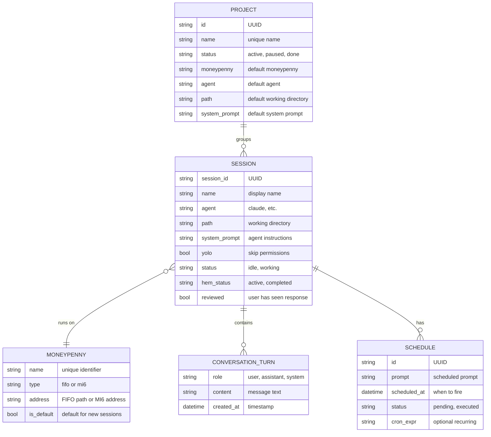

We are building James, a set of tools used to orchestrate agents (see the pun yet?).

# Some basic requirements

- Keep track of technical decisions in an ARCHITECTURE.md file. Always check if it needs updates
- Keep the spec up to date, I might ask you to do changes out of the spec, they should be reflected here.

# Architecture Overview


# Concepts



# MI6

MI6 is a transport abstraction that allows, by creating a central place that all hosts can reach, to communicate between these hosts.

- We'll have agents running remotely. They checking in to their boss through MI6.
- MI6 is simply a delocalized proxy where agents can check-in. It serves as transport.
- It is composed of two pieces: a local client `mi6-client` that connects to a unique, remote server `mi6-server`. Mi-6 server will run in a container somewhere.
- It is built using golang.
- mi-6 client opens a session to mi6-server. That session is authenticated using ssh-keys, and has a session-id determined by the client.
- mi-6 server has a list of authorized_keys, we should support ecdsa and rsa.
- communication between client and server is encrypted using the ssh-key, with per-message gzip compression negotiated during handshake
- 2 or more clients will open the same session on mi-6 server, then communicate through it.
- Communication on the client happens through stdio. Client should batch some of the text coming through stdin, then send to the server. Server then broadcasts to all _other_ connected clients to their stdout.
- For the client, let's support `mi6-client mi6.servername.com/session_id` as a valid command, in addition to flags.
- We should be able to pass the ECDSA key as environment variable to mi6-client, or directly in a `--key-value` path.
- Add a `--generate-key` that generates a key.

## MI6 Admin Key Management

MI6 supports remote management of `authorized_keys` through an admin channel:

- An `admin_keys` file (same OpenSSH format) is placed alongside `authorized_keys` on the server. Keys in this file have admin access.
- Admin clients connect to MI6 and join the special `__admin__` session. The server verifies the client's key is in `admin_keys` before allowing admin commands.
- Admin commands use JSON over MsgData:
  - `list_keys`: Lists all authorized keys with fingerprints, types, and comments
  - `add_key`: Adds a new key to `authorized_keys` (atomic write + automatic reload)
  - `delete_key`: Removes a key by SHA256 fingerprint (atomic write + automatic reload)
- The mi6-client supports `--admin-command JSON` flag for single-shot admin requests.
- Hem exposes admin commands:
  - `hem list mi6-keys [--mi6 ADDRESS]` — list authorized keys
  - `hem add mi6-key KEY_LINE [--mi6 ADDRESS]` — add a key
  - `hem delete mi6-key FINGERPRINT [--mi6 ADDRESS]` — remove a key
- Both `authorized_keys` and `admin_keys` are hot-reloaded on SIGHUP.

# Moneypenny

Moneypenny is a client deployed on each host, which handles agent sessions. It is built using Go.

- Interfacing is done using stdio. Commands are sent to Moneypenny using stdin, and it outputs responses on stdout.
- `-v` flag enables verbose logging to stderr: commands received, agent executions, responses sent.
- Moneypenny can either interface directly on stdio (for local use), or open a connection to an mi6-server. `moneypenny --mi6 mi6.servername.com/this_hosts_name` ; using host name as the session id.
- Moneypenny has a local store based on sqlite, to keep track of everything it needs (sessions, conversation history, parameters).
- When integrating through mi6, moneypenny creates an ECDSA ssh-key, stores it locally, and uses that to authenticate with mi6. Use `moneypenny --show-public-key` to output the public key for adding to an mi6-server's authorized_keys.
- We'll be using a protocol based on json envelopes for commands and responses:
  - Request: `{ "type": "request", "method": "method_name", "request_id": "id", "data": {} }`
  - Success response: `{ "type": "response", "status": "success", "request_id": "id", "data": {} }`
  - Error response: `{ "type": "response", "status": "error", "request_id": "id", "error_code": "ERROR_CODE", "data": { "message": "human-readable description" } }`
- Standardized error codes:
  - `SESSION_NOT_FOUND` - session_id does not exist
  - `SESSION_ALREADY_EXISTS` - create_session with a session_id that already exists
  - `SESSION_NOT_IDLE` - continue_session when session is in working state
  - `SESSION_NOT_WORKING` - stop_session when session is not in working state
  - `AGENT_NOT_FOUND` - the requested agent binary (e.g. claude) is not installed
  - `INVALID_PATH` - the provided path does not exist
  - `AGENT_ERROR` - the agent subprocess crashed or returned an error
  - `INVALID_REQUEST` - malformed command or missing required fields
  - `SCHEDULE_NOT_FOUND` - cancel_schedule with a schedule_id that does not exist
  - `INTERNAL_ERROR` - unexpected internal error

### Agent Support

Moneypenny supports multiple agent types:

- **claude** (default): Claude Code CLI. Uses `--output-format json --session-id <id> -p <prompt>`. System prompt via `--system-prompt`. Permissions via `--dangerously-skip-permissions`. New sessions use bare flags, continuations add `--continue`. Long (>4 KB), `-`-prefixed, or **multi-line** prompts are piped via stdin (bare `-p`) instead of inline, so they survive the Windows `cmd.exe` shim's first-newline command-line truncation.
- **copilot**: GitHub Copilot CLI. Uses `--resume <id> -s` for both new and continued sessions, with the prompt piped via stdin (not `-p`). Permissions via `--yolo`. JSON stream output. No system prompt flag — system prompt is written to an instructions file referenced by `COPILOT_CUSTOM_INSTRUCTIONS_DIRS`.

The copilot prompt is delivered on stdin rather than as an inline `-p` value. On Windows, npm installs `copilot` as a `.cmd`/`.ps1` batch shim that Go runs through `cmd.exe`, which truncates the command line at the first newline — a multi-line `-p` prompt loses everything after its first line (observed as agents receiving only the first line of review comments). Copilot reads its prompt from a non-TTY stdin when `-p` is omitted, so piping the prompt sidesteps argv entirely and preserves multi-line content (also avoids the Windows ~32KB argv limit). The `@file` form is not usable — copilot treats `@` as an attachment, not prompt text.

Method: **create_session**: creates a new session with an agent. Format of the data is `{ "agent": "claude", "system_prompt": "a system prompt for the agent", "yolo": boolean indicating if the session should be started with --dangerously-skip-permissions, "prompt": "prompt for the agent", "session_id": "GUID used for communication about that session id", "name": "a session name", "path": "the path where to start the agent" }`

- If session_id already exists, return `SESSION_ALREADY_EXISTS` error.
- When a new session is started, moneypenny saves all the parameters in its local storage, and invokes the agent following the parameters in data of the method.
- It requests output-format to be json, invokes the corresponding agent with the correct parameters.
- When invoking claude, it uses the session_id passed by the caller as session id.
- It waits for the response, then saves it in its local store and sends back the text response wrapped in the response envelope.
- Moneypenny should keep track of a session state, notably: working, when a prompt was sent to the agent and we are waiting for the response ; and idle, when the response was received.

Method: **continue_session**: continues a session that was started with an agent. Data for the request contains the session_id and the new prompt to send to the agent: `{ "session_id": "id", "prompt": "the new prompt" }`. It may also carry optional `model` and `effort` fields — temporary per-prompt overrides that win over the session's stored model/effort when non-empty (empty = use the session default). The same optional fields are accepted by **queue_prompt** and are persisted on the queued prompt (in `prompt_queue.model`/`effort`) so an override chosen while the session is busy is still honored when the queue drains.

- Moneypenny then simply runs the prompt, using the session_id to continue the conversation. It reuses the parameters previously sent when session was created.
- Moneypenny should reject continue_session commands when the session is not idle (`SESSION_NOT_IDLE` error).

Method: **list_sessions**: returns the list of sessions, with their respective status, name and ids.

Method: **get_session**: returns details about the provided session_id, including all parameters, status, and all prompts and responses (stored in sqlite).

Method: **delete_session**: deletes a session. If it is in working state, the agent subprocess is killed first.

Method: **stop_session**: stops the agent subprocess for a working session. Session state goes back to idle, allowing continue_session to be called afterwards. Returns `SESSION_NOT_WORKING` error if session is not in working state.

Method: **update_session**: updates session parameters. Data: `{ "session_id": "id", "name": "new name", "system_prompt": "new prompt", "yolo": true, "path": "/new/path" }`. Only non-nil fields are updated.

Method: **queue_prompt**: queues a prompt for a session that is currently working. Data: `{ "session_id": "id", "prompt": "the prompt to queue" }`. When the agent finishes, moneypenny drains the queue and continues with all queued prompts. Each queued prompt is stored as its own conversation turn, but they are joined and sent to the agent as a single combined prompt.

Method: **import_session**: creates a session with pre-existing conversation history without running an agent. Data: `{ "session_id": "id", "name": "name", "agent": "claude", "path": "/path", "conversation": [{"role": "user", "content": "..."}, ...] }`. Used by `hem import session`.

Method: **summarize_session**: asks the moneypenny to compact the session's conversation history into a standalone summary by invoking the session's configured agent as a one-shot over the full transcript. Data: `{ "session_id": "id" }`. Returns `{ "session_id": "id", "summary": "..." }`. An empty transcript returns `summary: ""`. Used by `hem summarize session` and by `hem copy session` to bootstrap the new session's prompt. Internally reuses the same `CompactSession` helper used by the agent-side recovery path (when the upstream agent reports its session is lost).

Method: **git_diff**: runs `git diff` and `git diff --cached` in a session's working directory. Data: `{ "session_id": "id" }`. Returns `{ "diff": "..." }`.

Method: **git_commit**: stages changes and commits in a session's working directory. Data: `{ "session_id": "id", "message": "commit message", "amend": false, "no_edit": false, "files": ["path", ...] }`. Runs `git add -A` then `git commit -m` (or `git commit --amend -m` when `amend`, or `git commit --amend --no-edit` when `amend` and `no_edit` — which reuses the previous commit message, so no message is required). When `files` is non-empty, only those pathspecs are staged and committed (`git add -- <files>` then `git commit … -- <files>`) instead of `git add -A`, so a partial commit of just the listed files is made. Returns `{ "output": "..." }`.

Method: **git_branch**: creates and switches to a new branch in a session's working directory. Data: `{ "session_id": "id", "branch": "branch-name" }`. Runs `git checkout -b`. Returns `{ "output": "..." }`.

Method: **git_push**: pushes the current branch to origin in a session's working directory. Data: `{ "session_id": "id" }`. Runs `git push -u origin <current-branch>`. Returns `{ "output": "..." }`.

Method: **execute_command**: executes a shell command on the host. Data: `{ "command": "the shell command to run", "path": "/optional/working/directory" }`. Runs the command via `sh -c` in the specified path (or moneypenny's current directory if path is empty). Returns `{ "output": "combined stdout+stderr", "exit_code": 0 }`. Non-zero exit codes are returned in the response (not as errors). Only returns an error envelope if the command fails to execute at all (e.g., path doesn't exist).

Method: **schedule**: creates a scheduled continuation for a session. Data: `{ "session_id": "id", "prompt": "the prompt to send", "at": "RFC3339 timestamp or relative duration" }`. The `at` field accepts RFC3339 timestamps, relative durations (`+2h`, `+30m`), local time (`YYYY-MM-DD HH:MM`, `HH:MM`). Returns `{ "schedule_id": "id", "scheduled_at": "RFC3339 timestamp" }`. When the scheduled time arrives: if the session is idle, continues directly; if the session is busy, queues the prompt via `queue_prompt`.

Method: **list_schedules**: lists pending schedules for a session. Data: `{ "session_id": "id" }`. Returns `{ "schedules": [{ "schedule_id": "id", "prompt": "...", "scheduled_at": "RFC3339", "created_at": "RFC3339" }, ...] }`.

Method: **cancel_schedule**: cancels a pending schedule. Data: `{ "session_id": "id", "schedule_id": "id" }`. Returns success if the schedule existed and was removed. Returns `INVALID_REQUEST` if the schedule_id is not found.

Method: **list_models**: returns available models for a given agent type. Data: `{ "agent": "claude" }`. Returns `{ "agent": "claude", "models": [{ "name": "sonnet", "value": "sonnet" }, ...] }`. For Claude, returns hardcoded known aliases (sonnet, opus, haiku). For Copilot, runs a one-shot agent query with **debug logging enabled** (`copilot -p … --model auto --log-level debug --log-dir <tmp>`) and parses the authoritative `Listed models:` line the CLI writes after fetching its `/models` endpoint — the real, complete list (dozens of entries, with display names). Embedding models are filtered out and a stdout-text parse of the model's answer is kept as a fallback for older copilot builds. The query is slow (~10-20s), so the result is memoized inside moneypenny for 24h. Hem caches the response persistently on top of this; see [Model cache](#model-cache). The `value` field is the CLI parameter to pass to `--model`; if empty, `name` is used.

Method: **list_directory**: lists entries in a directory. Data: `{ "path": "/some/path" }`. Returns `{ "path": "/some/path", "entries": [{ "name": "foo", "is_dir": true }, ...] }`. Hidden files (starting with `.`) are excluded. Defaults to `/` if path is empty.

Method: **get_version**: returns the version of moneypenny

Memory: Each session has a persistent, file-based memory — a per-session folder of Markdown files (`memory/`, one `README.md` per topic folder) that the agent reads and edits directly with its native file tools. Moneypenny grants access via `--add-dir` and injects an up-to-date outline into the system prompt each call. The `hem ... memory` CLI/TUI/Qew commands browse and edit the same folder. See the Session Memory section for details.

Local deployment: add a `--local` convenience flag that allows moneypenny to run in local mode through fifo.

- We invoke moneypenny with `--fifo FOLDER` or `--local` (defaults to `~/.config/james/moneypenny/fifo`)
- Moneypenny creates two fifo, `moneypenny-in` and `moneypenny-out`
- Then it uses these fifo to get input and produce output

Versioning: A single `VERSION` file at the project root is the source of truth for all components (mi6, moneypenny, hem). Semver format (e.g. `0.1.0`). The version is injected at compile time via Go's `-ldflags "-X main.Version=..."`. Each component's Makefile reads from `VERSION`. Bump minor for new features, patch for fixes. All components display their version on startup (moneypenny, hem server, mi6-server log it; hem TUI shows it in the status bar). `hem --version` shows both client and server versions.

# Hem

Hem handles the overall agent management. It connects to all its moneypenny instances, sends work there, and retrieve the work result. It acts as an interface for all of them. It is built using Go.

## Architecture: Client/Server

Hem uses a client/server architecture over a Unix domain socket (`~/.config/james/hem/hem.sock`).

- **Hem Server** (`hem server`): A long-running daemon that owns the SQLite store, moneypenny transport connections, and all orchestration logic. It listens on the Unix socket and processes requests.
- **Hem CLI** (all other commands): A thin client that parses the command, sends a JSON request to the server over the Unix socket, receives the response, and formats the output.
- The server must be running for any command to work. If the server is not running, the CLI prints an error.
- This architecture allows the server to maintain persistent state, open connections, and handle async operations, while the CLI is lightweight and stateless.
- Future clients (UI, web) can connect to the same socket.

### Internal protocol (over Unix socket)

Line-delimited JSON, one request/response per connection:
- Request: `{ "verb": "create", "noun": "session", "args": ["prompt text", "--name", "test"] }`
- Success response: `{ "status": "ok", "data": { ... } }`
- Error response: `{ "status": "error", "message": "human-readable error" }`
- `data` is always structured JSON. The CLI formats it according to `--output-type`.

## General

- Hem is a cli tool
- It uses commands with verbs and names, similar to kubectl, e.g. `hem add moneypenny`, `hem create session`, `hem list sessions`, etc. All names should support singular and plural for all verbs (eg both `hem add moneypenny` and `hem add moneypennies` are correct)
- For all commands we can specify an `--output-type` or `-o` which might be either `json`, `text`. If the expected output is a table, we can specify `tsv` or `table` (formats as table)
- The server stores state in a sqlite instance (moneypenny registry, session-to-moneypenny mapping).
- For MI6 transport, hem auto-generates an ECDSA SSH key (same approach as moneypenny), stored in its data directory. Use `hem show-public-key` to output the key for adding to mi6-server's authorized_keys.
- `hem set-default moneypenny -n NAME` sets the default moneypenny. Session commands use this default when `-m` is not specified.
- `hem set-default agent VALUE` sets the default agent (used by `create session` when `--agent` is not specified, fallback: `claude`).
- `hem set-default path VALUE` sets the default working directory (used by `create session` when `--path` is not specified, fallback: `.`).
- `hem set-default server --hem HOST/SESSION` sets the default hem server to connect via MI6. `hem set-default server --local` resets to local Unix socket (the default).
- `hem get-default agent|path|moneypenny|server` shows the current default for a given key.
- `hem list defaults` shows all configured defaults.
- The `--local` global flag forces local Unix socket connection, overriding any stored default server.

## Server

`hem start server [-v]` — starts the hem server daemon.

- The server listens on a Unix domain socket at `~/.config/james/hem/hem.sock`.
- `-v` enables verbose logging to stderr (requests received, responses sent).
- The server must be running before any other command can be used.
- On shutdown (SIGINT/SIGTERM), the server removes the socket file and exits cleanly.
- Only one server instance can run at a time (binding to the socket fails if another is already running).

## Moneypenny management

Hem has a list of moneypennies it can use. Each instance has a unique name and a transport reference (FIFO or MI6).

### Add

`hem add moneypenny --name|-n NAME [flags]`

- Name must be unique.
- Add a local moneypenny:
    - Local instances use FIFO for communication.
    - `--local` uses the default FIFO path (`~/.config/james/moneypenny/fifo`)
    - `--fifo-folder FOLDER` (expects `moneypenny-in` and `moneypenny-out` in FOLDER)
    - Or `--fifo-in INPUT_FIFO` and `--fifo-out OUTPUT_FIFO` for custom paths.
- Add an MI6 moneypenny:
    - `--mi6 mi6.server.example.com/session_id`
- A transport reference (FIFO or MI6) is required.
- On add, hem validates connectivity by calling `get_version` on the moneypenny.

Example: `hem add moneypenny -n local --fifo-folder ~/moneypenny-fifo`

### List

`hem list moneypennies` — lists all moneypennies with name, type (fifo/mi6), and connection info.

### Ping

`hem ping moneypenny -n NAME` — pings a moneypenny using `get_version`, displays version and round-trip time.

### Remove / Delete

`hem remove moneypenny -n NAME` or `hem delete moneypenny -n NAME` — removes the reference.

### Set default

`hem set-default moneypenny -n NAME` — sets the default moneypenny for session commands.

## Auto-Update

Moneypenny can self-update from GitHub releases when started with `--auto-update`.

### How it works

1. **Check**: A background goroutine periodically checks the GitHub Releases API (`/repos/cfe84/james/releases/latest`) for newer versions. Default interval: 1 hour, configurable via `--update-interval`.
2. **Download**: Downloads the platform-appropriate archive (e.g. `james-darwin-arm64.tar.gz`) and extracts `moneypenny` and `mi6-client` binaries to a staging directory (`~/.config/james/moneypenny/updates/VERSION/`).
3. **Wait for idle**: Polls session statuses every 30 seconds. Proceeds only when all sessions are idle (not working).
4. **Swap & restart**: Atomically replaces the running binary and `mi6-client`, then re-execs itself with the same arguments. MI6 reconnect and FIFO setup re-establish naturally.

### Flags

- `moneypenny --auto-update` — enable automatic updates (default: off)
- `moneypenny --update-interval 1h` — check frequency (default: 1h)

### Protocol

Method: **update_status**: returns the current auto-update state. Data: `{}`. Returns `{ "current_version": "0.10.3", "latest_version": "0.10.3", "update_available": false, "status": "up_to_date|checking|downloading|staged|waiting_idle|restarting|error|disabled", "last_checked": "2026-03-19T12:00:00Z", "error": "" }`. Returns `status: "disabled"` when `--auto-update` is not enabled.

## Model cache

`hem list_models` against copilot is slow (~10-20s) because moneypenny shells out to `copilot -p` (with debug logging) to enumerate models. Hem persists the result in its SQLite to make subsequent calls instant.

Schema (`model_cache` table):

| column        | description                                            |
|---------------|--------------------------------------------------------|
| `moneypenny`  | Moneypenny name (separate cache per host)              |
| `agent`       | `claude` or `copilot`                                  |
| `models_json` | JSON-encoded `[]{ "name", "value" }`                   |
| `cached_at`   | timestamp of last refresh                              |
| PRIMARY KEY   | (moneypenny, agent)                                    |

### `hem list-models [-m MP] [--agent AGENT] [--refresh]`

- Default (no `--refresh`): if a cache row exists, returns it immediately and fires an opportunistic background refresh (rate-limited; see below). If no row exists, queries the moneypenny synchronously and writes the result.
- `--refresh`: bypasses the cache read and the rate limit. Always queries the moneypenny.
- JSON output (`-o json`) carries `cached` (bool) and `cached_at` (RFC3339) so consumers can distinguish fresh vs cached responses.

### `hem refresh-models [-m MP] [--agent AGENT]`

Forces a moneypenny query and overwrites the cache. Returns a short confirmation (`Refreshed model cache for MP/AGENT: N models`) — call `hem list-models --refresh -o json` if you need the full list. Unlike the cache-miss path of `list-models`, this verb writes the result even when empty, so users can recover from a permanently revoked source.

### Background warmup

Every successful session-creation verb (`create session`, `create subsession`, `copy session`) kicks off an asynchronous `asyncRefreshModelCache(mp, agent)` after the moneypenny accepts the create. This keeps the cache warm without paying the latency on the user's critical path. `continue session` does NOT warm the cache (it doesn't know the agent from the session ID alone); users who only continue sessions for an extended period will still pay the cold-query cost the next time they open the wizard.

### Refresh floor and in-flight de-duplication

Two protections keep the slow copilot query from being hammered:

- **60s floor**: a background refresh is a no-op if the cache row is younger than 60 seconds.
- **In-flight de-dupe**: a `sync.Map` tracks active refreshes per `(moneypenny, agent)` pair. If a refresh is already running, subsequent calls in the same window are skipped entirely (rather than racing on the floor check and all firing concurrent slow queries).

`--refresh` and `refresh-models` bypass both protections.

### Empty-response handling

`fetchModelsFromMoneypenny` returns the raw moneypenny response. Whether the empty result is persisted depends on the call site:

- **Background warmup**: empty is treated as a transient failure; the previous cache row survives.
- **`list-models` cache miss (no `--refresh`)**: same — empty isn't written, next call retries the moneypenny.
- **`list-models --refresh`** / **`refresh-models`**: empty IS written. The user explicitly asked for the current state; if access has been revoked, the cache should reflect that.

### Invalidation

- Cache rows are dropped when a moneypenny is deleted (`DeleteMoneypenny`).
- No TTL — rows live until explicitly refreshed or the moneypenny is removed. The background warmup keeps them current.

## Sessions

Hem manages sessions on moneypennies. It tracks which moneypenny each session lives on in its local SQLite. By default, session commands wait for the agent to complete; use `--async` to return immediately.

### Create

`hem create session -m|--moneypenny NAME PROMPT [flags]`

- `-m` is optional if a default moneypenny is set.
- Hem generates a session_id (UUID) and sends `create_session` to the moneypenny.
- By default: waits for the agent to complete, prints the session_id and the response.
- With `--async`: prints the session_id and returns immediately without waiting.
- Flags: `--agent NAME` (default "claude"), `--name NAME` (session name, default empty), `--system-prompt TEXT`, `--traits ID1,ID2` (apply reusable traits, see Traits; when omitted, default-enabled traits are applied), `--yolo` (skip permissions), `--path PATH` (working directory for the agent), `--gadgets` (include James tooling instructions in system prompt).
- `--gadgets`: Appends instructions telling the agent about `hem` CLI access and scheduling. For MI6-connected moneypennies, includes the MI6 server address so the agent can connect back.

### Continue

`hem continue session SESSION_ID PROMPT` or `hem continue session --session-id ID PROMPT`

- Sends `continue_session` to the moneypenny that owns this session.
- If the session is currently working, the prompt is automatically queued via `queue_prompt` instead. The response indicates `queued: true`.
- By default: waits for the agent to complete, prints the response.
- `--async`: return immediately without waiting.
- `--model VALUE`: temporary model override for this prompt only (empty = the session's stored default). Carried through to both `continue_session` and `queue_prompt`.
- `--effort VALUE`: temporary effort/complexity override for this prompt only (empty = the session's stored default). Carried through to both `continue_session` and `queue_prompt`.
- `--attachment PATH` (repeatable): absolute path of a file already saved on the session's moneypenny (via `upload attachment`) to send with this prompt. Forwarded as `attachments` in `continue_session`; the moneypenny passes them to the agent (Copilot `--attachment`, Claude `--add-dir` + a prompt addendum) and records the filenames in the user turn. Used by Qew's attachment feature (see Qew Features); the cap is 10MB/file.

### Upload attachment

`hem upload attachment --session-id ID --name NAME --content BASE64`

- Relays a base64-encoded file to the session's moneypenny via `save_attachment`. The moneypenny decodes it, enforces a 10MB cap, sanitizes the name to a safe basename, and writes it to `<sessionDir>/attachments/<uuid>-<name>`, returning the resolved absolute path. That path is then passed to `continue session --attachment`.
- Primarily a transport for the Qew UI (paste / 📎 button / drag-and-drop); not typically invoked by hand.

### Stop

`hem stop session SESSION_ID` — stops a working session (kills the agent, session goes back to idle).

### Delete

`hem delete session SESSION_ID` — deletes a session (kills agent if working, removes from moneypenny and local tracking).

### State

`hem state session SESSION_ID` — shows the current state of the session (idle/working).

### Last

`hem last session SESSION_ID` — shows the last assistant response.

### Show

`hem show session SESSION_ID` — shows session parameters (agent, system_prompt, yolo, path, name, status, traits).

### Update

`hem update session SESSION_ID [--name NAME] [--system-prompt TEXT] [--traits ID1,ID2] [--gadgets true/false] [--yolo true/false] [--path PATH] [--project NAME_OR_ID]` — updates session parameters. Only specified fields are changed. `--project` moves the session to a project (hem-local operation, not sent to moneypenny). `--traits` recomposes the session's system prompt (empty value clears all traits).

### History / Log

`hem history session SESSION_ID [-n N]` or `hem log session SESSION_ID [-n N]` — shows conversation history. `-n` limits to last N turns (default: all).

### List

`hem list sessions [-m MONEYPENNY_NAME] [--all] [--status STATUS]` — lists all sessions across all moneypennies. `-m` filters by moneypenny. By default, completed sessions are hidden. `--all` shows everything. `--status completed` shows only completed.

### Complete

`hem complete session SESSION_ID` — marks a session as completed in hem's local tracking. Completed sessions are hidden from default list and dashboard views.

- If a completed session is continued (via `continue session`), it automatically goes back to active status.

### Import

`hem import session FILE.jsonl|SESSION_ID [-m MONEYPENNY] [--name NAME] [--project PROJECT] [--path PATH] [--agent AGENT]`

- Imports an existing Claude Code session from a JSONL file.
- If the argument is not a file on disk, it is treated as a session ID and searched for in `~/.claude/projects/` subdirectories (Claude Code stores sessions as `{session-id}.jsonl`).
- Parses the JSONL to extract: session ID, working directory (cwd), user messages (string content), assistant messages (text blocks from content array).
- Sends `import_session` to moneypenny to create the session with conversation history without running an agent.
- Tracks the session locally in hem, optionally assigning to a project.
- Default session name is first 40 chars of first user message.

### Summarize

`hem summarize session SESSION_ID [--out FILE]`

- Asks the session's agent to walk its full conversation history and produce a standalone summary suitable for resuming the work elsewhere.
- Sends `summarize_session` to the moneypenny that owns the session. The moneypenny invokes the session's configured agent as a one-shot with the entire transcript and a fixed summarization prompt (shared with the agent-side recovery path used when an upstream session is lost).
- The summary is returned as plain text. With `--out FILE`, the summary is also written to the local filesystem (CLI side).
- An empty transcript returns `"(no conversation history to summarize)"` rather than an error.

### Copy

`hem copy session SOURCE_ID [PROMPT...] [flags]`

- Creates a new session bootstrapped from a summary of an existing one. Source session is preserved (no state migration, no completion).
- All flags from `create session` apply and override the source's values: `-m/--moneypenny`, `--agent`, `--model`, `--effort`, `--name`, `--system-prompt`, `--traits`, `--yolo`, `--gadgets`, `--path`, `--compaction`, `--project`, `--async`. Any flag omitted is copied from the source (traits are inherited from the source unless `--traits` is given; the compaction mode is inherited from the source unless `--compaction` is given).
- The target moneypenny can differ from the source's (cross-host copy). The source's conversation history stays on the source moneypenny — only the summary is transferred.
- Source's gadgets/memory markers are stripped from the inherited system prompt to avoid double injection on the new session.
- `--yolo` is inherited only when the flag is not mentioned on the command line; passing `--yolo=false` explicitly disables yolo even when the source had it on.
- `--gadgets` is NOT inherited: gadgets embed the new session's ID into the system prompt, so the copy starts without gadgets unless the flag is set.
- If summarization of the source fails (timeout, agent error), the entire copy aborts and the error is returned to the caller — no new session is created.
- The summarizer reports a `turn_count` alongside the summary so callers can distinguish "the source genuinely has no conversation history yet" (`turn_count == 0`) from "history exists but the summarizer agent returned nothing" (`turn_count > 0`, empty summary — typically a transient failure such as a retired model). In the latter case copy aborts with an explicit error and `hem summarize session` returns an error too, rather than silently emitting a `(no history)` preamble/result. The literal `(the source session had no conversation history yet)` fallback is only written when the source truly has zero stored turns.
- Default name is `"Copy of <source name>"`.
- Bootstrap prompt is composed as a preamble (`"You are being created as a continuation of an existing session…"`) + the summary inside a `<prior-session-summary>` block + either the user's trailing args or, if absent, the stub `"Acknowledge the summary in one short paragraph and await further user instructions."` The agent-side recovery path (when an upstream session is lost) uses the same `<prior-session-summary>` tag so both code paths share a single bootstrap shape.

### Diff

`hem diff session SESSION_ID` — shows git diff for a session's working directory.

- Sends `git_diff` to the moneypenny that owns the session.
- Moneypenny runs `git diff` and `git diff --cached` in the session's working directory.
- Returns the combined diff output.

### Commit

`hem commit session SESSION_ID -m MESSAGE` — stages all changes and commits in the session's working directory.

- Sends `git_commit` to the moneypenny that owns the session.
- Moneypenny runs `git add -A` followed by `git commit -m MESSAGE`.
- `--amend` amends the last commit (with a new `-m MESSAGE`). `--no-edit` (implies `--amend`) stages all changes and amends the last commit **reusing its existing message** (`git commit --amend --no-edit`), so no `-m` is required.
- `--file PATH` (repeatable) restricts the commit to the given paths: the moneypenny stages and commits only those (`git add -- <files>` then `git commit … -- <files>`) instead of `git add -A`. Used by the Hem TUI and Qew git-diff review to commit/amend just the files marked reviewed.

### Branch

`hem branch session SESSION_ID --name BRANCH` — creates and switches to a new branch.

- Sends `git_branch` to the moneypenny that owns the session.
- Moneypenny runs `git checkout -b BRANCH` in the session's working directory.

### Push

`hem push session SESSION_ID` — pushes the current branch to origin.

- Sends `git_push` to the moneypenny that owns the session.
- Moneypenny runs `git push -u origin <current-branch>` in the session's working directory.

## Scheduled Continuation

Sessions can have scheduled continuations — prompts that are automatically sent to the agent at a future time.

### CLI Commands

`hem schedule session SESSION_ID --at TIME --prompt PROMPT [--cron EXPR]` — creates a scheduled continuation.

- `--at` accepts multiple time formats:
  - RFC3339 timestamps (`2026-03-06T14:30:00Z`)
  - Relative durations (`+2h`, `+30m`, `+1h30m`)
  - Local time with date (`2026-03-06 14:30`)
  - Local time without date (`14:30` — assumes today, or tomorrow if the time has passed)
- `--cron` creates a recurring schedule using a cron expression:
  - Standard 5-field format: `minute hour dom month dow` (numbers and `*`)
  - Shorthands: `@hourly`, `@daily`, `@every 2h`
  - When a recurring schedule fires, a new occurrence is automatically created for the next matching time.
  - The `cron_expr` is stored in the schedules table.
- Sends `schedule` to the moneypenny that owns the session.

`hem list schedules --session-id ID` — lists pending schedules for a session. Sends `list_schedules` to the moneypenny.

`hem cancel schedule SCHEDULE_ID --session-id ID` — cancels a pending schedule. Sends `cancel_schedule` to the moneypenny.

### Scheduler

Moneypenny runs a scheduler goroutine that starts on boot and checks for due schedules every 30 seconds.

- On daemon startup, before the scheduler starts, all sessions still marked `working` are reset to `idle`. Agent processes are tracked in memory and do not survive a restart, so a session left `working` (e.g. the daemon was killed or crashed mid-run) would otherwise be stale forever — and a due schedule for it would be queued behind a session that never drains its queue, so the scheduled task would never run. Resetting stale sessions on startup ensures overdue schedules fire directly when the daemon comes back online.
- On startup, the scheduler immediately checks for overdue schedules (then every 30 seconds), so one-shot schedules whose time passed while the daemon was offline fire as soon as it restarts.
- When a schedule is due and the session is idle: continues the session directly with the scheduled prompt.
- When a schedule is due and the session is busy: queues the prompt via `queue_prompt` (tagged with source `scheduled` so it is classified correctly when drained).
- When a schedule fires (one-shot or recurring), a "system" conversation turn is added to the session, visible in chat, showing when the task was triggered.
- The scheduled prompt itself is stored as a **`scheduled`** conversation turn (not a `user` turn), so it renders as a train-of-thought entry (⏰, gated by the show-thoughts toggle) rather than appearing as a message the user typed. It is still included verbatim in compaction/distillation transcripts.
- For recurring schedules, after firing, a new schedule is automatically created for the next cron-matching time.
- Executed one-shot schedules are removed from the pending list.

### Agent Self-Scheduling

Agents can create schedules from within their responses by including a special tag:

```
<schedule at="...">prompt to send later</schedule>
```

Moneypenny parses agent responses for `<schedule>` tags and creates schedules from them. The `at` attribute accepts the same time formats as the CLI `--at` flag.

Schedule instructions are appended to every session's system prompt automatically, informing the agent of the `<schedule>` tag syntax and its capabilities.

### TUI

- In the chat view, pending schedules are displayed with a ⏰ icon.
- In command mode, `t` creates a new schedule (two-step input: first the time, then the prompt).

## Session Memory

Each session has a persistent memory — a **folder of Markdown files** on the moneypenny host that survives across conversation turns, compactions, and session continuations. The agent reads and edits it directly with its **native file tools**; it is not a blob dumped into every prompt.

### Model

- Memory lives in a per-session folder `<sessionDir>/memory/` on the moneypenny.
- The structure is a **uniform hierarchy**: every node is a *folder* containing a `README.md` that serves as both that topic's note and an index of its sub-topics. The root note is `memory/README.md`; a node at path `a/b` is `memory/a/b/README.md`.
- Hierarchy comes purely from the folder path. There are no separate title/description/body fields — a node *is* its `README.md`. For display (outline/browser), a one-line **description** is derived from the README's first heading or first non-empty line.
- Paths are short slugs. `NormalizePath` rejects traversal (`..`/`.`), absolute paths, control characters, and prose-length segments (over 64 chars), so an agent can never escape the memory folder or pass a whole note as the path.
- Hierarchization is encouraged by instruction (soft), not enforced with hard size caps.

### How it works

- The agent edits memory with its normal file tools. The folder is outside the project working directory, so moneypenny passes `--add-dir <memoryDir>` so the agent can reach it. For **non-yolo** sessions it also pre-authorizes the file-writing tools so memory edits don't trigger permission prompts that would be auto-denied in non-interactive (`-p`) mode — but only where they can be path-scoped: Claude gets path-scoped `Read/Write/Edit/MultiEdit(<memoryDir>/**)`. **Copilot can't scope a tool by path**, and we won't grant a non-yolo session broad write access, so **non-yolo Copilot sessions have memory disabled** (no folder access, no injection). Yolo sessions (Claude or Copilot) already allow everything, so they get memory with just `--add-dir`.
- Each run, moneypenny injects a `<session-memory>` block into the system prompt: the absolute memory-folder path, the uniform-hierarchy convention, and an up-to-date **body-less outline** of the current tree. On first use it seeds a root `README.md` template.
- Because memory is local files managed by moneypenny, it works **without any hem/MI6 connectivity** — agents no longer shell out to `hem` to read or write memory.
- When a session is **duplicated**, the source session's `memory/` folder is copied into the new session (same-moneypenny only) so the copy inherits accumulated knowledge.

### CLI Commands (management)

The `hem ... memory` verbs remain for browsing/editing memory from the CLI, TUI, and Qew; they are now backed by the filesystem (the single source of truth):

- `hem show memory SESSION_ID` — prints the body-less outline of the whole tree **and the root `README.md` body** (the tree's index note).
- `hem show memory SESSION_ID PATH` — prints that node's `README.md` and lists its immediate children.
- `hem list memory SESSION_ID [PATH]` — lists the immediate children of PATH (or the roots).
- `hem search memory SESSION_ID QUERY` — ranked substring search over node path and README content.
- `hem update memory SESSION_ID PATH BODY` — creates or replaces the `README.md` at PATH (auto-creating ancestor folders). A BODY beginning with `-` is taken verbatim, not parsed as a flag. (Legacy `--title`/`--description` flags are still accepted and folded into the note.)
- `hem delete memory SESSION_ID PATH [--recursive]` — deletes a node's folder; refuses a node with child folders unless `--recursive`.

### TUI / Qew

- In chat command mode, `m` opens the memory view (Qew: command-palette `m` / Actions menu).
- The view has a **browse** tree (Enter/`e` edit, `n` new, `d` delete with confirm, `/` search, `r` refresh), a per-node **editor** with a Path field plus a single **Note (README.md)** Markdown field (the Path is locked when editing an existing node), and **search**. The tree includes a synthetic **"(root)"** row for the root `README.md`, which is viewable/editable like any other node but cannot be deleted.

### Migration (transitional)

Memory previously lived in moneypenny's SQLite (`memory_nodes` table, plus an even older flat `sessions.memory` blob). On moneypenny **startup**, that data is exported once into the per-session `memory/` folders (idempotent — skipped when a folder already has content); a lazy per-session export also runs on first access. The SQLite memory tables and this migration shim are slated for removal (TODO ~2026-06-12).

### Agent prompt

Agents are instructed to treat the memory folder as their long-term knowledge base: read `README.md` first, organize hierarchically with a `README.md` per folder, keep parents as concise synthesis + index of children, update existing notes instead of duplicating, and record the task, key decisions and rationale, conventions, important paths/names, current state, and pending actions.

## Sub-agents

Sessions can spawn sub-sessions for parallel task execution. Sub-sessions are linked to a parent session and are managed as a group.

### CLI Commands

`hem create subsession SESSION_ID PROMPT [flags]` — creates a sub-session linked to the parent session. Same flags as `create session` (agent, name, system-prompt, yolo, path, gadgets). The sub-session inherits the parent's moneypenny.

`hem list subsessions SESSION_ID` — lists sub-sessions for a parent session.

`hem show subsession SUBSESSION_ID` — shows sub-session details.

`hem stop subsession SUBSESSION_ID` — stops a working sub-session.

`hem delete subsession SUBSESSION_ID` — deletes a sub-session.

`hem watch session SESSION_ID` — polls sub-sessions for completion and queues their results back to the parent session via `queue_prompt`.

### Data Model

- Sub-sessions use the same session model, linked by a `parent_session_id` column in hem's SQLite.
- `HEM_SESSION_ID` environment variable is set by moneypenny when launching agents, allowing agents to create sub-sessions via `hem`.

### Behavior

- Sub-sessions are hidden from the dashboard and `list sessions` output (filtered by `parent_session_id`).
- Deleting a parent session cascades to all its sub-sessions.
- `watch session` polls sub-agents and queues completed results to the parent via `queue_prompt`.

### UI

- Sub-agents are displayed in the TUI and Qew chat views as "subagents".
- The gadgets system prompt includes sub-agent instructions, informing agents of the `hem create subsession` and `hem watch session` commands.

## Real-Time Agent Activity Streaming

When a Claude agent session is working, moneypenny streams its output in real time to provide visibility into what the agent is doing.

### How It Works

- Moneypenny launches the agent with `--output-format stream-json` and parses the streaming events.
- Three event types are captured: `thinking`, `tool_use`, and `text`.
- Events are stored in an in-memory ring buffer (30 events max per session). Older events are evicted as new ones arrive.
- Activity is ephemeral — it is not persisted to SQLite, only held in memory while the agent is working.
- When the agent finishes, the activity buffer is cleared and the actual response is shown.

### Final Reply Assembly

Some agent output is also persisted as conversation turns so the "train of thought" survives reloads: `thinking` turns (💭) and, for Claude, intermediate `agent_text` turns (📝) are stored alongside the final `assistant` reply. Both the hem TUI (command-mode key `T`) and Qew (header toggle / command-palette `t`) can show or hide these persisted train-of-thought turns; they are hidden by default, with live activity for the in-progress turn still shown while the agent works.

Claude exposes a dedicated `result` event for its final answer, so its streamed text blocks are kept as `agent_text` and the duplicate trailing block is deduped against the `result`. Copilot has no result event — its answer is delivered purely through `assistant.message` events. Copilot tags each `assistant.message` with a **`phase`**: `commentary` for pre-tool narration ("Now let me look at X") and `final_answer` for the concluding reply. Concatenating every block into the reply made it very chatty (all the preambles leaked into the bubble), so moneypenny now **classifies at end-of-turn**: when the stream carries phase labels, the reply is exactly the **`final_answer`** message(s) and everything else is train of thought. For older Copilot builds that omit `phase`, it falls back to a positional heuristic — the **trailing run of no-tool messages**, falling back to the **last non-empty message** if there is no such run (so an answer bundled with a housekeeping tool call is never lost). Preamble narration is persisted as `agent_text` (📝) and reasoning as `thinking` (💭) — both in the train of thought, in original order — while the reply is stored only as the final `assistant` turn. All events still stream live as activity during the turn.

### Moneypenny Protocol

Method: **get_session_activity**: returns the current activity buffer for a session. Data: `{ "session_id": "id" }`. Returns `{ "events": [{ "type": "thinking|tool_use|text", "content": "..." }, ...] }`. Returns an empty list if the session is idle or has no buffered events.

### Hem CLI

`hem activity session SESSION_ID` — displays the current activity buffer for a working session.

### TUI

- The chat view polls activity when the session status is "working".
- The last 5 events are displayed with icons: 💭 thinking, 🔧 tool_use, 📝 text.
- This replaces the random spy verb animation shown while waiting for the agent.
- When the agent finishes, activity is cleared and the full response is rendered as usual.

### Qew Web UI

- The web chat view similarly shows activity events when available.
- Falls back to the spy verb animation when no activity data is present (e.g., non-Claude agents or connectivity issues).

## Projects

Projects provide context for organizing sessions — a project groups related sessions with shared defaults.

### Create

`hem create project --name NAME [-m MONEYPENNY] [--path PATH] [--agent AGENT] [--system-prompt TEXT]`

- Name must be unique.
- When creating sessions with `--project NAME`, the project's defaults are used for unspecified flags.

### List

`hem list projects [--status active|paused|done]` — lists all projects, optionally filtered by status.

### Show

`hem show project NAME_OR_ID` — shows project details.

### Update

`hem update project NAME_OR_ID [--name NAME] [--status active|paused|done] [-m MONEYPENNY] [--path PATH] [--agent AGENT] [--system-prompt TEXT]`

### Delete

`hem delete project NAME_OR_ID` — deletes a project. Sessions linked to it are unlinked but kept.

## Traits

Traits are reusable, hem-level system-prompt snippets that can be toggled on/off per session. A trait has an `id`, a `name`, and a `prompt` (the snippet text). Selected traits are composed into the agent's system prompt, letting you maintain a shared library of behaviours (e.g. "concise commits", "design-first", "thorough testing") and mix them per agent.

Traits are a hem-level concept (like projects); moneypenny is unaware of them. The selected trait IDs for a session are persisted in hem's SQLite (`session_traits` table). The composed snippet is written into the session's system prompt at create/update time (compose-at-write).

### Create

`hem create trait --name NAME [--prompt TEXT | TEXT...] [--default=true|false]` — creates a trait. Name must be unique. The prompt may be passed via `--prompt` or as trailing positional args. `--default` marks the trait as enabled-by-default (applied automatically to new agents when `--traits` is not specified).

### List

`hem list traits` — lists all traits with a one-line prompt preview and a **Default** column (`yes`/`no`).

### Show

`hem show trait NAME_OR_ID` — shows a trait's full name and prompt.

### Update

`hem update trait NAME_OR_ID [--name NAME] [--prompt TEXT] [--default=true|false]` — updates a trait. Editing a trait definition does **not** retroactively rewrite existing sessions; the new text applies to sessions created or re-applied afterwards. `--default` toggles whether the trait is enabled by default for new agents.

### Delete

`hem delete trait NAME_OR_ID` — deletes a trait and removes it from any sessions referencing it.

### Applying traits to sessions

- On `create session`, `copy session`, and `update session`, the `--traits ID1,ID2` flag selects traits by ID or name (comma-separated). Unknown traits are an error.
- **Default traits:** traits flagged with `--default` are applied automatically to new agents created via `create session` **only when `--traits` is not provided at all**. Passing `--traits` (even an empty value) uses exactly the given selection and suppresses defaults. Defaults do not apply to `update session` or `copy session` (copy inherits the source's selection).
- On `update session`, passing `--traits` with an empty value clears all traits. The session's stored system prompt is recomposed: the existing traits block is stripped and the new one inserted, preserving gadgets/memory. This means subsequent chat messages use the updated traits.
- On `copy session`, traits are inherited from the source unless `--traits` is given.
- **System prompt composition order:** base → traits → gadgets → memory. The traits block is wrapped in `<!--james:traits:begin-->` / `<!--james:traits:end-->` sentinel markers so it can be stripped and recomposed regardless of its (arbitrary) content.
- TUI: a dedicated traits management view (dashboard key `t`) lists traits with new/edit/delete and a default indicator; the trait editor has an "Enable by default" toggle. Trait checkboxes appear in the create wizard (default traits pre-checked) and the edit-session form. Qew exposes the same via a **Traits** nav button and checkboxes in the create/edit dialogs.

## Session Compaction

Controls how a session's context is condensed as it grows. Set per session via the `--compaction agent|custom` flag on `create session` / `update session`, the TUI create/edit/wizard **Compaction** option, or the Qew create/edit dialogs.

- **`agent`** (default for pre-existing sessions): rely on the underlying agent's own automatic compaction. James does nothing special.
- **`custom`** (default for new sessions): when context reaches **75%** of the model's window, James runs a custom compaction before the next turn so session knowledge is preserved.

**Custom compaction pipeline:**
1. **Distillation (in-session):** the live agent is asked to reorganize its hierarchical memory and save everything important (task, decisions, current state, pending actions) into it, then emit a standalone handoff summary as its final message.
2. **Substitution:** a fresh underlying agent session is started (the James session id is unchanged) seeded with the summary and a note that its hierarchical memory holds the full detail. For automatic compaction the pending prompt is then run; for manual compaction the agent is told to "Await next instructions."

**Context usage** is tracked per turn and shown in the chat header (`🗃️ N% (Xk/Yk)`). Claude reports real token usage and its context window directly; Copilot exposes none, so usage is estimated (~4 chars/token) against a burned-in, code-tunable per-model window table.

**Manual compaction** — `compact session SESSION_ID` (TUI command-mode `K`; Qew command palette `K` or Actions ▸ Compact Session) runs the pipeline immediately regardless of the configured mode. The session must be idle.

**History display:** a compaction appears as a single collapsed `🗃️ Session compacted` line. When the train-of-thought toggle is on, the distillation's reasoning turns are shown using chain-of-thought formatting.

## Memory Distillation

`distillate session SESSION_ID` — asks the session's agent (same agent/model/effort) to read the **entire** transcript and fold every durable detail into the session's hierarchical memory, updating existing nodes rather than duplicating. Unlike compaction, distillation does **not** replace the live agent session or add any turns to the transcript — it runs a throwaway underlying agent purely to maintain memory, leaving the live context untouched.

- Available in the CLI (`hem distillate session ID`), TUI (chat command-mode `D`), and Qew (command palette `D` or Actions ▸ Distill to Memory).
- Runs asynchronously on the moneypenny; the session shows busy (`distilling`) while the agent inspects and writes memory, then returns to idle.
- The session must be idle. Requires the session to have memory tooling available (created with an MI6 control channel), same as compaction.

## Settings

`hem enable SETTING` / `hem disable SETTING` — toggle boolean settings stored in the defaults table.

Available settings:
- **schedule-system-prompt** — when enabled (default: enabled), schedule instructions are appended to every session's system prompt, informing agents of the `<schedule at="...">prompt</schedule>` self-scheduling syntax. Disable to prevent agents from creating their own schedules.

## Remote Execution

`hem run [-m MONEYPENNY] [--path PATH] [--session-id ID] COMMAND`

- Executes a shell command on a remote moneypenny via `execute_command`.
- `-m` specifies the moneypenny (uses default if not set).
- `--path` sets the working directory on the remote host.
- `--session-id` resolves the moneypenny and path from an existing session (can be overridden by `-m` and `--path`).
- Output is printed directly to stdout. Exit code from the remote command is forwarded.

## Dashboard

`hem dashboard [--project NAME] [--all]` — attention-based view of sessions.

Groups sessions by state:
1. **READY** — session is idle and unreviewed (agent finished, needs user attention)
2. **WORKING** — agent is currently running
3. **IDLE** — session is idle and reviewed (user has seen the response)
4. **COMPLETED** — user marked session as done (hidden unless `--all`)

The "reviewed" flag tracks whether the user has seen the latest agent response. A session becomes unreviewed when `continue_session` is called. It becomes reviewed when the user views the conversation history and the last turn is from the assistant (i.e., the agent has finished). This prevents the chat view's polling from prematurely marking a session as reviewed while the agent is still working.

Each session row also shows which agent it runs (`claude` or `copilot`). The agent is reported by the moneypenny in its `list_sessions` response and rendered as a colored label in the TUI dashboard (orange for copilot, violet for claude). Sessions on offline/unknown moneypennies show `-`.

The dashboard auto-refreshes every 5 seconds by polling moneypennies. When a session transitions from WORKING to READY, a notification sound is played client-side. In the TUI, the embedded WAV file is played via `afplay` (macOS) or `aplay` (Linux). In Qew, a Web Audio API chime is played and a slide-in pop-over notification is shown. Both clients support disabling sound: `--silent` flag for `hem ui`, and a toggle button in Qew's header. This works regardless of which view is active, as the dashboard polling runs in the background.

### Chat

### UI

`hem ui` — launches an interactive terminal UI (TUI) built with bubbletea + lipgloss.

- **Dashboard** (default view): attention-based grouped view of sessions (READY, WORKING, IDLE, COMPLETED). Shows project name and agent (claude/copilot) alongside sessions; the project column appears when any session has a project assigned. Uses a shared moneypenny session cache for instant rendering — moneypenny data refreshes in the background (10s timeout) so the dashboard never blocks. When connected via MI6, the server pushes broadcast updates as each moneypenny responds, so the dashboard updates incrementally without waiting for slow/offline moneypennies.
  - `Enter` — open chat for selected session
  - `a` — toggle show/hide completed sessions
  - `c` — mark session as completed
  - `d` — delete session
  - `e` — edit session parameters
  - `g` — view git diff for session
  - `n` — create new session (opens form)
  - `x` — open remote shell for session's moneypenny+path
  - `y` — copy session (open create wizard prefilled from the selected session; submit triggers `hem copy session`)
  - `S` — summarize session (open the summary view; runs `hem summarize session` and renders the result with an option to save to file)
  - `m` — switch to moneypennies view
  - `p` — switch to projects view
  - `l` — switch to full session list
  - `r` — refresh
  - `q` — quit
- **Projects**: browse all projects with status, moneypenny, agent, paths.
  - `Enter` — open project detail (filtered session list)
  - `e` — edit project
  - `n` — create new project (opens form)
  - `d` — delete project
  - `r` — refresh
  - `esc` — back to dashboard
- **Project detail**: dashboard filtered to a single project.
  - Same keys as dashboard, plus `n` creates session pre-filled with project name and in async mode.
  - `x` — open remote shell for session's moneypenny+path
  - `y` — copy session
  - `S` — summarize session
  - `esc` — back to projects
- **Session list**: browse all sessions with status, name, moneypenny, timestamps.
  - `Enter` — open chat for selected session
  - `n` — create new session
  - `e` — edit session parameters
  - `d` — delete session
  - `g` — view git diff
  - `i` — import session (opens form)
  - `s` — stop a working session
  - `x` — open remote shell for session's moneypenny+path
  - `y` — copy session (open the create wizard prefilled from this session)
  - `S` — summarize session (open the summary view)
  - `r` — refresh list
  - `esc` — back to dashboard
- **Summary view**: displays the result of `hem summarize session`. While the moneypenny runs the one-shot summarization the view shows a loading state; on completion the summary is rendered in a scrollable area.
  - `↑/↓ / PgUp/PgDn` — scroll
  - `s` — save to a local file (opens a modal prefilled with `<cwd>/<session-name>-summary.md`, user can edit before confirming with Enter; Esc cancels)
  - `esc` — back to the previous view
- **Chat view**: full conversation history with markdown rendering (glamour) for assistant messages. Send messages with Enter, scroll with PgUp/PgDn, supports paste. Queued messages show with ⏳ icon and `[Queued]` label; the queued indicator is preserved across poll refreshes and only cleared when an assistant response appears. System turns (e.g., schedule triggers) are rendered with a ⚙ icon in muted/italic style. Esc enters command mode; second Esc leaves chat.
  - Command mode: `c` complete, `d` delete (press twice to confirm), `e` edit, `g` git diff, `m` memory, `r` refresh, `s` stop, `S` summarize, `t` schedule (two-step: time then prompt), `T` toggle train of thought, `b` browse files, `o` model override, `f` effort override, `x` shell, Enter resume, Esc leave.
  - **Model/effort override** (`o`/`f` in command mode, i.e. `esc-o`/`esc-f`): opens a picker to temporarily override the agent's model or effort ("complexity") for prompts sent from this chat only. The first entry is always `Default (…)` (no override). The active model/effort is shown in the chat header as `🧠 model · ⚙ effort` (highlighted when overridden). Overrides reset automatically when you leave the chat (and do not change the session's stored defaults). Overrides also apply to prompts queued while the session is busy.
- **Moneypennies view**: browse registered moneypennies.
  - `Enter` — ping moneypenny
  - `s` — set as default
  - `d` — delete
  - `x` — open remote shell on this moneypenny
  - `r` — refresh
  - `esc` — back to dashboard
- **Shell view**: remote command execution on a moneypenny. Type commands and press Enter to execute them via `execute_command`. Shows command history with output. When opened from a session, uses that session's moneypenny and working directory.
  - `Enter` — run command
  - `Ctrl+U` — clear input
  - `PgUp/PgDn` — scroll output
  - `esc` — back
- **Create wizard** (3-step): Step 1 — select moneypenny from a list (arrow keys, Enter). Step 2 — browse remote filesystem to pick a working directory via `list_directory` (Enter to descend, Backspace to go up, Tab to confirm). Step 3 — fill in prompt, name, project, agent, model, system prompt, yolo (Tab between fields, Enter to submit). Agent and Model fields are cycling selectors (Space/Left/Right). Model options are loaded from the selected moneypenny via `list_models` and cached per agent type. Esc navigates back through steps. When created from project detail, runs async and returns to project view. **Dead-path fallback:** when the path browser is prefilled with a directory that no longer exists on the target moneypenny (typically when duplicating a session whose working directory was removed, or onto a different host), the listing fails and the browser falls back **once** to the moneypenny's home directory (requesting `~`, which the moneypenny resolves to its own home), so the user always lands on a navigable starting point instead of a stuck empty/errored view.
- **Edit form**: modify session parameters (name, project, model, system prompt, path, yolo). Model is a cycling selector populated from `list_models` when the session detail loads. Shows change indicators (*) for modified fields. Enter to save, Esc to cancel.
- **Create project form**: fill in name, moneypenny, agent, path, system prompt.
- **Edit project form**: modify project parameters. Enter to save, Esc to cancel.
- **Import form**: import session by JSONL file path or session ID. Optional name, project, path.
- **Diff view**: colored git diff display (green=add, red=remove, blue=hunk, amber=header). Scrollable with arrow keys and PgUp/PgDn. **Numbered marks:** `Shift+1`…`Shift+9` set a mark at the current scroll position (shown as a digit in the gutter); `1`…`9` jump back to it. Marks are in-memory only and reset when the diff reloads or the file selection changes. The files tab toggles an ephemeral **reviewed** mark per file (`Space`); when any files are marked reviewed, committing/amending from the diff view is scoped to just those files (via `--file` pathspecs) instead of `git add -A`.

### Chat

## MI6 Transport for Hem

Hem supports MI6 as an alternative transport for both server and client.

### Session Sync

Hem periodically syncs sessions from all registered moneypennies. On startup (async) and every 5 minutes, hem queries each moneypenny's `list_sessions` and adopts any sessions not already tracked in hem's SQLite. This allows a new hem instance to discover sessions created by other hem instances or directly on the moneypenny. Adopted sessions are inserted with `INSERT OR IGNORE` so existing tracking data (project assignment, completed status, reviewed flag) is never overwritten.

### Server MI6 Control Channel

`hem start server --mi6-control ADDRESS` — accepts commands from an MI6 session alongside the Unix socket.

- The server spawns `mi6-client` connecting to the specified address.
- Incoming JSON requests are dispatched through the same command handler as Unix socket requests.
- Auto-reconnects with backoff on connection loss.
- Implemented in `hem/pkg/server/mi6.go`.

### Client MI6 Transport

`hem --hem ADDRESS COMMAND` — sends commands to Hem server via MI6 instead of Unix socket.

- Uses the `Sender` interface (`hemclient.MI6Sender`) which spawns a persistent `mi6-client` connection.
- TUI also supports MI6 transport: `hem --hem ADDRESS ui`.
- The `--hem` flag is extracted before command parsing and applies to all commands.
- Named `--hem` (not `--mi6` or `--mi6-control`) to avoid conflict with `add moneypenny --mi6 ADDR` and `start server --mi6-control ADDR`.

# Qew - Web UI

Qew is a web-based UI for remote access to Hem via MI6. It serves a dashboard and chat interface accessible from any browser (phone, tablet, other computers).

## Usage

```bash
# Remote via MI6
qew --mi6 mi6.example.com/hem-control --password SECRET --listen :8077

# Local via Unix socket (same machine as Hem)
qew --password SECRET --listen :8077

# Local development (no password, no Secure cookie)
qew --development --listen 127.0.0.1:8077
```

- `--mi6`: MI6 address for the Hem control channel.
- `--socket`: Hem server Unix socket path (default `~/.config/james/hem/hem.sock`). Used when `--mi6` is not specified.
- `--listen`: HTTP listen address (default `:8077`).
- `--password`: Password for web UI authentication. Required when listening on non-loopback addresses.
- `--development`: Development mode — allows no password and disables Secure cookie flag.
- `--key`: SSH key path (default `~/.config/james/qew/qew_ecdsa`).
- `--show-public-key`: Output the public key and exit.
- `-v`: Verbose logging.

## Features

- **Dashboard**: Groups sessions by state (READY, WORKING, IDLE, COMPLETED), same as TUI dashboard. Polls every 5 seconds.
- **Chat**: View conversation history and send messages. Polls every 3 seconds. Shows optimistic message display. Markdown rendering (headings, code blocks, tables, bold, italics, inline code, blockquotes). **Infinite scroll-back**: only the latest page of turns (50) is fetched on open; scrolling to the top loads the next older page (`history session --count N --from OFFSET`, where `from` is end-relative) and prepends it while preserving the viewport position. Polling continues to refresh the recent window without discarding scroll-loaded older turns (the older/recent boundary shifts by the total delta, mirroring the TUI's `hem/pkg/ui/chat.go` merge). The reading position is preserved across polls; sending a message forces a scroll to the bottom. The message input is focused automatically when a session is opened.
- **Attachments (Qew)**: Files and screenshots can be attached to a prompt three ways: the 📎 button (opens a multi-file picker), **paste** (an image/file on the clipboard is captured from `clipboardData.files`), or **drag-and-drop** onto the chat pane (which shows a dashed outline while dragging). Each staged file appears as a removable chip above the input — image files show a thumbnail, others a 📄 icon, with the name and size and an ✕ to remove it (removal is purely client-side, so nothing is uploaded for a removed file). A **10MB/file** cap is enforced in the browser (oversize files are rejected with an alert). Attachments are **upload-on-send**: when the message is sent, each file is base64-relayed via `upload attachment --session-id ID --name NAME --content BASE64`; Hem forwards it to the session's moneypenny, which stores it under `<sessionDir>/attachments/<uuid>-<sanitized-name>` (outside the working directory) and returns the absolute path. The collected paths are passed to `continue session --attachment PATH …` along with the prompt (a prompt is required — an attachment-only send defaults to "Please review the attached file(s)."). Copilot ingests the files via its native repeatable `--attachment` flag; Claude (no attachment flag) is given read access to the files' directory via `--add-dir` and the absolute paths are appended to the prompt as an `[Attached files: …]` addendum (so the persisted user turn matches what the agent receives). Attachments are **idle-only** for v1 — sending with attachments while the agent is working is blocked. Staged attachments are cleared on a successful send and when switching sessions. Requires the 15MB MI6 message limit (see MI6 Transport).
- **Create/edit agent dialogs**: The create wizard's final step and the edit-session dialog expose **Agent** (dropdown: copilot — the default — or claude; create only, since an existing session's agent is fixed), **Model** (dropdown populated from the selected moneypenny via `list-models`, with a `(default)` option), and **Effort** (dropdown whose options track the agent: copilot adds `none/xhigh/max`). Both dialogs also expose **License to Kill** (yolo) and **Gadgets** toggles. Changing the agent in the wizard repopulates the model and effort dropdowns. On edit, clearing the effort sends the `none` sentinel; an unknown stored model is preserved as a `(current)` option. The edit dialog uses a wider modal with a taller system-prompt field and a read-only header line showing the agent (copilot/claude), moneypenny, and working path. Toggling **Gadgets** on edit sends `--gadgets true|false` and suppresses any simultaneous `--system-prompt` change so the backend recomposes the system prompt (mirroring the TUI edit form).
- **Duplicate session**: The chat Actions menu has a **Duplicate Session** item that opens the create wizard in copy mode, prefilled from the current session via `show session` (name `Copy of <source>`, the source's moneypenny/path pre-selected, and agent/model/effort/system-prompt/yolo/project/traits inherited). The prompt becomes optional (blank acknowledges the summary). Submitting invokes `copy session SOURCE_ID …` instead of `create session`, mirroring the TUI's `y` key. Copy mode emits an explicit `--yolo=true|false` (so unchecking disables a yolo source), only sends `--system-prompt` when the user edits it (otherwise the backend inherits and strips injected markers), preserves source traits not shown as checkboxes, and inherits cross-host onto a different moneypenny if the user changes it. As in the TUI, the path browser falls back **once** to the moneypenny's home (`~`) when the prefilled path no longer exists on the target host.
- **Git diff review**: The git diff modal opens at 97% of the viewport (`modal-large` variant) so large diffs are readable, with the diff body filling the available height and **long lines wrapping** (`white-space: pre-wrap`) instead of scrolling horizontally. Diff lines are clickable: clicking a line opens an inline comment editor below it; saved comments are shown in place and can be edited or removed. When one or more comments exist, a **Send comments (N)** button appears; it prompts for an optional overall comment, then sends a single review prompt to the agent. The prompt format (boilerplate header, then comments grouped under a `## <path>` heading per file and sorted by file then line; each comment is a `### Comment N - line N` heading (`- file header` for file-header lines), a fenced code block of the referenced line, then the comment text as plain prose) is byte-identical to the TUI's git-diff review (`hem/pkg/ui/diff.go`). The Git Log modal uses the same `modal-large` variant. The diff review also supports **keyboard navigation** (mirroring the TUI): `j`/`k` and `↓`/`↑` move a line cursor by one line, `PageDown`/`PageUp` by a full page, `Ctrl+D`/`Ctrl+U` by a half page (the cursor is clamped at the ends and scrolled into view), and `r` opens the inline comment editor on the cursor line (commentable lines only). **Numbered marks:** pressing `Shift+1`…`Shift+9` drops a numbered mark on the current cursor line (shown as a digit badge in the left gutter); pressing the matching `1`…`9` jumps the cursor back to that mark. Marks are in-memory only (not persisted) and reset when the diff is reopened. The cursor starts on the first commentable line, and hovering a line with the mouse moves the cursor to it. The working-tree diff additionally offers a **changed-files view** (mirroring the hem TUI's files tab): a **Files** button (or pressing `f`/`Tab` in the diff) switches to a list of changed files showing each file's path, `+added`/`-removed` line counts (or `binary`), and a `[N comments]` badge when it has inline comments; `j`/`k`/`↓`/`↑` move a selection (auto-repeat allowed), `Enter` (or clicking a row) opens that single file's diff (a **Back** button returns to the list), `Space` toggles an ephemeral **reviewed** mark rendered as a green `✔` (in-memory only, like the TUI — not persisted), and `Tab`/**View all** shows the whole unified diff again. **Scoped commit/amend:** when one or more files are marked reviewed, the **Commit**, **Commit & Push**, and **Amend** actions stage and commit *only* the reviewed files (passing each as a `--file` pathspec, so the moneypenny runs `git add -- <files>` and `git commit … -- <files>` rather than `git add -A`); with no files marked they stage all changes as before (the Amend confirm dialog states which scope applies). Inline comments remain keyed globally so they survive switching between the per-file and whole-tree views and a single **Send comments** still submits every comment across all files. Multi-file diffs whose total changed-line count exceeds 400 open on the files list by default (matching the TUI's `filesAutoThreshold`). The changed-files view is working-tree-diff only; the commit-review modal keeps its single read-through layout.
- **Git log commit review**: In the Git Log modal each commit line is clickable; selecting a commit opens its contents (`git show --stat --patch`) in the same review UI as the working-tree diff. The user can add inline line comments and **Send comments** to the agent — the review prompt boilerplate references the specific commit hash ("…review comments on the changes in commit `<hash>`…") instead of `git diff`. The commit header and diffstat preamble are shown but not commentable (they carry no file/line context); only patch lines accept comments. A **Back** button returns to the log (warning first if there are unsent comments). This commit-review capability is Qew-only (the TUI shows commit contents read-only).
- **Amend (no edit)**: The chat Actions menu has an **Amend (no edit)** item, and the working-tree git-diff modal action rows include an **Amend** button. After a confirmation it stages changes and amends the previous commit reusing its message (`commit session SID --amend --no-edit` → moneypenny `git add -A` then `git commit --amend --no-edit`); no message prompt. When files are marked reviewed in the changed-files view, the amend (and the Commit/Commit & Push actions) is scoped to just those files via `--file` pathspecs. Amend is offered for the working-tree diff only (not the commit-review modal).
- **Version display**: The Qew header shows the running Qew version (fetched from the unauthenticated `/version` endpoint, which returns the binary's `Version` injected at build time).
- **Keyboard navigation**: The dashboard and chat support keyboard control (mirroring the TUI). On the dashboard, `j`/`ArrowDown` and `k`/`ArrowUp` move a selection highlight across the session list (clamped at the ends, persisted across the 5-second auto-refresh by session id), and `Enter` opens the selected session (subagent rows open their parent first). Single-key dashboard shortcuts act either globally — `m` (moneypennies), `b` (toggle completion bell sound), `n` (new session), `p` (projects), `t` (traits) — or on the highlighted row: `c` (complete), `e` (edit), `y` (duplicate), `d` (delete, with confirm). Pressing `/` reveals a **fuzzy filter** input above the list and focuses it; typing live-filters the sessions by a case-insensitive subsequence match over name/project/agent/moneypenny/id (re-filtered locally from the cached dashboard payload, so it stays responsive across the auto-refresh), `Enter` blurs the input while keeping the filter applied (and selects the first match) so the results can be navigated with the usual `j`/`k`/`Enter` shortcuts, and `Escape` cancels the filter (clears the text and hides the input) — both while the input is focused **and** while navigating the list after `Enter` (so a committed filter can be dismissed without re-focusing the search box). In a conversation, `Escape` opens a small **command palette** modal (instead of leaving the chat) listing single-key actions: `c` complete, `e` edit, `y` duplicate, `a` new subagent, `p` move to project, `g` git diff, `o` model override, `f` effort override, `m` memory, `K` compact session, `D` distill to memory, `t` toggle train of thought, `s` stop, `d` delete, `q` back to the session list; clicking an item or pressing its key runs it, and `Escape` closes the palette and refocuses the message input. `Ctrl+U`/`Ctrl+D` scroll the message pane up/down by a half page (scrolling up near the top naturally triggers older-history loading). The session-action functions (`completeSession`/`deleteSession`/`showEditSessionModal`) take an optional session id so the same code serves the open chat and the dashboard-selected row; after completing/deleting a non-open session the dashboard reloads rather than closing the chat. Letter shortcuts are ignored while focus is in a form field; while any modal (including the palette) is open, view-nav keys are suppressed and `Escape` triggers the modal's own Close/Cancel/Back/OK button (so associated logic, such as the diff review's unsaved-comment confirmation, still runs); pressing `Escape` while editing an inline diff comment cancels just that comment rather than discarding the whole review. Key handling ignores IME composition (`isComposing`); auto-repeat (`repeat`) is allowed for list **navigation** (`j`/`k`/`↑`/`↓` on the dashboard session list and the management lists) so holding a key scrolls continuously, but is ignored for all action keys. The **Moneypennies**, **Traits**, and **Projects** management views, and the create/duplicate wizard's **moneypenny picker** and **path browser** list steps, also support `j`/`k` and `↑`/`↓` selection (the selected row is highlighted and scrolled into view). In the Moneypennies view the selected row responds to `Enter` (ping), `e` (toggle enabled), `s` (set default), `d` (delete), plus `n` (add) and `Escape` (back); in the Traits view, `Enter`/`e` (edit), `d` (delete), `n` (new) and `Escape` (back); in the Projects view, `Enter` (open — filters the dashboard by that project), `e` (edit), `d` (delete), `n` (new), and `q`/`Escape` (back to the session list) — all mirroring the hem TUI. In the wizard, `Enter` on the moneypenny picker advances to the path step and on the path browser opens the highlighted directory. The wizard's list steps permit keyboard **auto-repeat** for navigation (holding `j`/`k`/`↑`/`↓` scrolls continuously through a long listing) while still ignoring auto-repeat for `Enter` (a held Enter must not rapidly descend directories); the dashboard session list and the management lists likewise allow auto-repeat for `j`/`k`/`↑`/`↓` navigation but ignore it for every action key. **Standard modal contract:** in any modal, `Escape` triggers the dismiss action (Close/Cancel/Back/OK) and `Cmd`/`Ctrl`+`Enter` triggers the primary call-to-action (the single non-muted `.btn` in the modal's action row — e.g. Save/Send/Next/Create); when the CTA is ambiguous (the git diff view has several primary buttons) `Cmd`/`Ctrl`+`Enter` does nothing, and the inline diff comment editor keeps its own `Cmd`/`Ctrl`+`Enter` save. When a modal opens, its first text input/textarea/select is auto-focused so the cursor lands in the first field (e.g. creating a new trait focuses its first field).
- **Train-of-thought toggle**: Persisted train-of-thought turns (💭 `thinking`, 📝 `agent_text`) are hidden by default in the chat transcript so the conversation reads as a clean question/answer exchange; live activity for the in-progress turn is still streamed while the agent works. A header toggle button (💤/💭) and the command-palette action `t` (mirrored by the hem TUI command-mode key `T`) show/hide the persisted train of thought. The preference is remembered across reloads (`localStorage`).
- **Model/effort override (Qew)**: Two dropdowns in the chat header let you temporarily override the agent's **model** and **effort** ("complexity") for prompts sent from the open conversation; the first option is always `Default (…)` (no override). The command palette's `o` (`esc-o`) and `f` (`esc-f`) open a dedicated **keyboard-navigable picker modal** (mirroring the hem TUI's pickers): `j`/`k`/`↑`/`↓` move, `Enter` applies, `Esc` closes; clicking an entry also applies it. (The header dropdowns remain for mouse users, but the shortcuts no longer rely on the native `<select>.showPicker()`, which is unsupported in Firefox/Safari and unreliable right after a modal closes.) Choosing a value stores the override and refocuses the message input. Overrides are scoped to the current session and reset when you leave the chat — they never change the session's stored defaults — and are forwarded as `--model`/`--effort` on `continue session` (honored even for prompts queued while the session is busy). The effort options match the agent (copilot: none/low/medium/high/xhigh/max; others: low/medium/high).
- **Memory (Qew)**: The chat Actions menu and the command-palette action `m` (i.e. `esc-m`) open a 95% **Memory** modal that mirrors the hem TUI memory view: a browsable node **tree** (click a node to edit it, a search box, a "New node" button) and a per-node **editor** (Path — locked when editing an existing node — plus Title, Description, and a Body textarea that fills the height). It is backed by the `show`/`search`/`update`/`delete` `memory` commands. The modal follows the standard-modal contract: `Esc` backs out (editor → tree → close), and `Cmd`/`Ctrl`+`Enter` triggers the editor's Save. Flags are sent before the positional body so a body beginning with `-` stays verbatim.
- **De-emphasized system turns**: `system` conversation turns (e.g. an agent-process error or a fired-schedule notice) are rendered compact and muted (small gray italic with a `⚙` prefix, no role bubble) so a trailing error turn does not read like the agent's final answer.
- **Agent badge**: Each dashboard session row shows a small badge with the session's agent (`copilot` in orange, `claude` in violet), mirroring the TUI's agent column.
- **API proxy**: `POST /api` proxies JSON requests to Hem.
- **WebSocket**: `/ws` for real-time updates.
- **SSH key management**: Auto-generates ECDSA key on first run (MI6 mode only).
- **Single binary**: Web frontend embedded at build time via `embed.FS`.

## Security

- **Authentication**: Cookie-based login with `--password`. The session token embeds a created and last-active timestamp, both HMAC-signed. It is a **sliding session**: valid while the last-active time is within a 2-hour inactivity window, capped by a 30-day absolute lifetime, and re-issued (last-active reset) on any authenticated request older than a 10-minute refresh interval — so an open tab (which polls every few seconds) stays logged in, while a closed tab is dropped ~2h later. Tokens dated more than 60s in the future are rejected (clock-rollback guard). The signing key is `sha256(persistent-seed ‖ password)`: the seed is stored at `~/.config/james/qew/qew_secret` (0600, created with `O_EXCL`, length-validated) so cookies **survive process/container restarts**, while folding in the password means changing `--password` invalidates all existing sessions. A live WebSocket is force-closed at its session deadline so it can't outlive the window. Password compared using constant-time comparison.
- **CSRF protection**: API requires `X-Requested-With: QewClient` header on non-GET requests. Browsers block cross-origin custom headers without CORS preflight.
- **Passkeys (WebAuthn)**: Passwordless sign-in via platform/roaming authenticators (Touch ID, Windows Hello, phone, security keys), offered **in addition to** the password — the password remains for bootstrap and as a fallback. Because no accounts exist, you log in once with `--password`, then enroll a passkey from the header **🔑** dialog (register / list / remove); afterward either method works. Credentials belong to a single fixed WebAuthn user (`qew`) but multiple authenticators may be registered. The Relying Party ID and origin are derived **per request** from the `Host` header (RP ID = host without port; origin = `https://host`, honouring `X-Forwarded-Proto` from a TLS-terminating proxy such as Caddy, falling back to `http` only in `--development`). This requires a **secure context** (HTTPS, or `localhost` for development). Credentials are stored as JSON at `~/.config/james/qew/qew_passkeys.json` (0600, atomic write) holding the COSE public key, sign counter, AAGUID, transports, a user-chosen label and creation time; the sign counter is updated on every assertion (clone-detection). Registration endpoints require an authenticated (password) session; login endpoints are public but share the password login's per-IP rate limiter. The begin/finish ceremony is bound by a short-lived (5-minute, single-use) temporary cookie keying server-side challenge state. A successful assertion issues the **same** session cookie as a password login (no separate session type). Passkeys are only enabled when a `--password` is configured.
- **WebSocket origin check**: WebSocket upgrades validate the Origin header matches the request Host.
- **Login rate limiting**: Exponential backoff per IP on failed attempts (1s, 2s, 4s, ... up to 30s).
- **Cookie security**: `HttpOnly`, `SameSite=Strict`, `Secure` flag set in production (not in `--development` mode). `MaxAge` tracks the 2-hour inactivity window.
- **Known risk — no command allowlist**: The API proxies any Hem command. An authenticated user has full Hem access (delete sessions, modify projects, etc.). The web UI only uses dashboard/history/continue, but the API does not restrict commands.

`hem chat [-m MONEYPENNY] [--session-id ID] [flags]` — interactive REPL for chatting with an agent.

- By default, creates a new session (same flags as `create session`: `--agent`, `--name`, `--system-prompt`, `--yolo`, `--path`, `-m`).
- With `--session-id ID`, continues an existing session.
- Reads user input from stdin line by line. Each line is sent as a prompt (create on first message, continue on subsequent).
- Agent responses are displayed with a 🤖 prefix in violet (ANSI color).
- If the user sends a message while the agent is still responding, the message is queued. Multiple queued messages are batched (newline-separated) into a single prompt.
- This is a client-side command: the CLI handles the interactive loop directly, sending create/continue requests to the hem server.
- Ctrl+C or EOF exits the chat.

## Diagnostics

`hem diagnose [--hem ADDRESS | --local]` — runs connectivity and health diagnostics.

**Two-phase architecture**: Phase 1 runs client-side (no server needed), Phase 2 queries the server.

### Phase 1 — Local checks (instant, no server needed):
- **Data directory**: `~/.config/james/hem/` exists and is writable.
- **SSH key pair**: `hem_ecdsa` and `hem_ecdsa.pub` exist, reports fingerprint.
- **Database**: Opens `hem.db`, reports table counts (moneypennies, sessions, projects).

### Phase 2 — Server checks (single `diagnose` command):
- **Server connection**: Connects to hem server (Unix socket or MI6), reports latency.
- **MI6 control**: Reports whether MI6 control channel is configured.
- **Moneypenny connectivity**: Pings all registered moneypennies in parallel via `get_version`, reports version and latency.
- **Version mismatch**: Warns when moneypenny versions differ from hem version.
- **Agent availability**: Queries reachable moneypennies for agent binaries (claude, copilot) via `check_agents` command. Version-gated: skips moneypennies running older versions that don't support the command.
- **Cooldown status**: Reports moneypennies currently in cooldown with remaining time.
- **Session counts**: Total sessions by status (active, completed).
- **Cache state**: Age of last cache refresh, whether refresh is in progress.

### Output:
- **Text mode** (default): Streaming output, each check printed as soon as ready.
- **JSON mode** (`-o json`): Buffers all results, outputs single JSON array at end.

### Moneypenny `check_agents` command:
Cross-platform agent binary detection using Go's `exec.LookPath()` (works on Windows, macOS, Linux). Returns availability and resolved path for known agents (claude, copilot).

