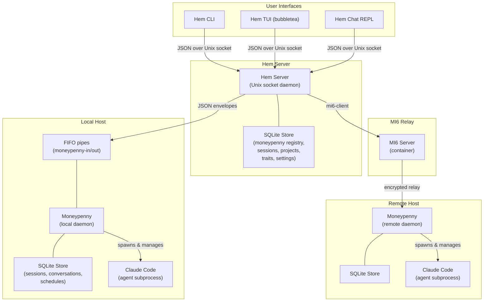
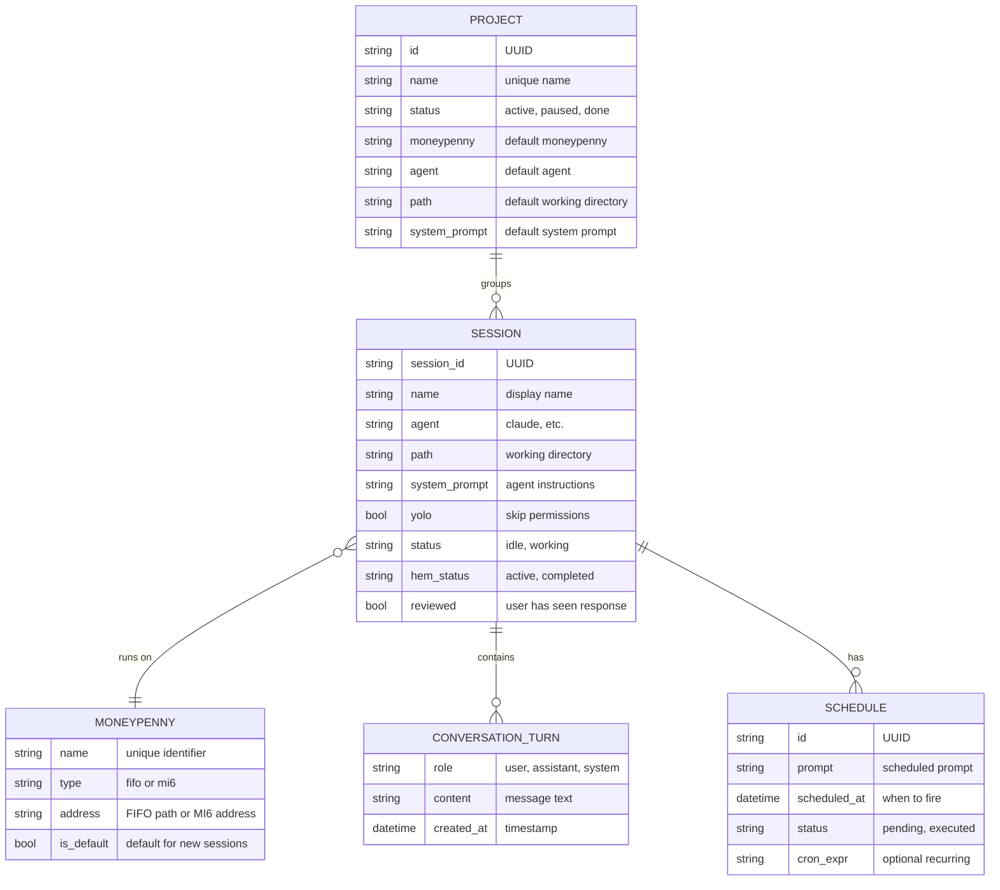

We are building James, a set of tools used to orchestrate agents (see the pun yet?).

# Some basic requirements

- Keep track of technical decisions in an ARCHITECTURE.md file. Always check if it needs updates
- Keep the spec up to date, I might ask you to do changes out of the spec, they should be reflected here.

# Architecture Overview

Alongside the operator interfaces, v1.78.0 adds the `gadgets` agent client.
Each Moneypenny hosts its session-scoped loopback endpoint and a separate
`<sessionDir>/memory.db` per session; these memory databases are distinct from
the operational stores shown below. Only cross-agent operations route back
through Hem. Local memory, schedules, and notifications stay in Moneypenny.


```mermaid
graph TB
    subgraph "User Interfaces"
        CLI["Hem CLI"]
        TUI["Hem TUI (bubbletea)"]
        CHAT["Hem Chat REPL"]
    end

    subgraph "Hem Server"
        SERVER["Hem Server<br/>(Unix socket daemon)"]
        SQLITE_HEM["SQLite Store<br/>(moneypenny registry,<br/>sessions, projects,<br/>traits, settings)"]
    end

    CLI -->|"JSON over Unix socket"| SERVER
    TUI -->|"JSON over Unix socket"| SERVER
    CHAT -->|"JSON over Unix socket"| SERVER
    SERVER --- SQLITE_HEM

    subgraph "Local Host"
        MP_LOCAL["Moneypenny<br/>(local daemon)"]
        FIFO["FIFO pipes<br/>(moneypenny-in/out)"]
        SQLITE_MP1["SQLite Store<br/>(sessions, conversations,<br/>schedules)"]
        AGENT1["Claude Code<br/>(agent subprocess)"]
    end

    SERVER -->|"JSON envelopes"| FIFO
    FIFO --- MP_LOCAL
    MP_LOCAL --- SQLITE_MP1
    MP_LOCAL -->|"spawns & manages"| AGENT1

    subgraph "Remote Host"
        MP_REMOTE["Moneypenny<br/>(remote daemon)"]
        SQLITE_MP2["SQLite Store"]
        AGENT2["Claude Code<br/>(agent subprocess)"]
    end

    subgraph "MI6 Relay"
        MI6_SERVER["MI6 Server<br/>(container)"]
    end

    SERVER -->|"mi6-client"| MI6_SERVER
    MI6_SERVER -->|"encrypted relay"| MP_REMOTE
    MP_REMOTE --- SQLITE_MP2
    MP_REMOTE -->|"spawns & manages"| AGENT2
```

# Concepts


```mermaid
erDiagram
    PROJECT ||--o{ SESSION : "groups"
    SESSION }o--|| MONEYPENNY : "runs on"
    SESSION ||--o{ CONVERSATION_TURN : "contains"
    SESSION ||--o{ SCHEDULE : "has"

    MONEYPENNY {
        string name "unique identifier"
        string type "fifo or mi6"
        string address "FIFO path or MI6 address"
        bool is_default "default for new sessions"
    }

    PROJECT {
        string id "UUID"
        string name "unique name"
        string status "active, paused, done"
        string moneypenny "default moneypenny"
        string agent "default agent"
        string path "default working directory"
        string system_prompt "default system prompt"
    }

    SESSION {
        string session_id "UUID"
        string name "display name"
        string agent "claude, etc."
        string path "working directory"
        string system_prompt "agent instructions"
        bool yolo "skip permissions"
        string status "idle, working"
        string hem_status "active, completed"
        bool reviewed "user has seen response"
    }

    CONVERSATION_TURN {
        string role "user, assistant, system"
        string content "message text"
        datetime created_at "timestamp"
    }

    SCHEDULE {
        string id "UUID"
        string prompt "scheduled prompt"
        datetime scheduled_at "when to fire"
        string status "pending, executed"
        string cron_expr "optional recurring"
    }
```

# MI6

MI6 is a transport abstraction that allows, by creating a central place that all hosts can reach, to communicate between these hosts.

- We'll have agents running remotely. They checking in to their boss through MI6.
- MI6 is simply a delocalized proxy where agents can check-in. It serves as transport.
- It is composed of two pieces: a local client `mi6-client` that connects to a unique, remote server `mi6-server`. Mi-6 server will run in a container somewhere.
- The server emits a keepalive ping every 60 seconds. `mi6-client` requires inbound traffic within 2m15s; when a TCP connection remains established but stops delivering relay frames, its read deadline expires and the client exits. Moneypenny detects that child exit and reconnects, preventing a half-open relay from indefinitely blocking requests.
- It is built using golang.
- mi-6 client opens a session to mi6-server. That session is authenticated using ssh-keys, and has a session-id determined by the client.
- mi-6 server has a list of authorized_keys, we should support ecdsa and rsa.
- communication between client and server is encrypted using the ssh-key, with per-message gzip compression negotiated during handshake
- 2 or more clients will open the same session on mi-6 server, then communicate through it.
- Communication on the client happens through stdio. Client should batch some of the text coming through stdin, then send to the server. Server then broadcasts to all _other_ connected clients to their stdout.
- James JSON transports invoke `mi6-client --line-mode`: each complete newline-delimited envelope is one MI6 frame, never a size/idle-triggered partial chunk. This prevents concurrent senders or mid-response joins from corrupting conversation JSON. Raw MI6 stream batching remains the default for other callers. Line mode rejects incomplete EOF records and records larger than 15 MiB minus 64 bytes of framing headroom. Upgrade the local `mi6-client` alongside Hem, Moneypenny, and Qew; no relay-server protocol change is required. Mixed old/new senders can still emit partial records until all James endpoints are upgraded.
- For the client, let's support `mi6-client mi6.servername.com/session_id` as a valid command, in addition to flags.
- We should be able to pass the ECDSA key as environment variable to mi6-client, or directly in a `--key-value` path.
- Add a `--generate-key` that generates a key.

## MI6 Admin Key Management

MI6 supports remote management of `authorized_keys` through an admin channel:

- An `admin_keys` file (same OpenSSH format) is placed alongside `authorized_keys` on the server. Keys in this file have admin access.
- Admin clients connect to MI6 and join the special `__admin__` session. The server verifies the client's key is in `admin_keys` before allowing admin commands.
- Admin commands use JSON over MsgData:
  - `list_keys`: Lists all authorized keys with fingerprints, types, and comments
  - `add_key`: Adds a new key to `authorized_keys` (atomic write + automatic reload)
  - `delete_key`: Removes a key by SHA256 fingerprint (atomic write + automatic reload)
- The mi6-client supports `--admin-command JSON` flag for single-shot admin requests.
- Every MI6 client connection requires an explicit `--server-fingerprint SHA256:...` pin for the relay's server key. This prevents an unattended first connection from trusting an attacker-controlled key. Clients retain a `known_hosts` record as a secondary local key-change check; obtain a previously trusted value without connecting with `mi6-client --display-server-fingerprint --server HOST:PORT`.
- The `MI6_SERVER_FINGERPRINT` environment variable supplies the same pin for Hem's direct `--hem` connections and MI6 key-administration commands, and for the James and Moneypenny Docker entrypoints. The direct `hem --mi6-server-fingerprint SHA256:... --hem ADDRESS …` flag overrides it.
- Existing MI6 Moneypenny registrations created before per-Moneypenny fingerprints were introduced use Hem's `MI6_SERVER_FINGERPRINT` as a migration fallback. An explicitly saved Moneypenny fingerprint always takes precedence; re-save each registration with its own pin when it connects to a different relay.
- Hem exposes admin commands:
  - `hem list mi6-keys [--mi6 ADDRESS]` — list authorized keys
  - `hem add mi6-key KEY_LINE [--mi6 ADDRESS]` — add a key
  - `hem delete mi6-key FINGERPRINT [--mi6 ADDRESS]` — remove a key
- Both `authorized_keys` and `admin_keys` are hot-reloaded on SIGHUP.

# Moneypenny

Moneypenny is a client deployed on each host, which handles agent sessions. It is built using Go.

- Interfacing is done using stdio. Commands are sent to Moneypenny using stdin, and it outputs responses on stdout.
- Session-list, session-detail/history/activity, schedule/channel-list, version, daemon-log, and update-status reads have dedicated workers. They do not wait behind shell commands, Git operations, model discovery, or other slow handlers. Mutations remain ordered; requests and replies are correlated by `request_id`, not arrival order. Queues are bounded and overload returns an explicit retryable error rather than blocking command intake.
- Hem's MI6 transport permits concurrent requests and accepts only response envelopes matching each request's unique ID. The local FIFO client still serializes request/response exchanges over its shared pipe.
- `-v` flag enables verbose logging to stderr: commands received, agent executions, responses sent.
- Moneypenny can either interface directly on stdio (for local use), or open a connection to an mi6-server. `moneypenny --mi6 mi6.servername.com/this_hosts_name` ; using host name as the session id.
- Moneypenny has a local store based on sqlite, to keep track of everything it needs (sessions, conversation history, parameters).
- When integrating through mi6, moneypenny creates an ECDSA ssh-key, stores it locally, and uses that to authenticate with mi6. Use `moneypenny --show-public-key` to output the public key for adding to an mi6-server's authorized_keys.
- We'll be using a protocol based on json envelopes for commands and responses:
  - Request: `{ "type": "request", "method": "method_name", "request_id": "id", "data": {} }`
  - Success response: `{ "type": "response", "status": "success", "request_id": "id", "data": {} }`
  - Error response: `{ "type": "response", "status": "error", "request_id": "id", "error_code": "ERROR_CODE", "data": { "message": "human-readable description" } }`
- Standardized error codes:
  - `SESSION_NOT_FOUND` - session_id does not exist
  - `SESSION_ALREADY_EXISTS` - create_session with a session_id that already exists
  - `SESSION_NOT_IDLE` - continue_session when session is in working state
  - `SESSION_NOT_WORKING` - stop_session when session is not in working state
  - `AGENT_NOT_FOUND` - the requested agent binary (e.g. claude) is not installed
  - `INVALID_PATH` - the provided path does not exist
  - `AGENT_ERROR` - the agent subprocess crashed or returned an error
  - `INVALID_REQUEST` - malformed command or missing required fields
  - `SCHEDULE_NOT_FOUND` - cancel_schedule with a schedule_id that does not exist
  - `INTERNAL_ERROR` - unexpected internal error

### Agent Support

Moneypenny supports multiple agent types:

- **claude** (default): Claude Code CLI. Uses `--output-format json --session-id <id> -p <prompt>`. System prompt via `--system-prompt`. Permissions via `--dangerously-skip-permissions`. New sessions use bare flags, continuations add `--continue`. Long (>4 KB), `-`-prefixed, or **multi-line** prompts are piped via stdin (bare `-p`) instead of inline, so they survive the Windows `cmd.exe` shim's first-newline command-line truncation.
- **copilot**: GitHub Copilot CLI. Uses `--resume <id> -s` for both new and continued sessions, with the prompt piped via stdin (not `-p`). Permissions via `--yolo`. JSON stream output. No system prompt flag — system prompt is written to an instructions file referenced by `COPILOT_CUSTOM_INSTRUCTIONS_DIRS`.

The copilot prompt is delivered on stdin rather than as an inline `-p` value. On Windows, npm installs `copilot` as a `.cmd`/`.ps1` batch shim that Go runs through `cmd.exe`, which truncates the command line at the first newline — a multi-line `-p` prompt loses everything after its first line (observed as agents receiving only the first line of review comments). Copilot reads its prompt from a non-TTY stdin when `-p` is omitted, so piping the prompt sidesteps argv entirely and preserves multi-line content (also avoids the Windows ~32KB argv limit). The `@file` form is not usable — copilot treats `@` as an attachment, not prompt text.

When Copilot emits a terminal `result` event and a non-empty final answer, Moneypenny records the completed answer even if the Copilot subprocess exits non-zero. Empty, incomplete, or stream-corrupt runs remain errors, so a process exit is recovered only after a valid completed response.

#### Context tier

Copilot exposes a **context-window tier** via the `--context <tier>` CLI flag, with values `default` (the standard window) and `long_context` (the 1M-token window). This is a copilot-native mechanism — the long-context variants are *not* separate `--model` identifiers (the `-1m` model ids copilot lists are rejected as `--model` values); the same model id is combined with `--context long_context` to raise its `max_context_window_tokens` (e.g. `copilot --model claude-sonnet-5 --context long_context` → 1,000,000). Moneypenny appends `--context <tier>` to both the one-shot and interactive copilot arg builders whenever a non-empty tier is set (persisted per session or supplied as a per-prompt override); an empty tier appends nothing (agent default). Claude has no equivalent and ignores the setting. The tier is stored per session (`sessions.context_tier`), can be overridden per prompt (`continue_session`/`queue_prompt` `context_tier`, persisted on `prompt_queue.context_tier`), and is surfaced end-to-end through the `--context` CLI flag and the TUI/Qew forms and per-conversation override pickers.


Method: **create_session**: creates a new session with an agent. Format of the data is `{ "agent": "claude", "system_prompt": "a system prompt for the agent", "yolo": boolean indicating if the session should be started with --dangerously-skip-permissions, "prompt": "prompt for the agent", "session_id": "GUID used for communication about that session id", "name": "a session name", "path": "the path where to start the agent" }`

- If session_id already exists, return `SESSION_ALREADY_EXISTS` error.
- When a new session is started, moneypenny saves all the parameters in its local storage, and invokes the agent following the parameters in data of the method.
- It requests output-format to be json, invokes the corresponding agent with the correct parameters.
- When invoking claude, it uses the session_id passed by the caller as session id.
- It waits for the response, then saves it in its local store and sends back the text response wrapped in the response envelope.
- Moneypenny should keep track of a session state, notably: working, when a prompt was sent to the agent and we are waiting for the response ; and idle, when the response was received.

Method: **continue_session**: continues a session that was started with an agent. Data for the request contains the session_id and the new prompt to send to the agent: `{ "session_id": "id", "prompt": "the new prompt" }`. It may also carry optional `model`, `effort`, and `context_tier` fields — temporary per-prompt overrides that win over the session's stored values when non-empty (empty = use the session default). The same optional fields are accepted by **queue_prompt** and are persisted on the queued prompt (in `prompt_queue.model`/`effort`/`context_tier`) so an override chosen while the session is busy is still honored when the queue drains. `context_tier` is copilot-only (`default`/`long_context`); see [Context tier](#context-tier).

- Moneypenny then simply runs the prompt, using the session_id to continue the conversation. It reuses the parameters previously sent when session was created.
- Moneypenny should reject continue_session commands when the session is not idle (`SESSION_NOT_IDLE` error).

Method: **list_sessions**: returns the list of sessions, with their respective status, name and ids.

Method: **get_session**: returns details about the provided session_id, including all parameters, status, and all prompts and responses (stored in sqlite).

Method: **delete_session**: deletes a session. If it is in working state, the agent subprocess is killed first.

Method: **stop_session**: stops the agent subprocess for a working session. Session state goes back to idle, allowing continue_session to be called afterwards. Returns `SESSION_NOT_WORKING` error if session is not in working state.

Method: **update_session**: updates session parameters. Data: `{ "session_id": "id", "name": "new name", "system_prompt": "new prompt", "yolo": true, "path": "/new/path" }`. Only non-nil fields are updated.

Method: **queue_prompt**: queues a prompt for a session that is currently working. Data: `{ "session_id": "id", "prompt": "the prompt to queue" }`. When the agent finishes, moneypenny drains the queue and continues with all queued prompts. Each queued prompt is stored as its own conversation turn, but they are joined and sent to the agent as a single combined prompt.

Method: **import_session**: creates a session with pre-existing conversation history without running an agent. Data: `{ "session_id": "id", "name": "name", "agent": "claude", "path": "/path", "conversation": [{"role": "user", "content": "..."}, ...] }`. Used by `hem import session`.

Method: **summarize_session**: asks the moneypenny to compact the session's conversation history into a standalone summary by invoking an agent as a one-shot over the full transcript. Data: `{ "session_id": "id" }`, plus optional agent overrides `{ "agent", "model", "effort", "context_tier", "yolo" }` — when present these replace the session's own agent parameters for the one-shot (used by `hem copy session` so a duplicate targeting a different agent summarizes with the *target* agent rather than the source's, which matters when the source agent is unavailable). Omitted/empty override fields fall back to the source session's value; when the `agent` override is set, `model`/`effort`/`context_tier` are taken only from the overrides (not carried from the source, since they belong to a different model namespace). Returns `{ "session_id": "id", "summary": "..." }`. An empty transcript returns `summary: ""`. Used by `hem summarize session` and by `hem copy session` to bootstrap the new session's prompt. Internally reuses the same `CompactSession` helper used by the agent-side recovery path (when the upstream agent reports its session is lost); the recovery path passes no overrides, so it still uses the session's own agent.

Method: **git_diff**: runs `git diff` and `git diff --cached` in a session's working directory. Data: `{ "session_id": "id" }`. Returns `{ "diff": "..." }`.

Method: **git_commit**: stages changes and commits in a session's working directory. Data: `{ "session_id": "id", "message": "commit message", "amend": false, "no_edit": false, "files": ["path", ...] }`. Runs `git add -A` then `git commit -m` (or `git commit --amend -m` when `amend`, or `git commit --amend --no-edit` when `amend` and `no_edit` — which reuses the previous commit message, so no message is required). When `files` is non-empty, only those pathspecs are staged and committed (`git add -- <files>` then `git commit … -- <files>`) instead of `git add -A`, so a partial commit of just the listed files is made. Returns `{ "output": "..." }`.

Method: **git_branch**: creates and switches to a new branch in a session's working directory. Data: `{ "session_id": "id", "branch": "branch-name" }`. Runs `git checkout -b`. Returns `{ "output": "..." }`.

Method: **git_push**: pushes the current branch to origin in a session's working directory. Data: `{ "session_id": "id" }`. Runs `git push -u origin <current-branch>`. Returns `{ "output": "..." }`.

Method: **execute_command**: executes a shell command on the host. Data: `{ "command": "the shell command to run", "path": "/optional/working/directory" }`. Runs the command via `sh -c` in the specified path (or moneypenny's current directory if path is empty). Returns `{ "output": "combined stdout+stderr", "exit_code": 0 }`. Non-zero exit codes are returned in the response (not as errors). Only returns an error envelope if the command fails to execute at all (e.g., path doesn't exist).

Method: **schedule**: creates a scheduled continuation for a session. Data: `{ "session_id": "id", "prompt": "the prompt to send", "at": "RFC3339 timestamp or relative duration" }`. The `at` field accepts RFC3339 timestamps, relative durations (`+2h`, `+30m`), local time (`YYYY-MM-DD HH:MM`, `HH:MM`). Returns `{ "schedule_id": "id", "scheduled_at": "RFC3339 timestamp" }`. When the scheduled time arrives: if the session is idle, continues directly; if the session is busy, queues the prompt via `queue_prompt`.

Method: **list_schedules**: lists pending schedules for a session. Data: `{ "session_id": "id" }`. Returns `{ "schedules": [{ "schedule_id": "id", "prompt": "...", "scheduled_at": "RFC3339", "created_at": "RFC3339" }, ...] }`.

Method: **cancel_schedule**: cancels a pending schedule. Data: `{ "session_id": "id", "schedule_id": "id" }`. Returns success if the schedule existed and was removed. Returns `INVALID_REQUEST` if the schedule_id is not found.

Method: **update_schedule**: edits a pending schedule in place (preserving its ID). Data: `{ "schedule_id": id, "prompt": "...", "scheduled_at": "RFC3339", "cron_expr": "...", "reply_channel_id": id }`. Validates that the schedule exists and is pending (else `INVALID_REQUEST`) and that any cron expression parses, then updates prompt, next-run time, cron, and reply channel. Emits a `chat_schedule` notification with `action: "updated"`.

Method: **list_models**: returns available models for a given agent type. Data: `{ "agent": "claude" }`. Returns `{ "agent": "claude", "models": [{ "name": "sonnet", "value": "sonnet" }, ...] }`. For Claude, returns hardcoded known aliases (sonnet, opus, haiku). For Copilot, runs a one-shot agent query (`copilot -p … --model auto --log-level debug --log-dir <tmp>`) and parses the model ids from the agent's **stdout answer**, validated against a strict id regex (`^[a-z][a-z0-9.]*-[a-z0-9.-]+$`) so prose/footer lines are dropped. (Earlier builds parsed a `Listed models:` debug-log line, but copilot ≥1.0.69 no longer emits it or any structured catalog in the debug log; the stdout answer is now the robust primary, with the log parse retained only as a best-effort source of display names.) Embedding models are filtered out. The query is slow (~10-20s), so the result is memoized inside moneypenny for 24h. Hem caches the response persistently on top of this; see [Model cache](#model-cache). The `value` field is the CLI parameter to pass to `--model`; if empty, `name` is used.

Method: **list_directory**: lists entries in a directory. Data: `{ "path": "/some/path" }`. Returns `{ "path": "/some/path", "entries": [{ "name": "foo", "is_dir": true }, ...] }`. Hidden files (starting with `.`) are excluded. Defaults to `/` if path is empty.

Method: **create_directory**: creates a new directory (including missing parents). Data: `{ "path": "/parent", "name": "newfolder" }` — `name` is created inside `path`; if `name` is omitted, `path` itself is created. `~`/`~/` is expanded to the moneypenny's home. Folder names containing `/`, `\`, `..`, or `.` are rejected. Returns `{ "path": "/parent/newfolder" }` with the resolved absolute path. Exposed via the hem CLI `create-directory` verb (`-m`/`--path`/`--name`).

Method: **get_version**: returns the version of moneypenny

Method: **get_logs**: returns the newest lines from Moneypenny's configured daemon log. Data: `{ "lines": 100 }`; `lines` defaults to 100 and must be between 1 and 10,000. Returns `{ "content": "...", "lines": 100, "truncated": false }`. To keep transport responses bounded, Moneypenny reads at most the final 2 MiB of the file; `truncated` is true when older bytes were omitted. Hem exposes this as `hem logs moneypenny -n NAME [--lines N]`, which works through FIFO and MI6 transports. The configured Windows `--log-file` is used directly; Unix service installations use their default service log path. Windows service installation writes the full Moneypenny command to `moneypenny-service.cmd`, a short `moneypenny-service.vbs` launcher, and a Task Scheduler definition in the configured data directory. On an unexpected nonzero exit, the wrapper snapshots the completed daemon log as `crash-logs/moneypenny-crash-YYYYMMDD-HHMMSS-exit-N.log` before Task Scheduler restarts it; the ten newest snapshots are retained. The launcher propagates Moneypenny's exit code; Task Scheduler restarts unexpected nonzero exits after one minute (up to 999 times) and has no execution-time limit. The definition is UTF-16LE with a BOM—the native Task Scheduler XML encoding—so `schtasks` does not fail on installations that reject UTF-8 task files. A clean zero exit, including an auto-update handoff, is not restarted. Its hidden-window mode runs the command without a visible console while retaining MI6 pin and auto-update settings.

Moneypenny session IDs must be canonical UUIDs. This validation applies to create and import requests before storage and to persistent session-directory operations. Session directories are additionally resolved relative to the configured sessions root and rejected if they could escape it.

Moneypenny rotates its daemon log in place: it checks at startup and then every minute. When the log reaches 10,000 lines, it removes its oldest 1,000 lines and retains the newest 9,000. In-place rewriting preserves active stdout/stderr handles, including those inherited by agent subprocesses.

Memory: Each session has authoritative hierarchical memory in `<sessionDir>/memory.db`, separate from Moneypenny's operational database. Agents use the session-scoped `gadgets memory` commands; Hem CLI/TUI/Qew management commands use the same SQLite APIs. Each invocation injects only the bounded root note, not the whole tree. See [Session Memory](#session-memory) and [Gadgets Platform](#gadgets-platform-v1780).

Local deployment: add a `--local` convenience flag that allows moneypenny to run in local mode through fifo.

- We invoke moneypenny with `--fifo FOLDER` or `--local` (defaults to `~/.config/james/moneypenny/fifo`)
- Moneypenny creates two fifo, `moneypenny-in` and `moneypenny-out`
- Then it uses these fifo to get input and produce output

Versioning: A single `VERSION` file at the project root is the source of truth for all components (mi6, moneypenny, hem). Semver format (e.g. `0.1.0`). The version is injected at compile time via Go's `-ldflags "-X main.Version=..."`. Each component's Makefile reads from `VERSION`. Bump minor for new features, patch for fixes. All components display their version on startup (moneypenny, hem server, mi6-server log it; hem TUI shows it in the status bar). `hem version` and `hem --version` print the local client version without attempting a Unix-socket or MI6 connection, so they remain available when remote connection configuration is incomplete.

# Hem

Hem handles the overall agent management. It connects to all its moneypenny instances, sends work there, and retrieve the work result. It acts as an interface for all of them. It is built using Go.

## Architecture: Client/Server

Hem uses a client/server architecture over a Unix domain socket (`~/.config/james/hem/hem.sock`).

- **Hem Server** (`hem server`): A long-running daemon that owns the SQLite store, moneypenny transport connections, and all orchestration logic. It listens on the Unix socket and processes requests.
- **Hem CLI** (all other commands): A thin client that parses the command, sends a JSON request to the server over the Unix socket, receives the response, and formats the output.
- The server must be running for any command to work. If the server is not running, the CLI prints an error.
- This architecture allows the server to maintain persistent state, open connections, and handle async operations, while the CLI is lightweight and stateless.
- Future clients (UI, web) can connect to the same socket.

### Internal protocol (over Unix socket)

Line-delimited JSON, one request/response per connection:
- Request: `{ "verb": "create", "noun": "session", "args": ["prompt text", "--name", "test"] }`
- Success response: `{ "status": "ok", "data": { ... } }`
- Error response: `{ "status": "error", "message": "human-readable error" }`
- `data` is always structured JSON. The CLI formats it according to `--output-type`.

## General

- Hem is a cli tool
- It uses commands with verbs and names, similar to kubectl, e.g. `hem add moneypenny`, `hem create session`, `hem list sessions`, etc. All names should support singular and plural for all verbs (eg both `hem add moneypenny` and `hem add moneypennies` are correct)
- For all commands we can specify an `--output-type` or `-o` which might be either `json`, `text`. If the expected output is a table, we can specify `tsv` or `table` (formats as table)
- The server stores state in a sqlite instance (moneypenny registry, session-to-moneypenny mapping).
- For MI6 transport, hem auto-generates an ECDSA SSH key (same approach as moneypenny), stored in its data directory. Use `hem show-public-key` to output the key for adding to mi6-server's authorized_keys.
- `hem set-default moneypenny -n NAME` sets the default moneypenny. Session commands use this default when `-m` is not specified.
- `hem set-default agent VALUE` sets the default agent (used by `create session` when `--agent` is not specified, fallback: `claude`).
- `hem set-default path VALUE` sets the default working directory (used by `create session` when `--path` is not specified, fallback: `.`).
- `hem set-default server --hem HOST/SESSION` sets the default hem server to connect via MI6. `hem set-default server --local` resets to local Unix socket (the default).
- `hem get-default agent|path|moneypenny|server` shows the current default for a given key.
- `hem list defaults` shows all configured defaults.
- The `--local` global flag forces local Unix socket connection, overriding any stored default server.
- **Timestamps** are transmitted as raw UTC RFC3339 (`2006-01-02T15:04:05Z`) in all table results (dashboard, session list, subsessions) and chat turns; localization to the viewer's timezone happens at each display layer (the CLI table printer, the hem TUI, and the qew browser) — never on the server, whose process timezone may differ from the user's.

## Server

`hem start server [-v]` — starts the hem server daemon.

- The server listens on a Unix domain socket at `~/.config/james/hem/hem.sock`.
- `-v` enables verbose logging to stderr (requests received, responses sent).
- The server must be running before any other command can be used.
- On shutdown (SIGINT/SIGTERM), the server removes the socket file and exits cleanly.
- Only one server instance can run at a time (binding to the socket fails if another is already running).

## Moneypenny management

Hem has a list of moneypennies it can use. Each instance has a unique name and a transport reference (FIFO or MI6).

### Add

`hem add moneypenny --name|-n NAME [flags]`

- Name must be unique.
- Add a local moneypenny:
    - Local instances use FIFO for communication.
    - `--local` uses the default FIFO path (`~/.config/james/moneypenny/fifo`)
    - `--fifo-folder FOLDER` (expects `moneypenny-in` and `moneypenny-out` in FOLDER)
    - Or `--fifo-in INPUT_FIFO` and `--fifo-out OUTPUT_FIFO` for custom paths.
- Add an MI6 moneypenny:
    - `--mi6 mi6.server.example.com/session_id`
- A transport reference (FIFO or MI6) is required.
- On add, hem validates connectivity by calling `get_version` on the moneypenny.

Example: `hem add moneypenny -n local --fifo-folder ~/moneypenny-fifo`

### List

`hem list moneypennies` — lists all moneypennies with name, type (fifo/mi6), and connection info.

### Ping

`hem ping moneypenny -n NAME` — pings a moneypenny using `get_version`, displays version and round-trip time.

### Remove / Delete

`hem remove moneypenny -n NAME` or `hem delete moneypenny -n NAME` — removes the reference.

### Set default

`hem set-default moneypenny -n NAME` — sets the default moneypenny for session commands.

## Auto-Update

Moneypenny can self-update from GitHub releases when started with `--auto-update`.

### How it works

1. **Check**: A background goroutine periodically checks the GitHub Releases API (`/repos/cfe84/james/releases/latest`) for newer versions. Default interval: 1 hour, configurable via `--update-interval`.
2. **Download**: Downloads the platform-appropriate archive (e.g. `james-darwin-arm64.tar.gz`) and extracts `moneypenny` and `mi6-client` binaries to a staging directory (`~/.config/james/moneypenny/updates/VERSION/`).
3. **Wait for idle**: Polls session statuses every 30 seconds. Proceeds only when all sessions are idle (not working).
4. **Install & restart**: On Unix, atomically replaces the running binary and `mi6-client`, then re-execs itself with the same arguments. On Windows, a staged update helper performs the replacement after the daemon exits and releases its executable lock. Before either restart path, Moneypenny cancels background workers and closes its SQLite store so the replacement cannot race the old process's WAL mapping. MI6 reconnect and FIFO setup re-establish naturally.

Before downloading an archive, Moneypenny verifies the detached Ed25519 signature on
`james-manifest.json`, confirms that its version matches the release tag, and checks the
selected archive's SHA-256 digest against the signed manifest. An update is rejected and
not extracted when any check fails. The release workflow also retains Authenticode signing
for Windows executables. Successful manifest-signature and archive-digest validations are
recorded in the Moneypenny log before staging.

On Windows, the staged archive contains `moneypenny-update-helper.exe`. Moneypenny
starts this helper and exits after staging; the helper waits for the original process
to release Windows' executable lock, replaces Moneypenny and `mi6-client`, then starts
Moneypenny with its original arguments.

### Windows release signing

Windows release archives contain Authenticode-signed executables. The release workflow builds the
Windows archive, then a dedicated Windows signing job authenticates to Azure Artifact Signing through
GitHub OIDC in the `artifact-signing` GitHub environment, signs every `.exe` with the public-trust
certificate profile, verifies each signature, and publishes only the verified signed ZIP. No signing
private key or long-lived Azure credential is stored in the repository.

### Flags

- `moneypenny --auto-update` — enable automatic updates (default: off)
- `moneypenny --update-interval 1h` — check frequency (default: 1h)

### Release signing key generation

`hem generate release-keypair [--output-dir DIR]` generates a new Ed25519 release
signing keypair without contacting the hem server. It writes a base64 public key,
the raw 64-byte private key, and the base64-encoded private key suitable for the
`JAMES_RELEASE_SIGNING_KEY` GitHub Actions secret. Existing files are never
overwritten; the default output directory is the current directory.

### Per-agent environment variables

`hem create session --env NAME=VALUE ...` assigns repeatable, per-session
environment variables to the created agent. `hem update session SESSION_ID --env
NAME=VALUE ...` replaces that session's complete environment-variable set. Names
must be valid portable environment variable identifiers; values may contain `=`.
Variables are stored on Moneypenny and injected only into the agent subprocess.
They are excluded from session lists and Moneypenny logs, but are returned to
authenticated session-edit clients so values can be reviewed or replaced. This permits
agent-specific configuration such as `PLAYWRIGHT_MCP_EXTENSION_TOKEN` without
changing the Moneypenny service environment.

### Protocol

Method: **update_status**: returns the current auto-update state. Data: `{}`. Returns `{ "current_version": "0.10.3", "latest_version": "0.10.3", "update_available": false, "status": "up_to_date|checking|downloading|staged|waiting_idle|restarting|error|disabled", "last_checked": "2026-03-19T12:00:00Z", "error": "" }`. Returns `status: "disabled"` when `--auto-update` is not enabled.

## Model cache

`hem list_models` against copilot is slow (~10-20s) because moneypenny shells out to `copilot -p` (with debug logging) to enumerate models. Hem persists the result in its SQLite to make subsequent calls instant.

Schema (`model_cache` table):

| column        | description                                            |
|---------------|--------------------------------------------------------|
| `moneypenny`  | Moneypenny name (separate cache per host)              |
| `agent`       | `claude` or `copilot`                                  |
| `models_json` | JSON-encoded `[]{ "name", "value" }`                   |
| `cached_at`   | timestamp of last refresh                              |
| PRIMARY KEY   | (moneypenny, agent)                                    |

### `hem list-models [-m MP] [--agent AGENT] [--refresh]`

- Default (no `--refresh`): if a cache row exists, returns it immediately and fires an opportunistic background refresh (rate-limited; see below). If no row exists, queries the moneypenny synchronously and writes the result.
- `--refresh`: bypasses the cache read and the rate limit. Always queries the moneypenny.
- JSON output (`-o json`) carries `cached` (bool) and `cached_at` (RFC3339) so consumers can distinguish fresh vs cached responses.

### `hem refresh-models [-m MP] [--agent AGENT]`

Forces a moneypenny query and overwrites the cache. Returns a short confirmation (`Refreshed model cache for MP/AGENT: N models`) — call `hem list-models --refresh -o json` if you need the full list. Unlike the cache-miss path of `list-models`, this verb writes the result even when empty, so users can recover from a permanently revoked source.

### Background warmup

Every successful session-creation verb (`create session`, `create subsession`, `copy session`) kicks off an asynchronous `asyncRefreshModelCache(mp, agent)` after the moneypenny accepts the create. This keeps the cache warm without paying the latency on the user's critical path. `continue session` does NOT warm the cache (it doesn't know the agent from the session ID alone); users who only continue sessions for an extended period will still pay the cold-query cost the next time they open the wizard.

### Refresh floor and in-flight de-duplication

Two protections keep the slow copilot query from being hammered:

- **60s floor**: a background refresh is a no-op if the cache row is younger than 60 seconds.
- **In-flight de-dupe**: a `sync.Map` tracks active refreshes per `(moneypenny, agent)` pair. If a refresh is already running, subsequent calls in the same window are skipped entirely (rather than racing on the floor check and all firing concurrent slow queries).

`--refresh` and `refresh-models` bypass both protections.

### Empty-response handling

`fetchModelsFromMoneypenny` returns the raw moneypenny response. Whether the empty result is persisted depends on the call site:

- **Background warmup**: empty is treated as a transient failure; the previous cache row survives.
- **`list-models` cache miss (no `--refresh`)**: same — empty isn't written, next call retries the moneypenny.
- **`list-models --refresh`** / **`refresh-models`**: empty IS written. The user explicitly asked for the current state; if access has been revoked, the cache should reflect that.

### Invalidation

- Cache rows are dropped when a moneypenny is deleted (`DeleteMoneypenny`).
- No TTL — rows live until explicitly refreshed or the moneypenny is removed. The background warmup keeps them current.

## Sessions

Hem manages sessions on moneypennies. It tracks which moneypenny each session lives on in its local SQLite. By default, session commands wait for the agent to complete; use `--async` to return immediately.

### Session hierarchy

- `hem adopt session SESSION_ID --parent PARENT_SESSION_ID` makes a tracked session a sub-session. Both must belong to the same Moneypenny; self-parenting and hierarchy cycles are rejected.
- `hem promote session SESSION_ID` clears its parent relationship and makes the sub-session top-level. Its own children remain attached.
- Both operations affect only Hem's tracking relationship: no agent process is restarted and session history, memory, schedules, and configuration are unchanged. Qew exposes matching **Make Subsession** and **Make Top-Level** actions; making a subsession presents an eligible parent-session picker.

### Updates

The v1.78.0 build, install, release archives, and Moneypenny auto-updater include the new `gadgets` binary. Auto-update stages the matching `moneypenny`, `mi6-client`, `hem`, and `gadgets` companions and installs `gadgets` even when upgrading an installation that does not yet have it. Agent tools use this client, not an embedded Hem command prefix.

When Qew registers a remote Moneypenny, its MI6 address defaults to the relay endpoint from the current Hem server's configured MI6 control connection, leaving its final session segment for the new Moneypenny. Its relay fingerprint is also prefilled. Both defaults remain editable.

### Non-interactive service installation

`moneypenny install --non-interactive` provisions a service without prompts. It requires exactly one service level (`--user` or `--system`) and exactly one transport (`--local` or `--mi6 HOST/SESSION`). MI6 installation additionally requires `--mi6-server-fingerprint SHA256:...`. Optional flags are `--auto-update`, `--update-interval DURATION`, `--data-dir PATH`, `--log-file PATH`, `--verbose`, and `--force`; `--force` is required to replace an existing service at the selected level.

Example:

```sh
moneypenny install --non-interactive --user \
  --mi6 mi6.example.com/my-host \
  --mi6-server-fingerprint SHA256:YOUR_RELAY_FINGERPRINT \
  --auto-update --update-interval 1h
```

### Create

`hem create session -m|--moneypenny NAME PROMPT [flags]`

- `-m` is optional if a default moneypenny is set.
- Hem generates a session_id (UUID) and sends `create_session` to the moneypenny.
- By default: waits for the agent to complete, prints the session_id and the response.
- With `--async`: prints the session_id and returns immediately without waiting.
- Flags: `--agent NAME` (default "claude"), `--name NAME` (session name, default empty), `--nick NICK` (optional short nickname/alias, see [Nicknames](#nicknames)), `--system-prompt TEXT`, `--traits ID1,ID2` (apply reusable traits, see Traits; when omitted, default-enabled traits are applied), `--yolo` (skip permissions), `--path PATH` (working directory for the agent), `--gadgets` (include James tooling instructions in system prompt), `--model VALUE` (agent model), `--effort VALUE` (reasoning effort), `--context VALUE` (copilot context-window tier, see [Context tier](#context-tier)).
- `--gadgets`: Appends a minimal daemon-managed notice; Moneypenny supplies capability-filtered `gadgets` instructions at runtime, never direct Hem commands. Hem injects trusted daemon routing metadata on session creation, copying, subagent creation, and daemon-level updates, storing it separately from the editable agent environment. Agent requests cannot override the route or their source identity.
- `--gadget-memory=true|false`, `--gadget-subagents=true|false`, `--gadget-agents=true|false`, `--gadget-traits=true|false`, `--gadget-scheduling=true|false`: explicit operator capability settings, also supported by copy, subsession creation, and update. Traits defaults to false because definitions are shared. `--gadgets` is a legacy instruction-notice flag, **not** a capability toggle; disabling it does not disable runtime tools.

### Continue

`hem continue session SESSION_ID PROMPT` or `hem continue session --session-id ID PROMPT`

- Sends `continue_session` to the moneypenny that owns this session.
- If the session is currently working, the prompt is automatically queued via `queue_prompt` instead. The response indicates `queued: true`.
- By default: waits for the agent to complete, prints the response.
- `--async`: return immediately without waiting.
- `--model VALUE`: temporary model override for this prompt only (empty = the session's stored default). Carried through to both `continue_session` and `queue_prompt`.
- `--effort VALUE`: temporary effort/complexity override for this prompt only (empty = the session's stored default). Carried through to both `continue_session` and `queue_prompt`.
- `--context VALUE`: temporary copilot context-window tier override for this prompt only (`default` or `long_context`; empty = the session's stored default). Carried through to both `continue_session` and `queue_prompt`. Copilot-only; ignored by Claude. See [Context tier](#context-tier).
- `--attachment PATH` (repeatable): absolute path of a file already saved on the session's moneypenny (via `upload attachment`) to send with this prompt. Forwarded as `attachments` in `continue_session`; the moneypenny passes them to the agent (Copilot `--attachment`, Claude `--add-dir` + a prompt addendum) and records the filenames in the user turn. Used by Qew's attachment feature (see Qew Features); the cap is 10MB/file.

### Upload attachment

`hem upload attachment --session-id ID --name NAME --content BASE64`

- Relays a base64-encoded file to the session's moneypenny via `save_attachment`. The moneypenny decodes it, enforces a 10MB cap, sanitizes the name to a safe basename, and writes it to `<sessionDir>/attachments/<uuid>-<name>`, returning the resolved absolute path. That path is then passed to `continue session --attachment`.
- Primarily a transport for the Qew UI (paste / 📎 button / drag-and-drop); not typically invoked by hand.

### Stop

`hem stop session SESSION_ID` — stops a working session (kills the agent, session goes back to idle).

### Delete

`hem delete session SESSION_ID` — deletes a session (kills agent if working, removes from moneypenny and local tracking).

### State

`hem state session SESSION_ID` — shows the current state of the session (idle/working).

### Last

`hem last session SESSION_ID` — shows the last assistant response.

### Show

`hem show session SESSION_ID` — shows session parameters (agent, system_prompt, yolo, path, name, nick, status, traits).

### Update

`hem update session SESSION_ID --gadgets true` regenerates the gadgets block even
when it is already enabled. It replaces legacy direct-Hem instructions with a
daemon-managed notice, preserving base instructions, traits, nickname and memory.
Daemon-level updates also refresh trusted Hem routing metadata while preserving
an environment containing only user-provided variables. Opening, continuing, queuing work, compacting, or
distilling an existing session through Hem also refreshes its route automatically.
No Hem address, key or command prefix is advertised
in the prompt. Sessions without a configured route receive an explicit error for
agent-routing operations rather than falling back to an agent-controlled endpoint.

Use `--gadget-memory=false`, `--gadget-subagents=false`,
`--gadget-agents=false`, `--gadget-traits=false`, or `--gadget-scheduling=false` to revoke individual
agent capabilities; `true` grants them. Omitted capability fields remain unchanged.
The daemon checks current permissions on every gadget request, including during
an already-running agent turn. Notifications cannot be disabled by these flags.

`hem update session SESSION_ID [--name NAME] [--nick NICK] [--system-prompt TEXT] [--traits ID1,ID2] [--gadgets true/false] [--yolo true/false] [--path PATH] [--model VALUE] [--effort VALUE] [--context VALUE] [--project NAME_OR_ID]` — updates session parameters. Only specified fields are changed. `--project` moves the session to a project (hem-local operation, not sent to moneypenny). `--traits` recomposes the session's system prompt (empty value clears all traits). `--nick` sets or clears (empty value) the session's nickname, recomposing the identity block at the top of the system prompt. `--effort`/`--context` accept `none` (or `default`) to clear the stored override back to the agent default. `--path` **repoints** the session to a new working directory — it does NOT move or create the folder; the moneypenny validates the new path exists (`os.Stat`) and errors otherwise. Use it only after you have actually moved the session folder on the host. Editable in the hem TUI edit form (Path field) and the Qew edit dialog (Path field).

### History / Log

`hem history session SESSION_ID [-n N]` or `hem log session SESSION_ID [-n N]` — shows conversation history. `-n` limits to last N turns (default: all).

### List

`hem list sessions [-m MONEYPENNY_NAME] [--all] [--status STATUS]` — lists all sessions across all moneypennies. `-m` filters by moneypenny. By default, completed sessions are hidden. `--all` shows everything. `--status completed` shows only completed.

### Complete

`hem complete session SESSION_ID` — marks a session as completed in hem's local tracking. Completed sessions are hidden from default list and dashboard views.

- If a completed session is continued (via `continue session`), it automatically goes back to active status.

`hem mark session SESSION_ID [--read]` — marks a session as **"ready"** (unread) by clearing its `reviewed` flag, so an idle session resurfaces in the **READY** attention group exactly like a fresh agent response (useful to re-flag a conversation you want to revisit — "mark as unread"). Pass `--read` to instead set `reviewed` (mark as read). This is a pure hem-store operation with no moneypenny/protocol interaction; opening the chat again flips it back to reviewed.

### Import

`hem import session FILE.jsonl|SESSION_ID [-m MONEYPENNY] [--name NAME] [--project PROJECT] [--path PATH] [--agent AGENT]`

- Imports an existing Claude Code session from a JSONL file.
- If the argument is not a file on disk, it is treated as a session ID and searched for in `~/.claude/projects/` subdirectories (Claude Code stores sessions as `{session-id}.jsonl`).
- Parses the JSONL to extract: session ID, working directory (cwd), user messages (string content), assistant messages (text blocks from content array).
- Sends `import_session` to moneypenny to create the session with conversation history without running an agent.
- Tracks the session locally in hem, optionally assigning to a project.
- Default session name is first 40 chars of first user message.

### Summarize

`hem summarize session SESSION_ID [--out FILE]`

- Asks the session's agent to walk its full conversation history and produce a standalone summary suitable for resuming the work elsewhere.
- Sends `summarize_session` to the moneypenny that owns the session. The moneypenny invokes the session's configured agent as a one-shot with the entire transcript and a fixed summarization prompt (shared with the agent-side recovery path used when an upstream session is lost).
- The summary is returned as plain text. With `--out FILE`, the summary is also written to the local filesystem (CLI side).
- An empty transcript returns `"(no conversation history to summarize)"` rather than an error.

### Copy

`hem copy session SOURCE_ID [PROMPT...] [flags]`

- Creates a new session bootstrapped from a summary of an existing one. Source session is preserved (no state migration, no completion).
- All flags from `create session` apply and override the source's values: `-m/--moneypenny`, `--agent`, `--model`, `--effort`, `--context`, `--name`, `--system-prompt`, `--traits`, `--env`, `--yolo`, `--gadgets`, `--path`, `--compaction`, `--project`, `--async`. Any flag omitted is copied from the source (traits are inherited from the source unless `--traits` is given; the compaction mode and user-provided environment are inherited unless explicitly replaced).
- The target moneypenny can differ from the source's (cross-host copy). The source's conversation history stays on the source moneypenny — only the summary is transferred.
- **The summary is generated with the _target_ agent's parameters, not the source's.** Summarization is pure text-processing of the stored transcript, so it runs on whichever agent the copy targets (resolved `--agent`/`--model`/`--effort`/`--context`/`--yolo`). This means a copy targeting a working agent no longer depends on the source agent being available — e.g. duplicating a Claude session to Copilot works even when Claude is broken/unauthenticated. (The one-shot still executes on the source moneypenny, which owns the transcript, so the target agent must be installed there.)
- **Cross-agent copies drop the source model/effort/context** unless explicitly overridden: when `--agent` changes the agent from the source's, the source's `--model`/`--effort`/`--context` are NOT inherited (they belong to a different model namespace and would be invalid for the new agent); the new agent picks its own defaults instead. Passing any of those flags explicitly still overrides. When the agent is unchanged, all three are inherited as before.
- Source's gadgets/memory markers are stripped from the inherited system prompt to avoid double injection on the new session.
- `--yolo` is inherited only when the flag is not mentioned on the command line; passing `--yolo=false` explicitly disables yolo even when the source had it on.
- The legacy `--gadgets` notice is not inherited unless requested. Capability settings **are** inherited from the source unless explicitly overridden with `--gadget-*`; the daemon binds a new credential to the copy's identity independently of the notice.
- If summarization of the source fails (timeout, agent error), the entire copy aborts and the error is returned to the caller — no new session is created.
- The summarizer reports a `turn_count` alongside the summary so callers can distinguish "the source genuinely has no conversation history yet" (`turn_count == 0`) from "history exists but the summarizer agent returned nothing" (`turn_count > 0`, empty summary — typically a transient failure such as a retired model). In the latter case copy aborts with an explicit error and `hem summarize session` returns an error too, rather than silently emitting a `(no history)` preamble/result. The literal `(the source session had no conversation history yet)` fallback is only written when the source truly has zero stored turns.
- Default name is `"Copy of <source name>"`.
- Bootstrap prompt is composed as a preamble (`"You are being created as a continuation of an existing session…"`) + the summary inside a `<prior-session-summary>` block + either the user's trailing args or, if absent, the stub `"Acknowledge the summary in one short paragraph and await further user instructions."` The agent-side recovery path (when an upstream session is lost) uses the same `<prior-session-summary>` tag so both code paths share a single bootstrap shape.

### Diff

`hem diff session SESSION_ID` — shows git diff for a session's working directory.

- Sends `git_diff` to the moneypenny that owns the session.
- Moneypenny runs `git diff` and `git diff --cached` in the session's working directory.
- Returns the combined diff output.

### Commit

`hem commit session SESSION_ID -m MESSAGE` — stages all changes and commits in the session's working directory.

- Sends `git_commit` to the moneypenny that owns the session.
- Moneypenny runs `git add -A` followed by `git commit -m MESSAGE`.
- `--amend` amends the last commit (with a new `-m MESSAGE`). `--no-edit` (implies `--amend`) stages all changes and amends the last commit **reusing its existing message** (`git commit --amend --no-edit`), so no `-m` is required.
- `--file PATH` (repeatable) restricts the commit to the given paths: the moneypenny stages and commits only those (`git add -- <files>` then `git commit … -- <files>`) instead of `git add -A`. Used by the Hem TUI and Qew git-diff review to commit/amend just the files marked reviewed.

### Branch

`hem branch session SESSION_ID --name BRANCH` — creates and switches to a new branch.

- Sends `git_branch` to the moneypenny that owns the session.
- Moneypenny runs `git checkout -b BRANCH` in the session's working directory.

### Push

`hem push session SESSION_ID` — pushes the current branch to origin.

- Sends `git_push` to the moneypenny that owns the session.
- Moneypenny runs `git push -u origin <current-branch>` in the session's working directory.

## Scheduled Continuation

Sessions can have scheduled continuations — prompts that are automatically sent to the agent at a future time.

### CLI Commands

`hem schedule session SESSION_ID --at TIME --prompt PROMPT [--cron EXPR] [--channel CHANNEL_ID] [--mark-ready]` — creates a scheduled continuation.

- `--at` accepts multiple time formats:
  - RFC3339 timestamps (`2026-03-06T14:30:00Z`)
  - Relative durations (`+2h`, `+30m`, `+1h30m`)
  - Local time with date (`2026-03-06 14:30`)
  - Local time without date (`14:30` — assumes today, or tomorrow if the time has passed)
- `--cron` creates a recurring schedule using a cron expression:
  - Standard 5-field format: `minute hour dom month dow`. Each field supports `*`, single values, comma-separated lists (`9,13,17`), ranges (`1-5`), and steps (`*/2`, `0-30/10`). Day-of-week is `0-7` where both `0` and `7` mean Sunday.
  - Shorthands: `@hourly`, `@daily`, `@every 2h`
  - When a recurring schedule fires, a new occurrence is automatically created for the next matching time.
  - The `cron_expr` is stored in the schedules table.
- `--channel CHANNEL_ID` routes the agent's response for this scheduled prompt to a bound channel (see **Channels**), in addition to the normal session transcript.
- Sends `schedule` to the moneypenny that owns the session.

`hem list schedules --session-id ID` — lists pending schedules for a session. Sends `list_schedules` to the moneypenny.

`hem cancel schedule SCHEDULE_ID --session-id ID` — cancels a pending schedule. Sends `cancel_schedule` to the moneypenny.

`hem edit schedule SCHEDULE_ID --session-id ID [--at TIME] [--prompt PROMPT] [--cron EXPR] [--channel ID] [--mark-ready=BOOL]` — edits a **pending** schedule **in place** (preserving its ID) via `update_schedule`. Any flag that is omitted retains the schedule's current value (the command first fetches the schedule via `list_schedules` and merges), so a single field can be changed without re-supplying the rest; `--cron ""` clears recurrence, `--channel 0` clears channel routing, and `--mark-ready=false` prevents the result from surfacing as Ready. The moneypenny rejects the edit if the schedule is missing or not pending, and validates the cron expression. `list_schedules` returns, alongside the display table, an exact `schedules` array (full untruncated prompt, `cron_expr`, `reply_channel_id`, `mark_ready`) so UIs can prefill an edit form accurately.

### Scheduler

Moneypenny runs a scheduler goroutine that starts on boot and checks for due schedules every 30 seconds.

- On daemon startup, before the scheduler starts, all sessions still marked `working` are reset to `idle`. Agent processes are tracked in memory and do not survive a restart, so a session left `working` (e.g. the daemon was killed or crashed mid-run) would otherwise be stale forever — and a due schedule for it would be queued behind a session that never drains its queue, so the scheduled task would never run. Resetting stale sessions on startup ensures overdue schedules fire directly when the daemon comes back online.
- On startup, the scheduler immediately checks for overdue schedules (then every 30 seconds), so one-shot schedules whose time passed while the daemon was offline fire as soon as it restarts.
- When a schedule is due and the session is idle: continues the session directly with the scheduled prompt.
- When a schedule is due and the session is busy: queues the prompt via `queue_prompt` (tagged with source `scheduled` so it is classified correctly when drained).
- When a schedule fires (one-shot or recurring), a "system" conversation turn is added to the session, visible in chat, showing when the task was triggered.
- The scheduled prompt itself is stored as a **`scheduled`** conversation turn (not a `user` turn), so it renders as a train-of-thought entry (⏰, gated by the show-thoughts toggle) rather than appearing as a message the user typed. It is still included verbatim in compaction/distillation transcripts.
- For recurring schedules, after firing, a new schedule is automatically created for the next cron-matching time.
- Executed one-shot schedules are removed from the pending list.

### Agent Self-Scheduling

Agents can create schedules from within their responses by including a special tag:

```
<schedule at="...">prompt to send later</schedule>
```

Moneypenny parses agent responses for `<schedule>` tags and creates schedules from them. The `at` attribute accepts the same time formats as the CLI `--at` flag.

Schedule instructions are appended to every session's system prompt automatically, informing the agent of the `<schedule>` tag syntax and its capabilities.

### TUI

- In the chat view, pending schedules are displayed with a ⏰ icon.
- In command mode, `t` creates a new schedule (two-step input: first the time, then the prompt).
- The schedule picker (command-mode `t`) lists pending schedules; `e` on a highlighted schedule opens the same two-step input **prefilled** with the current time and prompt to edit it in place (via `edit schedule`), while cron/channel are retained. `d` cancels; the last row (`+ New schedule…`) creates one.

## Channels

Moneypenny supports an opt-in external provider-plugin transport through
`MONEYPENNY_CHANNEL_PLUGIN`. The configured executable is supervised as a
newline-delimited JSON child process and keeps provider credentials and SDK
details outside Moneypenny. `james-teams-agency` currently exposes the existing
Agency Teams operations through this boundary; leaving the variable unset
preserves the embedded Agency implementation. Future push adapters, including
`james-teams-trouter`, will use the same protocol.

The `james-teams-trouter` executable currently provides a testable lifecycle
probe rather than live message delivery. It accepts `initialize`, `configure`,
`authenticate`, `status`, `connect`, and `shutdown` JSONL requests and emits
`status` events. `--dry-run` performs the complete lifecycle without network
access. On Windows, `JAMES_TEAMS_AUTH_COMMAND` may point to a delegated-auth
helper that returns JSON with an `account` field; on macOS the helper is optional and the probe uses Azure CLI
(`az login` plus an IC3 Teams token request) by default. The helper is an explicit
temporary integration seam for validating authentication before the native
Trouter client is added. It does not dispatch prompts or send Teams messages.

Channels bind a session (hem agent) to an external communication channel, letting the
agent participate in conversations outside the James UI. The first provider is **Microsoft
Teams** (via the `agency mcp teams` MCP server). Channels are a **moneypenny-level** concept:
the daemon owns the polling loop, the binding, and the outbound relay. Hem/TUI/Qew are thin
management clients.

### Model

- A **channel** binds a session to a `(provider, target_id)` pair, e.g. a Teams chat id. It
  carries an optional display label, an enabled flag, a per-channel cursor, the last error, and
  two gating attributes: an optional **@mention** and an **allow-anyone** flag (default off).
- A **provider** exposes capabilities: `search` (find targets by query) and/or `by-id` (bind a
  known id directly). Teams supports both.
- Bindings and an outbound relay queue live in moneypenny's SQLite (`channels`, `channel_outbox`).

### Gating (who and what is forwarded)

Two independent, opt-in gates decide which inbound messages reach the agent. Both are evaluated
during polling; a message that fails either gate is examined and ignored (its cursor still
advances, so it is never reprocessed). If the owner identity needed by the sender gate cannot be
resolved, polling stops without advancing the cursor and retries on the next poll:

- **Sender gate (allow-anyone)**: by default a channel only forwards messages from the signed-in
  owner (the account driving the provider — its identity is resolved once via the provider, e.g.
  Teams `GetUserPresence`). Set **allow-anyone** to forward messages from every participant. If the
  owner's identity cannot be resolved the channel fails closed (forwards no messages), records the
  lookup error, and retries on the next poll.
- **@mention gate**: when a channel has a configured mention name, only messages that address it
  are forwarded, and the mention token is stripped before forwarding. Matching is case-insensitive,
  whole-word, and the leading `@` is optional — so both a user-typed `@james ...` and a Teams-native
  mention (which arrives cleaned to the bare name `james`) match. An empty mention forwards everything.
  When creating a channel for a session that has a **nickname**, the mention gate defaults to that nick
  (hem TUI/Qew pre-fill the field; the `hem create channel` CLI applies the nick when `--mention` is
  omitted entirely). This is only a default — clearing the field (or passing `--mention ""`) still
  forwards all messages. The edit/`set channel` flow never re-applies the nick.

### Behaviour

- **Polling**: A `ChannelManager` goroutine ticks every 5s. Each enabled channel is polled every
  60s normally, dropping to every 10s for 5 minutes after any activity (a message sent or
  received), then reverting to 60s. For Teams, the adapter internally shares one `ListChats` call
  per tick (cached ~3s) as a cheap change-detector, skipping the per-chat message fetch for any
  channel whose latest chat activity is not newer than its cursor.
- **Inbound**: New messages (timestamp beyond the stored cursor, excluding messages the agent
  itself sent — tracked in `channel_outbox.sent_msg_id`) are forwarded to the bound session as a
  continuation prompt. The cursor advances past every message examined so nothing is reprocessed.
  At bind time the cursor is initialised to the latest message so history is not replayed.
- **Outbound**: When the agent finishes a run whose reply is routed to a channel, the response is
  enqueued in `channel_outbox`; a drainer sends it via the provider. Every outbound message carries
  an agent-attribution prefix `[🤖 <name>]` rendered in the provider's native format — for
  Teams the message is sent as HTML with the prefix italicized and gray on its own line above the
  body. The Markdown body is converted to the HTML subset Teams supports (`markdownToTeamsHTML`:
  headings→bold, bold/italic/strike, inline `code` and fenced blocks→`<pre>`, blockquotes, ordered/
  unordered lists, links; all literal text HTML-escaped). `<name>` is the channel's configured
  `--mention` when set, otherwise the session name.
- **Reply routing**: `ReplyChannelID` flows as metadata through the run/queue/schedule paths. A
  scheduled prompt created with `--channel` delivers its output to that channel. Queued prompts
  are only grouped together when they share a reply channel.
- **Errors**: Provider/auth failures (e.g. `agency` needs sign-in) surface verbatim as a channel
  `last_error` and, for inbound processing, a system turn in the session. The user resolves them
  by authenticating `agency` on the moneypenny host.
- **Command resolution**: the provider MCP command (default `agency`) is resolved to an absolute
  path at startup so it launches even when moneypenny runs under a minimal PATH (launchd/systemd):
  PATH is tried first, then well-known install locations (`~/.config/agency/CurrentVersion/agency`,
  `~/.local/bin`, `~/bin`, Homebrew, `/usr/local/bin`). Override with `MONEYPENNY_CHANNEL_CMD`.

### CLI Commands

- `hem list channel-providers [-m MP | --session-id ID]` — lists available providers and their capabilities.
- `hem search channel --query TEXT [--provider teams] [--session-id ID | -m MP]` — searches a provider for candidate targets (returns id/label/detail rows).
- `hem create channel --session-id ID --target-id TARGET [--provider teams] [--label LABEL] [--mention @name] [--allow-anyone]` — binds a session to a channel. When `--mention` is omitted and the session has a nickname, the mention gate defaults to the nick; pass `--mention ""` to force forward-all.
- `hem list channel --session-id ID` — lists a session's channels (with mention and sender policy).
- `hem set channel CHANNEL_ID --session-id ID [--mention @name] [--allow-anyone | --owner-only]` — updates a channel's mention gate and/or sender policy (`--mention ""` clears the mention).
- `hem enable channel CHANNEL_ID --session-id ID` / `hem disable channel CHANNEL_ID --session-id ID` — toggles a channel.
- `hem delete channel CHANNEL_ID --session-id ID` — removes a binding.

Provider-scoped commands (`list channel-providers`, `search channel`) resolve the moneypenny from
`--session-id` when given (so UI in a chat context needs no moneypenny name), else from `-m`/default.

### TUI

- In the chat view command mode, `C` opens the Channels view for the session.
- The view lists bound channels (with enabled state, mention, sender policy, and last error) and
  supports `n` new, `e` toggle enabled, `m` edit mention/senders, `a` toggle sender policy, `d`
  delete (two-step), `r` refresh. The add flow walks provider → method (search vs. id) →
  search-and-pick or type-id → gating (mention + sender policy) → bind.

### Qew

- The command palette (`n`) and Actions menu expose **Channels**, opening a modal that mirrors the
  TUI flow: list/enable/disable/delete/**edit** plus an add wizard (provider → search/id → gating →
  bind). Each channel row shows its mention and sender policy; **Edit** updates them in place.
- The scheduled-task modal gains an optional channel selector that passes `--channel`.

## Gadgets Platform (v1.78.0)

`gadgets` is the agent-facing, dependency-free Go client for Moneypenny's
session-scoped tools. Agents use **only the new gadgets commands** for memory,
agent communication, subagent creation, shared traits, scheduling, and notifications—not direct
Hem commands, legacy memory files, or direct database access. Hem remains the
operator's administrative CLI/server, with TUI and Qew as operator interfaces.

### Capabilities and operator controls

| Capability | Default | Agent operations |
| --- | --- | --- |
| Memory | On, revocable | Get/list/search/set/batch/delete memory; inspect current revision |
| Subagents | On, revocable | Create own subagents; list/message direct children and reply to parent |
| Agents | Off, explicit combined grant | Discover and message all Hem-tracked agents |
| Create agents | Off, separate explicit grant | Create independent top-level agents on the caller's Moneypenny |
| Traits | Off, explicit grant | List/view existing shared traits and replace their prompt bodies |
| Scheduling | On, revocable | List/create/delete schedules belonging to this session |
| Notifications | Always available | Send actionable operator notifications |

The Agents grant combines discovery and messaging; it does **not** grant editing,
deletion, or other management of sessions. Subagents scope does not cover siblings,
arbitrary descendants, or unrelated sessions. Gadget-created subagents inherit
the parent's current capabilities; agents cannot override permissions during
creation. Operator changes to a parent are not a promise of recursively changing
already-created children's settings.

The separate `create_agents` grant enables `gadgets agents create` with a
nonempty prompt on stdin and optional `--name`, `--agent`, `--model`, `--path`, and `--traits`.
It returns a new session ID immediately (`async: true`). The session is top-level,
on the creator's Moneypenny by default (or any registered target named with
`--moneypenny`), and inherits the creator's current gadget permissions;
agent/model/path defaults otherwise follow ordinary `hem create session`.
The creator's project, parent relationship, and yolo setting are not inherited.
The daemon binds identity from credentials, and Hem supplies
`--from=<creator-session-id>` so the initial prompt displays the originating
agent's name. `hem create session --from ID` also supports this attribution for
operator calls without creating a parent/child relationship.
Agents cannot supply `--from`, routing credentials, or override permissions.
`gadgets subagents create` accepts the same optional target Moneypenny while
remaining a child of the authenticated creator.
Both creation commands also accept `--yolo` only when the authenticated creator
currently has License to Kill. Hem obtains that state from its fresh source
Moneypenny lookup and rejects requests from ordinary agents, so an agent cannot
escalate through a request field.
This grant does not imply discovery, messaging, or session management access.

Both `gadgets agents create` and `gadgets subagents create` accept
`--traits "Name,trait-id"`; `hem create subsession` also accepts this option.
Names and IDs use the existing resolver with deduplication. Selected prompts
are composed before gadget instructions and their IDs persisted in `session_traits`.
Unknown traits fail before creating a session. Explicit `--traits=""` selects
none; omitted applies default-enabled traits for top-level agents and none for
subagents, preserving existing behavior. Neither inherits the creator's selected
traits. Selection during creation requires only the corresponding creation
permission, not the opt-in permission for listing/viewing/editing shared traits.

Capability defaults apply when an older session has no stored capability object.
Hem's create/copy/edit and subsession commands expose the six explicit
`--gadget-memory`, `--gadget-subagents`, `--gadget-agents`, `--gadget-create-agents`, `--gadget-traits`, and
`--gadget-scheduling` booleans. The existing TUI wizard/edit forms and Qew
create/copy/edit dialogs expose matching permission controls and an
always-available-notifications hint. Copy inherits permissions unless overridden;
updates preserve unspecified values. `--gadgets` controls only the legacy stored
instruction notice: neither it nor `schedule-system-prompt` authorizes tools.

The Traits grant is opt-in (`false` for new and legacy sessions). It permits
`gadgets traits list`, `gadgets traits get ID`, and `gadgets traits edit ID`.
IDs or exact names use the existing trait resolver. Edit reads the complete
replacement prompt body from stdin, preserving whitespace; empty stdin clears
the body. It does not rename, create, delete, change default-enabled settings,
assign traits, or change unrelated fields. An agent may edit only a trait
assigned to its own session; list and get can still view all definitions.
Definitions are shared across all agents on the owning Hem: edits affect
**future use**, not already-composed session prompts. List returns Hem's trait
table with previews; get/edit return
the full definition. Missing IDs, missing/null body fields, unknown fields,
and unsupported operations fail without changes. The existing 1 MiB request
and 4 MiB response limits apply; trait results have no paging.

### Transport and permission boundary

Moneypenny starts a daemon-local HTTP endpoint on `127.0.0.1` with an ephemeral
port. It issues a session-bound bearer credential via the child process environment
(`JAMES_GADGETS_URL`, `JAMES_GADGETS_TOKEN`), not an editable authorization file
or prompt text. Every request resolves identity from that credential and checks
current daemon-stored capabilities; revocation applies to subsequent calls even
in an active turn. There are no agent identity, endpoint, credential, route, or
permission override flags.

Memory, schedules, and notifications are handled locally without Hem/MI6.
Agent discovery, messaging, subagent creation, and shared trait access go daemon→existing Hem
infrastructure using operator-supplied routing metadata, over its Unix socket or
MI6 control channel. Hem supplies current hierarchy checks and normal
create/continue/queue behavior; parent replies are callbacks. Missing routing or
transport failures are explicit errors, not a fallback to direct agent Hem access.
Trait requests are strictly allowlisted and checked against a fresh capability
lookup both at the daemon gateway and at Hem, never request-supplied permissions.

Non-yolo Claude and Copilot receive narrow execution grants for `gadgets`, not
memory-directory or general file-write grants. Capability-based memory is not
disabled merely because an adapter is non-yolo; native agent deny rules still
apply and may block shell execution. This is **not an OS sandbox or same-user/yolo
isolation guarantee**. A same-user process with broad native access may still
reach files or administrative interfaces; operator Hem remains administrative.

### Agent command surface

```text
gadgets memory get [path] [--offset N] [--limit N]
gadgets memory list|revisions [path]
gadgets memory search query
gadgets memory set [path] [--body text]
gadgets memory batch
gadgets memory delete path [--recursive]
gadgets agents list
gadgets agents create [--name name] [--agent agent] [--model model] [--path path] [--traits names-or-IDs]
gadgets agents message id [--body text]
gadgets traits list
gadgets traits get ID
gadgets traits edit ID
gadgets subagents list
gadgets subagents create [--name name] [--agent agent] [--model model] [--path path] [--traits names-or-IDs]
gadgets subagents message id [--body text]
gadgets schedule list
gadgets schedule create (--cron expr | --at timestamp) --prompt text
gadgets schedule delete id
gadgets notify [text]
```

Omitted memory paths mean the root (`""`). Writes and messages accept stdin;
subagent creation reads its prompt from stdin. `memory batch` takes one JSON
array of `{ "path": "...", "body": "..." }` replacements and sends one atomic
request, not a sequence of independent writes. `notify` accepts stdin when text
is omitted and requires 1–1,000 Unicode characters of actionable content.
Agent scheduling does not expose all operator Hem scheduling features; it has
list/create/delete, not schedule editing or arbitrary-session targeting.
Schedules use the existing prompt/time records; no separate schedule-name field is exposed.

The client emits structured JSON success/error envelopes and nonzero exit codes
on failure, with no automatic retries. Requests are bounded to 1 MiB and
responses to 4 MiB. Its HTTP client accepts loopback endpoints only and rejects
proxies, redirects, URL credentials, queries, and fragments. See
[`gadgets/README.md`](gadgets/README.md) for exact syntax, HTTP schema, and limits.
`memory revisions` reports **only the current revision**: no historical bodies,
historical revision replay, or compare-and-swap writes are provided.

## Session Memory

Each session's authoritative memory is a **separate SQLite database at
`<sessionDir>/memory.db`**, not Moneypenny's operational database and not its
retired `memory/` directory. It survives turns, restarts, and compaction.

### Model and write guarantees

- Memory is a uniform hierarchy of Markdown nodes addressed by slash-delimited
  topic paths. The root path is the empty string (`""`); whole-tree listing is
  root-first, followed by case-sensitive path order. `list [path]` browses only
  immediate children. Each note includes an overview and annotated child index.
- Nodes retain path, title, description, body, and current revision. Missing
  descriptions are derived from the first non-empty heading/line for display.
  Path normalization rejects `.`/`..`, control characters, invalid UTF-8, and
  segments longer than 64 Unicode characters; paths are logical keys, not file
  destinations.
- All new or updated bodies must be valid UTF-8 and **at most 4,000 Unicode
  characters**, including headings and index; the root targets **2,000 or fewer**.
  Oversized writes fail without truncation. Missing ancestors are auto-created.
- A batch commits every replacement and missing ancestor in one transaction, or
  none. Invalid/duplicate normalized paths or an oversized replacement reject
  the whole batch. Each committed replacement monotonically increases that
  node's current revision; caller-supplied revisions are ignored. There is no
  retained revision history or replay API.
- Root deletion is refused. A node with descendants requires `--recursive`;
  subtree checks and removal are transactional.
- Imported oversized notes remain readable intact. They are not destructively
  reduced by import, copying, or prompt injection; any later replacement must
  meet the limit. Agents should split relevant oversized notes and update indexes
  atomically, preserving useful knowledge rather than discarding it.

### Root-first runtime prompt

Each memory-enabled invocation reloads the authored root and injects its body
inside `<root-memory>` within the shared `<session-memory>` instructions.
No recursive outline or descendant bodies are injected. An absent root is seeded
with a knowledge-only overview/index. The root is a navigation map: agents follow
relevant branches and use `gadgets memory list` to repair incomplete indexes.

The injected **root body** is capped at **4,000 Unicode characters** (not bytes
or tokens). An oversized root receives a marked excerpt plus a pointer to
`gadgets memory get` for the full content; stored content is unchanged. Reads
are paged at 64,000 Unicode characters by default (configurable with `--limit`);
follow `next_offset` with `--offset` for unusually large imported notes, including
those exceeding the transport response limit.
A separate warning of at most **2,000 Unicode characters** lists **individual
oversized nodes and their character counts**, with an omitted-count/navigation
footer when necessary. This is not an aggregate-tree size limit: many small
nodes do not trigger an oversized warning merely because their sum is large.
Creation, read, and migration errors surface explicitly, rather than silently
presenting empty memory.

Usage and size rules belong in the system prompt, not stored notes. Agents keep
durable knowledge and annotated navigation in memory, maintain parent indexes
and ancestor summaries, verify stale facts, and update rather than duplicate
notes. Normal runs, compaction, and distillation share this contract and the same
gadgets access. Memory-disabled compaction summarizes only; distillation requires
Memory enabled. Claude receives system-prompt instructions, Copilot its custom
instructions file, and OpenCode a task prefix—not a separate system-role message.

### Operator CLI, TUI, and Qew

The existing management commands call the **same SQLite memory APIs** as gadgets:

- `hem show memory SESSION_ID` — body-less outline plus the root note.
- `hem show memory SESSION_ID PATH` — complete node and immediate children.
- `hem list memory SESSION_ID [PATH]` — immediate children of PATH (of root
  when omitted).
- `hem search memory SESSION_ID QUERY` — ranked substring search over paths,
  notes, and metadata.
- `hem update memory SESSION_ID PATH BODY` — create/replace a node, including
  root with `PATH=""`; the same 4,000-character validation applies. A body
  beginning with `-` is verbatim; legacy title/description flags are folded into
  the note.
- `hem delete memory SESSION_ID PATH [--recursive]` — transactional node/subtree
  deletion; the root cannot be deleted.

The existing TUI (`m` in chat command mode) and Qew (`m` in the command palette /
Actions menu) retain their tree browser, node editor, search, and confirmation
flows. The synthetic **(root)** row is editable but not deletable. The editor's
**Memory note** label describes Markdown content, not a live file;
Path is locked when editing an existing node. Same-moneypenny duplication copies
an authoritative SQLite snapshot through `CopyTree`, preserving oversized
imported bodies, never copying backup README files.

### Temporary importer

Before accepting work at boot, Moneypenny runs a **temporary files→SQLite
importer** for every registered session, including inactive sessions. It also
offers an idempotent per-session retry before access. Imported nodes and the
`files-to-sqlite-v1` completion marker commit in the same transaction. A failure
rolls back, is surfaced, and remains retryable; successful imports are not
replayed after restart or later edits to backup files.
The boot pass attempts all sessions and aborts daemon startup if any import
fails; repair the source/access problem and restart to retry before accepting work.

If **any `README.md` exists anywhere in the legacy memory tree**, that file tree
is authoritative over **all** stale memory rows in the main operational database,
including paths absent from the file tree. This is **not a per-path merge**:
deleted notes must not be resurrected from stale rows. Empty README files count.
Only when there is no README does the importer fall back to legacy `memory_nodes`,
or the old flat `sessions.memory` blob as `notes` when there are no legacy nodes.
README bodies—including oversized roots and descendants—are preserved intact;
directories without a README remain navigable nodes. Legacy directory components
that no longer meet the current 64-character slug rule are deterministically
mapped to `legacy-<hash>` SQLite paths and flagged as such; their original files
remain untouched backups. The same mapping applies to invalid paths in legacy
database rows, preserving historical content while keeping new gadget writes
strictly validated. Unreadable sources, symlinks, and non-directory roots
still fail rather than silently lose knowledge.

Legacy files remain untouched **backups**, not writable authority; old operational
memory rows are migration inputs only. Both the former startup and lazy
**SQLite→file exporters have been removed**. This importer is transitional, not
a permanent synchronization layer. Its removal evaluation is already scheduled
as **#366 for September 16, 2026 at 11:15 Pacific**.

### Operator notifications

Normal runs receive notification guidance independently of memory permissions,
including non-yolo Copilot/OpenCode. While an agent is working, it can request human intervention by emitting
`<NOTIFY_USER>message</NOTIFY_USER>` in streamed thinking or intermediate text.
Moneypenny removes complete tags from persisted activity, saves each bounded
message as a durable `notification` turn, and broadcasts it immediately. Hem
and Qew always render it as **Action needed**, independently of the
train-of-thought setting. Agents reserve this for authentication, permission,
credentials, irreversible decisions, or blocking external dependencies—not
routine progress.

## Sub-agents

Sessions can spawn sub-sessions for parallel task execution. Sub-sessions are linked to a parent session and are managed as a group.

### CLI Commands

`hem create subsession SESSION_ID PROMPT [flags]` — creates a sub-session linked to the parent session. Same flags as `create session` (agent, name, system-prompt, yolo, path, gadgets). The sub-session inherits the parent's moneypenny.

`hem list subsessions SESSION_ID` — lists sub-sessions for a parent session.

`hem show subsession SUBSESSION_ID` — shows sub-session details.

`hem stop subsession SUBSESSION_ID` — stops a working sub-session.

`hem delete subsession SUBSESSION_ID` — deletes a sub-session.

`hem watch session SESSION_ID` — polls sub-sessions for completion and queues their results back to the parent session via `queue_prompt`.

### Data Model

- Sub-sessions use the same session model, linked by a `parent_session_id` column in hem's SQLite.
- Agent sub-session creation goes through `gadgets subagents create`. Moneypenny binds the source to the authenticated session, and Hem fixes the parent from that identity, not an agent-supplied environment value or CLI flag.

### Behavior

- Sub-sessions are hidden from the dashboard and `list sessions` output (filtered by `parent_session_id`).
- Deleting a parent session cascades to all its sub-sessions.
- `watch session` polls sub-agents and queues completed results to the parent via `queue_prompt` — tagged as **callbacks** (see below) so they render distinctly from the human's messages.

### Callbacks

Subagents report results back to their parent as **callbacks**, which render as a distinct highlighted turn (↩️) rather than as a normal user ("you") message:

- When a James agent creates a subagent through `gadgets subagents create`, the daemon-bound parent identity supplies provenance for the initial prompt. The conversation labels it with the invoking agent's nick or session name in Hem and Qew, rather than the human label. A user-created subagent remains labelled with the configured human name.
- **`hem callback session PARENT_ID --from ORIGIN_ID MESSAGE`** delivers a message from a subagent to its parent. The origin session is resolved to a friendly label (`nick · name`, falling back to name / nick / short id) and prefixed as `↩️ Callback from {label}:`. If the parent is idle the callback is delivered immediately; if busy it is queued. Either way the turn is recorded with the `callback` role.
- `gadgets subagents message PARENT_ID` replies with the callback role and the daemon-bound source identity. Hem checks its authoritative parent/child records on every request; the subagents scope permits only direct children and reply to the parent, not arbitrary siblings or descendants.
- `watch session`-delivered results are also tagged as callbacks.
- In both the TUI and Qew, `callback` turns render compact and indented like a train-of-thought turn but **highlighted** (primary colour, ↩️ marker) so they clearly read as a subagent report. Unlike train-of-thought turns, callbacks are **always shown** (not hidden by the train-of-thought toggle) because the agent acts on them.

### UI

- The live TUI and Qew chat views show only non-completed subagents, keeping finished work from crowding active conversations and numbered quick navigation.
- Both clients provide an **All subagents** view that includes completed work: Hem's `Esc` → `a` picker and Qew's command-palette `l` shortcut. Entries can be opened from either view. Qew's modal supports `j`/`k` and `↓`/`↑` selection (clamped at the ends), `Enter` to open the selected agent, and `Escape` to close.
- Runtime gadget instructions expose only permitted tools. The combined agents capability grants list/message across tracked agents, not editing or deletion. Subagent creation is bound to the authenticated parent and inherits its current capabilities without accepting permission overrides.

### Qew Omnibar Recency

The Qew dashboard omnibar (`o`) orders sessions by their **last conversation message** (the dashboard's `Last Activity` timestamp), newest first. Session creation time does not affect this ordering.

## Real-Time Agent Activity Streaming

When a Claude agent session is working, moneypenny streams its output in real time to provide visibility into what the agent is doing.

### How It Works

- Moneypenny launches the agent with `--output-format stream-json` and parses the streaming events.
- Three event types are captured: `thinking`, `tool_use`, and `text`.
- Events are stored in an in-memory ring buffer (30 events max per session). Older events are evicted as new ones arrive.
- Activity is ephemeral — it is not persisted to SQLite, only held in memory while the agent is working.
- When the agent finishes, the activity buffer is cleared and the actual response is shown.

### Final Reply Assembly

Some agent output is also persisted as conversation turns so the "train of thought" survives reloads: `thinking` turns (💭) and, for Claude, intermediate `agent_text` turns (📝) are stored alongside the final `assistant` reply. Both the hem TUI (command-mode key `T`) and Qew (header toggle / command-palette `t`) can show or hide these persisted train-of-thought turns; they are hidden by default, with live activity for the in-progress turn still shown while the agent works.

Claude exposes a dedicated `result` event for its final answer, so its streamed text blocks are kept as `agent_text` and the duplicate trailing block is deduped against the `result`. Copilot has no result event — its answer is delivered purely through `assistant.message` events. Copilot tags each `assistant.message` with a **`phase`**: `commentary` for pre-tool narration ("Now let me look at X") and `final_answer` for the concluding reply. Concatenating every block into the reply made it very chatty (all the preambles leaked into the bubble), so moneypenny now **classifies at end-of-turn**: when the stream carries phase labels, the reply is exactly the **`final_answer`** message(s) and everything else is train of thought. For older Copilot builds that omit `phase`, it falls back to a positional heuristic — the **trailing run of no-tool messages**, falling back to the **last non-empty message** if there is no such run (so an answer bundled with a housekeeping tool call is never lost). Preamble narration is persisted as `agent_text` (📝) and reasoning as `thinking` (💭) — both in the train of thought, in original order — while the reply is stored only as the final `assistant` turn. All events still stream live as activity during the turn.

### Moneypenny Protocol

Method: **get_session_activity**: returns the current activity buffer for a session. Data: `{ "session_id": "id" }`. Returns `{ "events": [{ "type": "thinking|tool_use|text", "content": "..." }, ...] }`. Returns an empty list if the session is idle or has no buffered events.

### Hem CLI

`hem activity session SESSION_ID` — displays the current activity buffer for a working session.

### TUI

- The chat view polls activity when the session status is "working".
- The last 5 events are displayed with icons: 💭 thinking, 🔧 tool_use, 📝 text.
- This replaces the random spy verb animation shown while waiting for the agent.
- When the agent finishes, activity is cleared and the full response is rendered as usual.

### Qew Web UI

- The web chat view similarly shows activity events when available.
- Falls back to the spy verb animation when no activity data is present (e.g., non-Claude agents or connectivity issues).

## Projects

Projects provide context for organizing sessions — a project groups related sessions with shared defaults.

### Create

`hem create project --name NAME [-m MONEYPENNY] [--path PATH] [--agent AGENT] [--system-prompt TEXT]`

- Name must be unique.
- When creating sessions with `--project NAME`, the project's defaults are used for unspecified flags.

### List

`hem list projects [--status active|paused|done]` — lists all projects, optionally filtered by status.

### Show

`hem show project NAME_OR_ID` — shows project details.

### Update

`hem update project NAME_OR_ID [--name NAME] [--status active|paused|done] [-m MONEYPENNY] [--path PATH] [--agent AGENT] [--system-prompt TEXT]`

### Delete

`hem delete project NAME_OR_ID` — deletes a project. Sessions linked to it are unlinked but kept.

## Nicknames

A session may have an optional short **nickname** (e.g. `ian`) — a hem-level alias that makes sessions easier to reference and identify.

Nicknames serve three purposes:

1. **Targeting sessions in hem CLI:** any session-targeting command accepts `--nick NICK` in place of `--session-id`. Hem resolves the nick to the underlying session ID before dispatching (e.g. `hem continue session --nick ian "do X"`, `hem show session --nick ian`). Resolution is nick-only — there is no fallback to matching session names. An unknown nick is an error. The two assignment commands (`create session`, `update session`) treat `--nick` as a value to write, not a selector.
2. **Display + filtering:** the nick is shown in front of the session name in the hem TUI (dashboard, sessions list, and chat/conversation title bar) and Qew (dashboard and chat title bar), styled dim/italic in the TUI and bold `#60a5fa` in Qew (e.g. `ian · Bernard`). Assistant messages in both conversation views are attributed to the nick rather than the session name. Filtering in both UIs matches against the nick in addition to the name.
3. **Identity in the system prompt:** when a nick is set, a short identity block is composed at the **very top** of the session's system prompt: `Your name is Ian, you may refer to yourself as such.` (the nick is title-cased for the sentence). This lets the agent refer to itself by the nickname.

Nicknames are a hem-level concept (like projects and traits); moneypenny is unaware of them. The nick is persisted in hem's SQLite (`sessions.nick` column) and is **unique case-insensitively** across sessions — assigning a nick already used by another session is an error.

### Agent-to-agent attribution

Agents message through `gadgets agents message` (global grant) or `gadgets subagents message` (direct parent/child scope). Moneypenny derives source identity from the session credential, and Hem resolves its preferred display name (nick, then session name). Moneypenny persists source ID and display name with the destination conversation turn, including queued delivery when busy. Parent replies use the callback role. Qew and the TUI show the source label instead of `you`; ordinary human prompts retain their human label. Qew's **person** button lets each browser choose its local human display name.

### Setting / clearing a nick

- `hem create session … --nick NICK` assigns the nick and prepends the identity block.
- `hem update session SESSION_ID --nick NICK` assigns (or, with an empty value, clears) the nick and recomposes the identity block. The mapping is persisted only after moneypenny accepts the prompt update.
- The nick is settable without the CLI via the TUI create wizard / edit form and the Qew create/edit dialogs (a **Nick** field).
- `copy session` does **not** inherit the source's nick (nicks are unique); any nick block in the inherited system prompt is stripped.

**System prompt composition order** with a nick becomes: nick → base → traits → gadgets → memory. The nick block is wrapped in `<!--james:nick:begin-->` / `<!--james:nick:end-->` sentinel markers so it can be stripped and recomposed independently.

## Traits

Traits are reusable, hem-level system-prompt snippets that can be toggled on/off per session. A trait has an `id`, a `name`, and a `prompt` (the snippet text). Selected traits are composed into the agent's system prompt, letting you maintain a shared library of behaviours (e.g. "concise commits", "design-first", "thorough testing") and mix them per agent.

Traits are a hem-level concept (like projects); moneypenny is unaware of them. The selected trait IDs for a session are persisted in hem's SQLite (`session_traits` table). The composed snippet is written into the session's system prompt at create/update time (compose-at-write).

### Create

`hem create trait --name NAME [--prompt TEXT | TEXT...] [--default=true|false]` — creates a trait. Name must be unique. The prompt may be passed via `--prompt` or as trailing positional args. `--default` marks the trait as enabled-by-default (applied automatically to new agents when `--traits` is not specified).

### List

`hem list traits` — lists all traits with a one-line prompt preview and a **Default** column (`yes`/`no`).

### Show

`hem show trait NAME_OR_ID` — shows a trait's full name and prompt.

### Update

`hem update trait NAME_OR_ID [--name NAME] [--prompt TEXT] [--default=true|false]` — updates a trait. Editing a trait definition does **not** retroactively rewrite existing sessions; the new text applies to sessions created or re-applied afterwards. `--default` toggles whether the trait is enabled by default for new agents.

### Delete

`hem delete trait NAME_OR_ID` — deletes a trait and removes it from any sessions referencing it.

### Applying traits to sessions

- On `create session`, `copy session`, and `update session`, the `--traits ID1,ID2` flag selects traits by ID or name (comma-separated). Unknown traits are an error.
- **Default traits:** traits flagged with `--default` are applied automatically to new agents created via `create session` **only when `--traits` is not provided at all**. Passing `--traits` (even an empty value) uses exactly the given selection and suppresses defaults. Defaults do not apply to `update session` or `copy session` (copy inherits the source's selection).
- On `update session`, passing `--traits` with an empty value clears all traits. The session's stored system prompt is recomposed: the existing traits block is stripped and the new one inserted, preserving gadgets/memory. This means subsequent chat messages use the updated traits.
- On `copy session`, traits are inherited from the source unless `--traits` is given.
- **System prompt composition order:** base → traits → gadgets → memory. The traits block is wrapped in `<!--james:traits:begin-->` / `<!--james:traits:end-->` sentinel markers so it can be stripped and recomposed regardless of its (arbitrary) content.
- TUI: a dedicated traits management view (dashboard key `t`) lists traits with new/edit/delete and a default indicator; the trait editor has an "Enable by default" toggle. Trait checkboxes appear in the create wizard (default traits pre-checked) and the edit-session form. Qew exposes the same via a **Traits** nav button and checkboxes in the create/edit dialogs.

## Session Compaction

Controls how a session's context is condensed as it grows. Set per session via the `--compaction agent|custom` flag on `create session` / `update session`, the TUI create/edit/wizard **Compaction** option, or the Qew create/edit dialogs.

- **`agent`** (default for pre-existing sessions): rely on the underlying agent's own automatic compaction. James does nothing special.
- **`custom`** (default for new sessions): when context reaches **75%** of the model's window, James runs a custom compaction before the next turn so session knowledge is preserved.

**Custom compaction pipeline:**
1. **Distillation (in-session):** when memory is enabled, the live agent preserves durable knowledge under the shared system-level memory contract, then emits a standalone handoff summary. When memory is disabled, it summarizes without requesting memory access.
2. **Substitution:** a fresh underlying agent session is started (the James session id is unchanged) seeded with the summary. Memory-enabled runs also receive the refreshed root index, without claiming memory holds the full history. For automatic compaction the pending prompt is then run; for manual compaction the agent is told to "Await next instructions."

**Context usage** is tracked per turn and shown in the chat header (`🗃️ N% (Xk/Yk)`). Claude reports real token usage and its context window directly; Copilot exposes none, so usage is estimated (~4 chars/token) against a burned-in, code-tunable per-model window table.

**Manual compaction** — `compact session SESSION_ID` (TUI command-mode `K`; Qew command palette `K` or Actions ▸ Compact Session) runs the pipeline immediately regardless of the configured mode. The session must be idle.

**History display:** a compaction appears as a single collapsed `🗃️ Session compacted` line. When the train-of-thought toggle is on, the distillation's reasoning turns are shown using chain-of-thought formatting.

## Memory Distillation

`distillate session SESSION_ID` — asks the session's agent (same agent/model/effort) to read the **entire** transcript and fold every durable detail into the session's hierarchical memory, updating existing nodes rather than duplicating. Unlike compaction, distillation does **not** replace the live agent session or add any turns to the transcript — it runs a throwaway underlying agent purely to maintain memory, leaving the live context untouched.

- Available in the CLI (`hem distillate session ID`), TUI (chat command-mode `D`), and Qew (command palette `D` or Actions ▸ Distill to Memory).
- Runs asynchronously on the moneypenny; the session shows busy (`distilling`) while the agent inspects and writes memory, then returns to idle.
- The session must be idle with its **Memory capability enabled**, independent of provider/yolo mode. Disabled memory is rejected before becoming busy; native agent deny rules can still prevent gadget execution. No Hem/MI6 connectivity is required for local memory. Distillation uses the same system-level gadgets/SQLite memory contract, without duplicating it in task instructions.

## Settings

`hem enable SETTING` / `hem disable SETTING` — toggle boolean settings stored in the defaults table.

Available settings:
- **schedule-system-prompt** — legacy stored setting; it does not gate prompt injection or scheduling permissions. Current agent guidance uses **`gadgets schedule`**, gated by the session's Scheduling capability. Operator Hem scheduling remains administrative. Legacy `<schedule>` output tags remain supported for compatibility.

## Remote Execution

`hem run [-m MONEYPENNY] [--path PATH] [--session-id ID] COMMAND`

- Executes a shell command on a remote moneypenny via `execute_command`.
- `-m` specifies the moneypenny (uses default if not set).
- `--path` sets the working directory on the remote host.
- `--session-id` resolves the moneypenny and path from an existing session (can be overridden by `-m` and `--path`).
- Output is printed directly to stdout. Exit code from the remote command is forwarded.

## Dashboard

When a Moneypenny is unavailable, Hem retains its last known session names,
agent types, and timestamps and reports the sessions (including subsessions)
as **offline**, not Ready or working. Invalidating a cache entry requests a
refresh without discarding that metadata. A successful refresh restores live
statuses; an expired retry cooldown alone does not. Qew uses these same
dashboard rows. The metadata cache is in memory, so names cannot be recovered
after a Hem restart until that Moneypenny responds again.

`hem dashboard [--project NAME] [--all]` — attention-based view of sessions.

Groups sessions by state:
1. **READY** — session is idle and unreviewed (agent finished, needs user attention)
2. **WORKING** — agent is currently running
3. **IDLE** — session is idle and reviewed (user has seen the response)
4. **COMPLETED** — user marked session as done (hidden unless `--all`)

The "reviewed" flag tracks whether the user has seen the latest agent response. A session becomes unreviewed when `continue_session` is called. It becomes reviewed when the user views the conversation history and the last turn is from the assistant (i.e., the agent has finished). This prevents the chat view's polling from prematurely marking a session as reviewed while the agent is still working. The user can also manually toggle the flag with `hem mark session` (see **Session commands**) — "mark as ready" (unread) re-promotes an idle session into the READY group, and `--read` clears it; in the TUI/Qew this is bound to `u`.

Each session row also shows which agent it runs (`claude` or `copilot`). The agent is reported by the moneypenny in its `list_sessions` response and rendered as a colored label in the TUI dashboard (orange for copilot, violet for claude). Sessions on offline/unknown moneypennies show `-`.

The dashboard auto-refreshes every 5 seconds by polling moneypennies. When a session transitions from WORKING to READY, a notification sound is played client-side. In the TUI, the embedded WAV file is played via `afplay` (macOS) or `aplay` (Linux). In Qew, a Web Audio API chime is played and a slide-in pop-over notification is shown. Both clients support disabling sound: `--silent` flag for `hem ui`, and a toggle button in Qew's header. This works regardless of which view is active, as the dashboard polling runs in the background.

### Chat

### UI

`hem ui` — launches an interactive terminal UI (TUI) built with bubbletea + lipgloss.

- **Dashboard** (default view): attention-based grouped view of sessions (READY, WORKING, IDLE, COMPLETED). Shows project name and agent (claude/copilot) alongside sessions; the project column appears when any session has a project assigned. Uses a shared moneypenny session cache for instant rendering — moneypenny data refreshes in the background (10s timeout) so the dashboard never blocks. When connected via MI6, the server pushes broadcast updates as each moneypenny responds, so the dashboard updates incrementally without waiting for slow/offline moneypennies.
  - `Enter` — open chat for selected session
  - `a` — toggle show/hide completed sessions
  - `c` — mark session as completed
  - `d` — delete session
  - `e` — edit session parameters
  - `g` — view git diff for session
  - `n` — create new session (opens form)
  - `x` — open remote shell for session's moneypenny+path
  - `y` — copy session (open create wizard prefilled from the selected session; submit triggers `hem copy session`)
  - `S` — summarize session (open the summary view; runs `hem summarize session` and renders the result with an option to save to file)
  - `m` — switch to moneypennies view
  - `p` — switch to projects view
  - `l` — switch to full session list
  - `r` — refresh
  - `q` — quit
- **Projects**: browse all projects with status, moneypenny, agent, paths.
  - `Enter` — open project detail (filtered session list)
  - `e` — edit project
  - `n` — create new project (opens form)
  - `d` — delete project
  - `r` — refresh
  - `esc` — back to dashboard
- **Project detail**: dashboard filtered to a single project.
  - Same keys as dashboard, plus `n` creates session pre-filled with project name and in async mode.
  - `x` — open remote shell for session's moneypenny+path
  - `y` — copy session
  - `S` — summarize session
  - `esc` — back to projects
- **Session list**: browse all sessions with status, name, moneypenny, timestamps.
  - `Enter` — open chat for selected session
  - `n` — create new session
  - `e` — edit session parameters
  - `d` — delete session
  - `g` — view git diff
  - `i` — import session (opens form)
  - `s` — stop a working session
  - `x` — open remote shell for session's moneypenny+path
  - `y` — copy session (open the create wizard prefilled from this session)
  - `S` — summarize session (open the summary view)
  - `r` — refresh list
  - `esc` — back to dashboard
- **Summary view**: displays the result of `hem summarize session`. While the moneypenny runs the one-shot summarization the view shows a loading state; on completion the summary is rendered in a scrollable area.
  - `↑/↓ / PgUp/PgDn` — scroll
  - `s` — save to a local file (opens a modal prefilled with `<cwd>/<session-name>-summary.md`, user can edit before confirming with Enter; Esc cancels)
  - `esc` — back to the previous view
- **Chat view**: full conversation history with markdown rendering (glamour) for assistant messages. Send messages with Enter, scroll with PgUp/PgDn, supports paste. Queued messages show with ⏳ icon and `[Queued]` label; the queued indicator is preserved across poll refreshes and only cleared when an assistant response appears. System turns (e.g., schedule triggers) are rendered with a ⚙ icon in muted/italic style. Esc enters command mode; second Esc leaves chat. If the Qew/Hem connection is temporarily unavailable (including deployment-time HTTP errors), the existing conversation remains displayed, the header changes to `Disconnected — retrying`, and the existing chat refresh loop retries in the background. The Send button is disabled while disconnected and re-enabled after a successful refresh.
  - Command mode: `c` complete, `d` delete (press twice to confirm), `e` edit, `g` git diff, `m` memory, `r` refresh, `s` stop, `S` summarize, `t` schedule (two-step: time then prompt), `T` toggle train of thought, `b` browse files, `o` model override, `f` effort override, `w` context override (copilot-only), `x` shell, `j`/`k` (or `↓`/`↑`) scroll the transcript a few lines (`Ctrl+U`/`Ctrl+D` and `PgUp`/`PgDn` scroll a larger step), Enter resume, Esc leave.
  - **Model/effort/context override** (`o`/`f`/`w` in command mode, i.e. `esc-o`/`esc-f`/`esc-w`): opens a picker to temporarily override the agent's model, effort ("complexity"), or copilot context-window tier for prompts sent from this chat only. The first entry is always `Default (…)` (no override). The active model/effort is shown in the chat header as `🧠 model · ⚙ effort` (and `🪟 tier` when a context override is active), highlighted when overridden. The context picker (`w`) is copilot-only. Overrides reset automatically when you leave the chat (and do not change the session's stored defaults). Overrides also apply to prompts queued while the session is busy.
- **Moneypennies view**: browse registered moneypennies.
  - `Enter` — ping moneypenny
  - `s` — set as default
  - `d` — delete
  - `x` — open remote shell on this moneypenny
  - `r` — refresh
  - `esc` — back to dashboard
- **Shell view**: remote command execution on a moneypenny. Type commands and press Enter to execute them via `execute_command`. Shows command history with output. When opened from a session, uses that session's moneypenny and working directory.
  - `Enter` — run command
  - `Ctrl+U` — clear input
  - `PgUp/PgDn` — scroll output
  - `esc` — back
- **Create wizard** (3-step): Step 1 — select moneypenny from a list (arrow keys, Enter). Step 2 — browse remote filesystem to pick a working directory via `list_directory` (Enter to descend, Backspace to go up, Tab to confirm), with a **+ Add folder** entry at the bottom of the list that opens an inline folder-name input (Enter creates the folder via `create_directory` and descends into it, Esc cancels). Step 3 — fill in prompt, name, project, agent, model, effort, context (copilot-only tier), system prompt, yolo (Tab between fields, Enter to submit). Agent, Model, Effort and Context fields are cycling selectors (Space/Left/Right). Model options are loaded from the selected moneypenny via `list_models` and cached per agent type; changing the agent repopulates the effort and context options (Context collapses to a single default value for non-copilot agents). Esc navigates back through steps. When created from project detail, runs async and returns to project view. **Dead-path fallback:** when the path browser is prefilled with a directory that no longer exists on the target moneypenny (typically when duplicating a session whose working directory was removed, or onto a different host), the listing fails and the browser falls back **once** to the moneypenny's home directory (requesting `~`, which the moneypenny resolves to its own home), so the user always lands on a navigable starting point instead of a stuck empty/errored view.
- **Edit form**: modify session parameters (name, project, model, effort, context, system prompt, path, yolo). Model is a cycling selector populated from `list_models` when the session detail loads; Effort and Context are cycling selectors (Context is copilot-only and offers just the default value for other agents). Clearing Effort/Context sends the `none` clear sentinel. Shows change indicators (*) for modified fields. Enter to save, Esc to cancel.
- **Create project form**: fill in name, moneypenny, agent, path, system prompt.
- **Edit project form**: modify project parameters. Enter to save, Esc to cancel.
- **Import form**: import session by JSONL file path or session ID. Optional name, project, path.
- **Diff view**: colored git diff display (green=add, red=remove, blue=hunk, amber=header). Scrollable with arrow keys and PgUp/PgDn. **Numbered marks:** `Shift+1`…`Shift+9` set a mark at the current scroll position (shown as a digit in the gutter); `1`…`9` jump back to it. Marks are in-memory only and reset when the diff reloads or the file selection changes. The files tab toggles an ephemeral **reviewed** mark per file (`Space`); when any files are marked reviewed, committing/amending from the diff view is scoped to just those files (via `--file` pathspecs) instead of `git add -A`.

### Chat

## MI6 Transport for Hem

Hem supports MI6 as an alternative transport for both server and client.

### Session Sync

Hem periodically syncs sessions from all registered moneypennies. On startup (async) and every 5 minutes, hem queries each moneypenny's `list_sessions` and adopts any sessions not already tracked in hem's SQLite. This allows a new hem instance to discover sessions created by other hem instances or directly on the moneypenny. Adopted sessions are inserted with `INSERT OR IGNORE` so existing tracking data (project assignment, completed status, reviewed flag) is never overwritten.

### Server MI6 Control Channel

`hem start server --mi6-control ADDRESS --mi6-server-fingerprint SHA256:...` — accepts commands from an MI6 session alongside the Unix socket. The server fingerprint is required to pin the MI6 relay.

- The server spawns `mi6-client` connecting to the specified address.
- Server startup parses these server-specific flags before resolving the configured
  default Hem server, so it never needs an unrelated client relay pin to start.
- Incoming JSON requests are dispatched through the same command handler as Unix socket requests.
- Auto-reconnects with backoff on connection loss.
- Implemented in `hem/pkg/server/mi6.go`.

### Client MI6 Transport

`hem --hem ADDRESS COMMAND` — sends commands to Hem server via MI6 instead of Unix socket.

- Uses the `Sender` interface (`hemclient.MI6Sender`) which spawns a persistent `mi6-client` connection.
- TUI also supports MI6 transport: `hem --hem ADDRESS ui`.
- The `--hem` flag is extracted before command parsing and applies to all commands.
- Named `--hem` (not `--mi6` or `--mi6-control`) to avoid conflict with `add moneypenny --mi6 ADDR` and `start server --mi6-control ADDR`.

# Qew - Web UI

Qew is a web-based UI for remote access to Hem via MI6. It serves a dashboard and chat interface accessible from any browser (phone, tablet, other computers).

## Usage

```bash
# Remote via MI6
qew --mi6 mi6.example.com/hem-control --password SECRET --listen :8077

# Local via Unix socket (same machine as Hem)
qew --password SECRET --listen :8077

# Local development (no password, no Secure cookie)
qew --development --listen 127.0.0.1:8077
```

- `--mi6`: MI6 address for the Hem control channel.
- `--socket`: Hem server Unix socket path (default `~/.config/james/hem/hem.sock`). Used when `--mi6` is not specified.
- `--listen`: HTTP listen address (default `:8077`).
- `--password`: Password for web UI authentication. Required when listening on non-loopback addresses.
- `--development`: Development mode — allows no password and disables the Secure cookie flag, but requires a loopback listen address (`127.0.0.1`, `::1`, or `localhost`).
- Docker deployments require `QEW_PASSWORD`; the container does not implicitly enable `--development`. Unauthenticated development mode must be explicitly started outside the deployment container with a loopback listen address.
- `--key`: SSH key path (default `~/.config/james/qew/qew_ecdsa`).
- `--show-public-key`: Output the public key and exit.
- `-v`: Verbose logging.

## Features

- **Dashboard**: Groups sessions by state (READY, WORKING, IDLE, COMPLETED), same as TUI dashboard. Polls every 5 seconds.
- **Chat**: View conversation history and send messages. Polls every 3 seconds. Shows optimistic message display. The 🖋️ toggle beside Attach controls per-conversation compose mode and defaults to disabled: Enter submits and Shift+Enter inserts a newline. When multiline mode is enabled, Enter inserts a newline and Cmd/Ctrl+Enter or **Send** submits. **Ctrl+P** toggles the mode while a conversation is open. This preference is retained per conversation in browser local storage. The 💭 button controls stored train-of-thought turns; the adjacent 📄/🧾 Activity detail button switches between **Brief** (concise thought text and the newest five live updates) and **Expanded** (full text and all retained live updates), also persisted locally. The adjacent ⏰ button opens the Scheduled Tasks modal; a red dot marks one or more pending tasks. Pending schedules are not rendered as conversation rows. Hem exposes the same Activity detail mode with `Esc` then `A`. Thought and tool activity is timestamped and an immediately following same-category status update replaces its predecessor when it contains the predecessor's full text. In the Git diff Files view, reviewed-file markers also persist locally per conversation, but only when the complete diff for that file has an identical content fingerprint; any changed or removed file is automatically unmarked. Saved but unsubmitted inline review comments are also retained locally per conversation and restored after reload only for files whose complete diff remains identical; they are cleared after successful submission. The Files view also shows a local **↻ potential duplication** signal, reporting repeated normalized added-line patterns and exact repeated runs of three meaningful added lines, both per file and in the heading. Single-word line matches, short lines, and punctuation-only lines are ignored; no source code or analysis is sent to the server. Markdown rendering (headings, code blocks, tables, bold, italics, inline code, blockquotes); source line breaks are emitted as explicit HTML breaks so copies into rich-text clients such as Teams retain paragraph separation. On narrow screens, the **Actions** menu is a viewport-bounded, scrollable overlay so its lower actions remain reachable. **Infinite scroll-back**: only the latest page of turns (50) is fetched on open; scrolling to the top loads the next older page (`history session --count N --from OFFSET`, where `from` is end-relative) and prepends it while preserving the viewport position. Polling continues to refresh the recent window without discarding scroll-loaded older turns (the older/recent boundary shifts by the total delta, mirroring the TUI's `hem/pkg/ui/chat.go` merge). The reading position is preserved across polls; sending a message forces a scroll to the bottom. The message input is focused automatically when a session is opened. The chat **title** shows the session's name; when a chat is opened without a name in hand — via a deep-link/hash URL (`#/session/<id>`, e.g. on reload or browser back/forward) or the parent-session stack — Qew resolves the name from the cached dashboard payload, then backfills it from `show session` (the `name` field) once loaded, falling back to the truncated session GUID only for genuinely unnamed sessions.
- **Attachments (Qew)**: Files and screenshots can be attached to a prompt three ways: the 📎 button (opens a multi-file picker), **paste** (an image/file on the clipboard is captured from `clipboardData.files`), or **drag-and-drop** onto the chat pane (which shows a dashed outline while dragging). Each staged file appears as a removable chip above the input — image files show a thumbnail, others a 📄 icon, with the name and size and an ✕ to remove it (removal is purely client-side, so nothing is uploaded for a removed file). A **10MB/file** cap is enforced in the browser (oversize files are rejected with an alert). Attachments are **upload-on-send**: when the message is sent, each file is base64-relayed via `upload attachment --session-id ID --name NAME --content BASE64`; Hem forwards it to the session's moneypenny, which stores it under `<sessionDir>/attachments/<uuid>-<sanitized-name>` (outside the working directory) and returns the absolute path. The collected paths are passed to `continue session --attachment PATH …` along with the prompt (a prompt is required — an attachment-only send defaults to "Please review the attached file(s)."). Copilot ingests the files via its native repeatable `--attachment` flag; Claude (no attachment flag) is given read access to the files' directory via `--add-dir` and the absolute paths are appended to the prompt as an `[Attached files: …]` addendum (so the persisted user turn matches what the agent receives). Attachments are **idle-only** for v1 — sending with attachments while the agent is working is blocked. Staged attachments are cleared on a successful send and when switching sessions. The optimistic `[Queued]` bubble shown for the send carries a `📎×N` badge, while the server persists the turn with an `[Attached files: …]` addendum; the client reconciles the two by matching the base prompt (not the badged display text) so an attachment send does not leave a duplicate `[Queued]` copy alongside the real turn. Requires the 15MB MI6 message limit (see MI6 Transport).
- **Create/edit agent dialogs**: The create wizard's final step and the edit-session dialog expose **Agent** (dropdown: copilot — the default — claude, or opencode; create only, since an existing session's agent is fixed), **Model** (dropdown populated from the selected moneypenny via `list-models`, with a `(default)` option), **Effort** (dropdown whose options track the agent: copilot adds `none/xhigh/max`; OpenCode offers `minimal/low/medium/high/max` as provider variants), and (copilot-only) **Context** (dropdown offering `(default)`/`1M (long context)`, hidden for other agents). Both dialogs also expose **License to Kill** (yolo) and **Gadgets** toggles. Changing the agent in the wizard repopulates the model, effort, and context dropdowns (the Context field is shown only for copilot). On edit, clearing the effort or context sends the `none` sentinel; an unknown stored model is preserved as a `(current)` option. The edit dialog uses a wider modal with a taller system-prompt field and a read-only header line showing the agent, moneypenny, and working path. Toggling **Gadgets** on edit sends `--gadgets true|false` and suppresses any simultaneous `--system-prompt` change so the backend recomposes the system prompt (mirroring the TUI edit form). In the wizard's **path-selection step**, the directory list ends with an **➕ Add folder** row: clicking it prompts for a folder name, calls `create-directory` on the selected moneypenny, and re-renders the browser inside the newly created folder (mirroring the hem TUI's `+ Add folder` entry).
- **Duplicate session**: The chat Actions menu has a **Duplicate Session** item that opens the create wizard in copy mode, prefilled from the current session via `show session` (name `Copy of <source>`, the source's moneypenny/path pre-selected, and agent/model/effort/context/system-prompt/yolo/project/traits inherited). The prompt becomes optional (blank acknowledges the summary). Submitting invokes `copy session SOURCE_ID …` instead of `create session`, mirroring the TUI's `y` key. Copy mode emits an explicit `--yolo=true|false` (so unchecking disables a yolo source), only sends `--system-prompt` when the user edits it (otherwise the backend inherits and strips injected markers), preserves source traits not shown as checkboxes, and inherits cross-host onto a different moneypenny if the user changes it. As in the TUI, the path browser falls back **once** to the moneypenny's home (`~`) when the prefilled path no longer exists on the target host.
- **Git diff review**: The git diff modal opens at 97% of the viewport (`modal-large` variant) so large diffs are readable, with the diff body filling the available height and **long lines wrapping** (`white-space: pre-wrap`) instead of scrolling horizontally. Diff lines are clickable: clicking a line opens an inline comment editor below it; saved comments are shown in place and can be edited or removed. When one or more comments exist, a **Send comments (N)** button appears; it prompts for an optional overall comment, then sends a single review prompt to the agent. The prompt format (boilerplate header, then comments grouped under a `## <path>` heading per file and sorted by file then line; each comment is a `### Comment N - line N` heading (`- file header` for file-header lines), a fenced code block of the referenced line, then the comment text as plain prose) is byte-identical to the TUI's git-diff review (`hem/pkg/ui/diff.go`). The Git Log modal uses the same `modal-large` variant. The diff review also supports **keyboard navigation** (mirroring the TUI): `j`/`k` and `↓`/`↑` move a line cursor by one line, `PageDown`/`PageUp` by a full page, `Ctrl+D`/`Ctrl+U` by a half page (the cursor is clamped at the ends and scrolled into view), and `r` opens the inline comment editor on the cursor line (commentable lines only). **Numbered marks:** pressing `Shift+1`…`Shift+9` drops a numbered mark on the current cursor line (shown as a digit badge in the left gutter); pressing the matching `1`…`9` jumps the cursor back to that mark. Marks are in-memory only (not persisted) and reset when the diff is reopened. The cursor starts on the first commentable line, and hovering a line with the mouse moves the cursor to it. The working-tree diff additionally offers a **changed-files view** (mirroring the hem TUI's files tab): a **Files** button (or pressing `f`/`Tab` in the diff) switches to a list of changed files showing each file's path, `+added`/`-removed` line counts (or `binary`), and a `[N comments]` badge when it has inline comments; `j`/`k`/`↓`/`↑` move a selection (auto-repeat allowed), `Enter` (or clicking a row) opens that single file's diff (a **Back** button returns to the list), `Space` toggles an ephemeral **reviewed** mark rendered as a green `✔` (in-memory only, like the TUI — not persisted), and `Tab`/**View all** shows the whole unified diff again. **Scoped commit/amend:** when one or more files are marked reviewed, or a single file's diff is open (its **Amend**/**Commit** buttons appear in that single-file view too), the **Commit**, **Commit & Push**, and **Amend** actions stage and commit *only* those files (the reviewed set plus the currently-open file, passing each as a `--file` pathspec, so the moneypenny runs `git add -- <files>` and `git commit … -- <files>` rather than `git add -A`); with nothing marked and the whole-tree diff in view they stage all changes as before (the Amend confirm dialog states which scope applies). Inline comments remain keyed globally so they survive switching between the per-file and whole-tree views and a single **Send comments** still submits every comment across all files. Multi-file diffs whose total changed-line count exceeds 400 open on the files list by default (matching the TUI's `filesAutoThreshold`). The changed-files view is working-tree-diff only; the commit-review modal keeps its single read-through layout.
- **Git log commit review**: In the Git Log modal each commit line is clickable; selecting a commit opens its contents (`git show --stat --patch`) in the same review UI as the working-tree diff. The user can add inline line comments and **Send comments** to the agent — the review prompt boilerplate references the specific commit hash ("…review comments on the changes in commit `<hash>`…") instead of `git diff`. The commit header and diffstat preamble are shown but not commentable (they carry no file/line context); only patch lines accept comments. A **Back** button returns to the log (warning first if there are unsent comments). This commit-review capability is Qew-only (the TUI shows commit contents read-only).
- **Amend (no edit)**: The chat Actions menu has an **Amend (no edit)** item, and the working-tree git-diff modal action rows include an **Amend** button. After a confirmation it stages changes and amends the previous commit reusing its message (`commit session SID --amend --no-edit` → moneypenny `git add -A` then `git commit --amend --no-edit`); no message prompt. When files are marked reviewed in the changed-files view, the amend (and the Commit/Commit & Push actions) is scoped to just those files via `--file` pathspecs. Amend is offered for the working-tree diff only (not the commit-review modal).
- **Version display**: The Qew header shows the running Qew version (fetched from the unauthenticated `/version` endpoint, which returns the binary's `Version` injected at build time).
- **Keyboard navigation**: The dashboard and chat support keyboard control (mirroring the TUI). On the dashboard, `j`/`ArrowDown` and `k`/`ArrowUp` move a selection highlight across the session list (clamped at the ends, persisted across the 5-second auto-refresh by session id), and `Enter` opens the selected session (subagent rows open their parent first). Single-key dashboard shortcuts act either globally — `m` (moneypennies), `b` (toggle completion bell sound), `n` (new session), `p` (projects), `t` (traits), `o` (session omnibar / quick switcher — see below) — or on the highlighted row: `c` (complete), `u` (mark ready/unread), `e` (edit), `y` (duplicate), `d` (delete, with confirm). Pressing `/` reveals a **fuzzy filter** input above the list and focuses it; typing live-filters the sessions by a case-insensitive subsequence match over name/project/agent/moneypenny/id (re-filtered locally from the cached dashboard payload, so it stays responsive across the auto-refresh), `Enter` blurs the input while keeping the filter applied (and selects the first match) so the results can be navigated with the usual `j`/`k`/`Enter` shortcuts, and `Escape` cancels the filter (clears the text and hides the input) — both while the input is focused **and** while navigating the list after `Enter` (so a committed filter can be dismissed without re-focusing the search box). With no active filter, `Escape` opens a shortcut-reference modal listing every session-list control; its own `Escape` closes it. In a conversation, `Escape` opens a small **command palette** modal (instead of leaving the chat) listing single-key actions: `c` complete, `u` mark ready, `e` edit, `y` duplicate, `a` new subagent, `p` move to project, `g` git diff, `o` model override, `f` effort override, `m` memory, `K` compact session, `D` distill to memory, `t` toggle train of thought, `s` stop, `d` delete, `q` back to the session list; clicking an item or pressing its key runs it, and when the session has subagents the palette also lists them under a **Subagents** heading with numbered shortcuts — pressing `1`-`9` (or clicking an entry) opens the Nth subagent (mirroring the hem TUI command-mode digits). `Escape` closes the palette and refocuses the message input. From the palette, pressing `j`/`k` (or `↓`/`↑`) instead enters a **keyboard nav mode**: the palette closes, the message input is blurred, and `j`/`k` scroll the transcript a few lines at a time (subsequent presses keep scrolling); `Escape` (or clicking/focusing the input) returns to the message input. `Ctrl+U`/`Ctrl+D` scroll the message pane up/down by a half page (scrolling up near the top naturally triggers older-history loading). The session-action functions (`completeSession`/`deleteSession`/`showEditSessionModal`) take an optional session id so the same code serves the open chat and the dashboard-selected row; after completing/deleting a non-open session the dashboard reloads rather than closing the chat. Letter shortcuts are ignored while focus is in a form field; while any modal (including the palette) is open, view-nav keys are suppressed and `Escape` triggers the modal's own Close/Cancel/Back/OK button (so associated logic, such as the diff review's unsaved-comment confirmation, still runs); pressing `Escape` while editing an inline diff comment cancels just that comment rather than discarding the whole review. Key handling ignores IME composition (`isComposing`); auto-repeat (`repeat`) is allowed for list **navigation** (`j`/`k`/`↑`/`↓` on the dashboard session list and the management lists) so holding a key scrolls continuously, but is ignored for all action keys. The **Moneypennies**, **Traits**, and **Projects** management views, and the create/duplicate wizard's **moneypenny picker** and **path browser** list steps, also support `j`/`k` and `↑`/`↓` selection (the selected row is highlighted and scrolled into view). In the Moneypennies view the selected row responds to `Enter` (ping), `e` (toggle enabled), `s` (set default), `d` (delete), plus `n` (add) and `Escape` (back); in the Traits view, `Enter`/`e` (edit), `d` (delete), `n` (new) and `Escape` (back); in the Projects view, `Enter` (open — filters the dashboard by that project), `e` (edit), `d` (delete), `n` (new), and `q`/`Escape` (back to the session list) — all mirroring the hem TUI. In the wizard, `Enter` on the moneypenny picker advances to the path step and on the path browser opens the highlighted directory. The wizard's list steps permit keyboard **auto-repeat** for navigation (holding `j`/`k`/`↑`/`↓` scrolls continuously through a long listing) while still ignoring auto-repeat for `Enter` (a held Enter must not rapidly descend directories); the dashboard session list and the management lists likewise allow auto-repeat for `j`/`k`/`↑`/`↓` navigation but ignore it for every action key. **Standard modal contract:** in any modal, `Escape` triggers the dismiss action (Close/Cancel/Back/OK) and `Cmd`/`Ctrl`+`Enter` triggers the primary call-to-action (the single non-muted `.btn` in the modal's action row — e.g. Save/Send/Next/Create); when the CTA is ambiguous (the git diff view has several primary buttons) `Cmd`/`Ctrl`+`Enter` does nothing, and the inline diff comment editor keeps its own `Cmd`/`Ctrl`+`Enter` save. When a modal opens, its first text input/textarea/select is auto-focused so the cursor lands in the first field (e.g. creating a new trait focuses its first field).
- **Ctrl+J/K scrolling (Qew)**: `Ctrl+J` and `Ctrl+K` navigate down/up in the dashboard session omnibar while its filter has focus. In an open conversation they enter keyboard navigation and scroll the transcript down/up, matching `Esc` then `j`/`k`; on the dashboard session list they scroll the list down/up without changing its selected row. All Qew pickers, wizard lists, management lists, and diff/file-review lists accept `Ctrl+J`/`Ctrl+K` as down/up navigation alongside their existing arrow and `j`/`k` bindings. Plain `j`/`k` retain their existing selection-navigation behavior. Pressing unmodified `i` in a conversation returns focus to the message input (without intercepting `i` while already typing).
- **Session omnibar / quick switcher (Qew)**: Pressing `o` on the dashboard opens a modal **quick switcher** for jumping to any session by name. It lists all non-archived sessions (agents) sorted by **recency** (most recently active first), built instantly from the cached dashboard payload (no network call). A focused text input at the top **live-filters by nickname + name** (case-insensitive subsequence match); matching nicknames rank before title-only matches, while recency is preserved within each group. `↑`/`↓` or `Ctrl+J`/`Ctrl+K` move the selection, `Enter` opens the highlighted session (subagent rows open their parent first, mirroring the dashboard `Enter`), a row click also opens, and `Esc` (or the Close button) dismisses. Each row shows `nick · name` with a muted sub-line (`agent · moneypenny · relative time`). Distinct from the inline `/` fuzzy filter (which filters the dashboard list in place over more fields); the omnibar is a dedicated modal switcher scoped to nick+name.
- **Train-of-thought toggle**: Persisted train-of-thought turns (💭 `thinking`, 📝 `agent_text`) are hidden by default in the chat transcript so the conversation reads as a clean question/answer exchange; live activity for the in-progress turn is still streamed while the agent works. A header toggle button (💤/💭) and the command-palette action `t` (mirrored by the hem TUI command-mode key `T`) show/hide the persisted train of thought. The preference is remembered across reloads (`localStorage`).
- **Model/effort/context override (Qew)**: Header dropdowns let you temporarily override the agent's **model**, **effort** ("complexity"), and (copilot-only) **context-window tier** for prompts sent from the open conversation; the first option is always `Default (…)` (no override). The context dropdown is hidden for non-copilot agents. The command palette's `o` (`esc-o`), `f` (`esc-f`), and `w` (`esc-w`) open a dedicated **keyboard-navigable picker modal** (mirroring the hem TUI's pickers): `j`/`k`/`↑`/`↓` move, `Enter` applies, `Esc` closes; clicking an entry also applies it. (The header dropdowns remain for mouse users, but the shortcuts no longer rely on the native `<select>.showPicker()`, which is unsupported in Firefox/Safari and unreliable right after a modal closes.) Choosing a value stores the override and refocuses the message input. Overrides are scoped to the current session and reset when you leave the chat — they never change the session's stored defaults — and are forwarded as `--model`/`--effort`/`--context` on `continue session` (honored even for prompts queued while the session is busy). The effort options match the agent (copilot: none/low/medium/high/xhigh/max; others: low/medium/high); the context tier (copilot-only) offers `default`/`1M (long context)`.
- **Memory (Qew)**: The chat Actions menu and command-palette `m` (`esc-m`) open the existing 95% **Memory** modal: a browsable/searchable node tree, **(root)** row, New node action, and per-node editor. The editor has a Path (locked for existing nodes) and one Markdown Note textarea, not separate Title/Description inputs or direct file access. Its `show`/`search`/`update`/`delete memory` commands share Moneypenny's authoritative per-session SQLite APIs and 4,000-character write validation. `Esc` backs out editor → tree → close; `Cmd`/`Ctrl`+`Enter` saves. Flags precede the positional body so a body beginning with `-` stays verbatim.
- **Scheduled tasks (Qew)**: The chat Actions menu (**Scheduled Tasks**) and the command-palette action `h` (i.e. `esc-h`) open a **Scheduled Tasks** modal for the open conversation, mirroring the hem TUI's schedule picker. It lists the session's pending scheduled prompts — each showing a friendly local time, a `↻ <cron>` badge for recurring ones, and the prompt — with **Edit** and **Delete** buttons per task. **Delete** runs `cancel schedule <id> --session-id <id>`. A **New task** form includes date/time, optional **cron**, optional channel, a **Mark result Ready** checkbox, and a prompt. When enabled, each completed run sets a durable Moneypenny marker; Hem consumes each newer marker once and surfaces the idle session in the Ready group. **Edit** preserves or changes this setting with the other exact schedule values. (`list schedule` returns the `ID, Status, Scheduled At, Prompt, Cron, Mark Ready` display table plus an exact `schedules` array the UIs read for prefill.)
- **Scheduled tasks (Hem TUI)**: The chat command-mode `t` schedule picker identifies marked tasks with `[Ready]`. New and edited tasks expose the same setting during their time/prompt entry flow: **Alt-R** toggles whether the completed result is surfaced in the dashboard Ready group.
- **Agent badge**: Each dashboard session row shows a small badge with the session's agent (`copilot` in orange, `claude` in violet, or `opencode`), mirroring the TUI's agent column.
- **OpenCode cost (Qew)**: OpenCode's provider-reported `cost` values from completed streamed steps are accumulated per James session. Qew displays the session total beside context usage in the conversation header (or by itself when no context window is available). Claude and Copilot do not expose a comparable provider dollar amount, so they show no cost.
- **API proxy**: `POST /api` proxies JSON requests to Hem.
- **WebSocket**: `/ws` for real-time updates.
- **SSH key management**: Auto-generates ECDSA key on first run (MI6 mode only).
- **Single binary**: Web frontend embedded at build time via `embed.FS`.

## Security

- **Authentication**: Cookie-based login with `--password`. The session token embeds a created and last-active timestamp, both HMAC-signed. It is a **sliding session**: valid while the last-active time is within a 2-hour inactivity window, capped by a 30-day absolute lifetime, and re-issued (last-active reset) on any authenticated request older than a 10-minute refresh interval — so an open tab (which polls every few seconds) stays logged in, while a closed tab is dropped ~2h later. Tokens dated more than 60s in the future are rejected (clock-rollback guard). The signing key is `sha256(persistent-seed ‖ password)`: the seed is stored at `~/.config/james/qew/qew_secret` (0600, created with `O_EXCL`, length-validated) so cookies **survive process/container restarts**, while folding in the password means changing `--password` invalidates all existing sessions. A live WebSocket is force-closed at its session deadline so it can't outlive the window. Password compared using constant-time comparison.
- **CSRF protection**: API requires `X-Requested-With: QewClient` header on non-GET requests. Browsers block cross-origin custom headers without CORS preflight.
- **Passkeys (WebAuthn)**: Passwordless sign-in via platform/roaming authenticators (Touch ID, Windows Hello, phone, security keys), offered **in addition to** the password — the password remains for bootstrap and as a fallback. Because no accounts exist, you log in once with `--password`, then enroll a passkey from the header **🔑** dialog (register / list / remove); afterward either method works. Credentials belong to a single fixed WebAuthn user (`qew`) but multiple authenticators may be registered. The Relying Party ID and origin are derived **per request** from the `Host` header (RP ID = host without port; origin = `https://host`, honouring `X-Forwarded-Proto` from a TLS-terminating proxy such as Caddy, falling back to `http` only in `--development`). This requires a **secure context** (HTTPS, or `localhost` for development). Credentials are stored as JSON at `~/.config/james/qew/qew_passkeys.json` (0600, atomic write) holding the COSE public key, sign counter, AAGUID, transports, a user-chosen label and creation time; the sign counter is updated on every assertion (clone-detection). Registration endpoints require an authenticated (password) session; login endpoints are public but share the password login's per-IP rate limiter. The begin/finish ceremony is bound by a short-lived (5-minute, single-use) temporary cookie keying server-side challenge state. A successful assertion issues the **same** session cookie as a password login (no separate session type). Passkeys are only enabled when a `--password` is configured.
- **WebSocket origin check**: WebSocket upgrades validate the Origin header matches the request Host.
- **Login rate limiting**: Exponential backoff per IP on failed attempts (1s, 2s, 4s, ... up to 30s).
- **Cookie security**: `HttpOnly`, `SameSite=Strict`, `Secure` flag set in production (not in `--development` mode). `MaxAge` tracks the 2-hour inactivity window.
- **Known risk — no command allowlist**: The API proxies any Hem command. An authenticated user has full Hem access (delete sessions, modify projects, etc.). The web UI only uses dashboard/history/continue, but the API does not restrict commands.

`hem chat [-m MONEYPENNY] [--session-id ID] [flags]` — interactive REPL for chatting with an agent.

- By default, creates a new session (same flags as `create session`: `--agent`, `--name`, `--system-prompt`, `--yolo`, `--path`, `-m`).
- With `--session-id ID`, continues an existing session.
- Reads user input from stdin line by line. Each line is sent as a prompt (create on first message, continue on subsequent).
- Agent responses are displayed with a 🤖 prefix in violet (ANSI color).
- If the user sends a message while the agent is still responding, the message is queued. Multiple queued messages are batched (newline-separated) into a single prompt.
- This is a client-side command: the CLI handles the interactive loop directly, sending create/continue requests to the hem server.
- Ctrl+C or EOF exits the chat.

## Diagnostics

`hem diagnose [--hem ADDRESS | --local]` — runs connectivity and health diagnostics.

**Two-phase architecture**: Phase 1 runs client-side (no server needed), Phase 2 queries the server.

### Phase 1 — Local checks (instant, no server needed):
- **Data directory**: `~/.config/james/hem/` exists and is writable.
- **SSH key pair**: `hem_ecdsa` and `hem_ecdsa.pub` exist, reports fingerprint.
- **Database**: Opens `hem.db`, reports table counts (moneypennies, sessions, projects).

### Phase 2 — Server checks (single `diagnose` command):
- **Server connection**: Connects to hem server (Unix socket or MI6), reports latency.
- **MI6 control**: Reports whether MI6 control channel is configured.
- **Moneypenny connectivity**: Pings all registered moneypennies in parallel via `get_version`, reports version and latency.
- **Version mismatch**: Warns when moneypenny versions differ from hem version.
- **Agent availability**: Queries reachable moneypennies for agent binaries (claude, copilot) via `check_agents` command. Version-gated: skips moneypennies running older versions that don't support the command.
- **Cooldown status**: Reports moneypennies currently in cooldown with remaining time.
- **Session counts**: Total sessions by status (active, completed).
- **Cache state**: Age of last cache refresh, whether refresh is in progress.

### Output:
- **Text mode** (default): Streaming output, each check printed as soon as ready.
- **JSON mode** (`-o json`): Buffers all results, outputs single JSON array at end.

### Moneypenny `check_agents` command:
Cross-platform agent binary detection using Go's `exec.LookPath()` (works on Windows, macOS, Linux). Returns availability and resolved path for known agents (claude, copilot, opencode).
